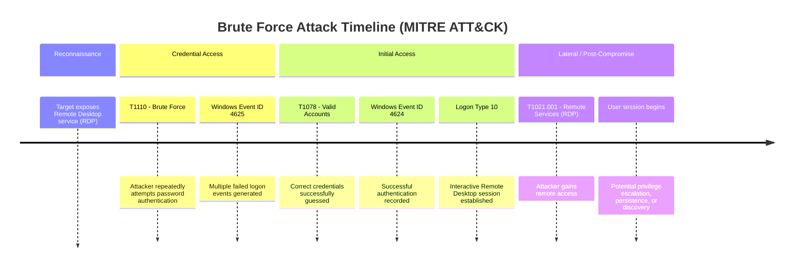
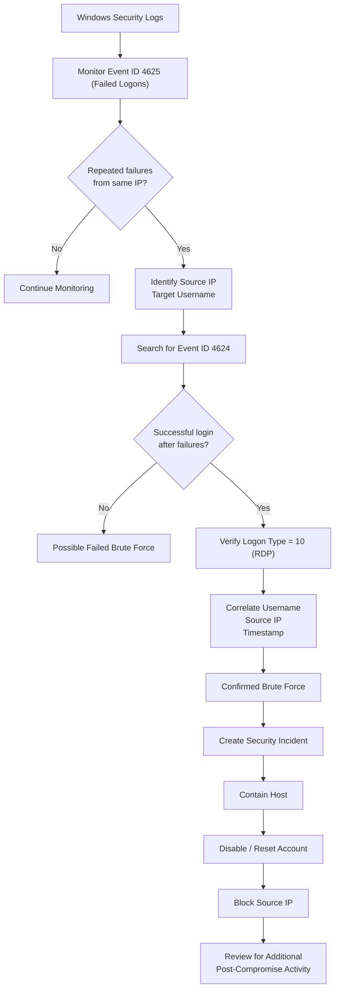

![[Bruteforce - BTLO Walkthrough-1782753702635.webp]]

# 1. Overview

This challenge is about analyzing the **Windows Event Logs** to investigate **Remote Desktop Protocol (RDP)** bruteforce attempts. It's includes analyzing a large volume log of **Audit failures** to identify specific **Indicator of Compromises (IoCs)**.

**Tools used**
- **Windows Events Log Viewer** to extract information about the bruteforce event.
- **TimelineExplorer.exe** (Zimmerman-Tools) for analyzing attempted events on the host.

# 2. Initial analysis

> [!quote]- Scenario
> _Can you analyze logs from an attempted RDP bruteforce attack?_
>
> _One of our system administrators identified a large number of Audit Failure events in the Windows Security Event log._
>
> _There are a number of different ways to approach the analysis of these logs! Consider the suggested tools, but there are many others out there!_

In this challenge, we are provided with 3 evidence files:

1. `BTLO_Bruteforce_Challenge.txt`: A raw text export of the Windows Security Event logs.
2. `BTLO_Bruteforce_Challenge.csv`: The log data structured in a tabular format. Each column has a specific log field (e.g., Event ID, Account Name, IP Address).
3. `BTLO_Bruteforce_Challenge.evtx`: A native binary file format for **Windows Events Log Viewer**.

# 3. Q&A

### T-1. How many Audit Failure events are there? (Format: Count of Events)?

Opening the file `BTLO_Bruteforce_Challenge.csv` in **TimelineExplorer.exe**, we can count the number of failed login attempts by **Event ID: 4625 (failed logon attempt):**

![[Bruteforce - BTLO Walkthrough-1782786270652.webp]]

This event is generated by **Microsoft Windows Security Auditing** provider. Whenever the authentication fails, it captures the details of **target account, src IP, logon type** along with **specific failure reasons**.

> If the **Audit Logon policy** weren't enabled on the host, we wouldn't be able to see these attempts in the security logs.

### T-2. What is the username of the local account that is being targeted? (Format: Username)

Looking `BTLO_Bruteforce_Challenge.evtx` in **Windows Event Logs Viewer**, we can find the username `administrator` was targeted for logon attempts:

![[Bruteforce - BTLO Walkthrough-1782794291968.webp]]

### T-3. What is the failure reason related to the Audit Failure logs? (Format: String)

Looking up the **FailureReason** `%%2313`, it means that username is unknown or password is incorrect, indicating "Unknown username or bad password" as failure reason.

### T-4. What is the Windows Event ID associated with these logon failures? (Format: ID)

The event ID **4625** is associated with these logon failures.

### T-5. What is the source IP conducting this attack? (Format: X.X.X.X)

Looking at Windows Events Viewer again, the src IP address `113.161.192.227` is captured as the one who tried to logon:

![[Bruteforce - BTLO Walkthrough-1782796052164.webp]]

### T-6. What country is this IP address associated with? (Format: Country)

Looking up the IP address, we can see that public IP is from **ISP: Vietnam Posts and Telecommunications Group**, located in **Vietnam:**  

![[Bruteforce - BTLO Walkthrough-1782796414914.webp]]

### T-7. What is the range of source ports that were used by the attacker to make these login requests? (LowestPort-HighestPort - Ex: 100-541)

In the raw export of Windows Events Log txt file, we can see what source ports were associated with bruteforce attack:

```bash
> cat BTLO_Bruteforce_Challenge.txt | grep "Source Port:" | sort | (head -n 10; tail -n 10)
	Source Port:		-
	Source Port:		-
	Source Port:		-
	Source Port:		-
	Source Port:		49162
	Source Port:		49170
	Source Port:		49177
	Source Port:		49184
	Source Port:		49192
	Source Port:		49194
	Source Port:		65483
	Source Port:		65488
	Source Port:		65496
	Source Port:		65497
	Source Port:		65508
	Source Port:		65515
	Source Port:		65516
	Source Port:		65526
	Source Port:		65529
	Source Port:		65534
```

The ports shown in the raw txt file were in the random order. So, I used the command `sort`, then `(head -n 10; tail -n 10)` to see the first and last 10 lines of the source port to confirm the numbers.


# 4. MITRE tactics mapping

The timeline illustrates the attack progression from the attacker's perspective. The attacker first targeted the exposed **Remote Desktop Protocol (RDP)** service and launched a **brute-force attack by repeatedly attempting** different password combinations, generating numerous **failed logon events (Event ID 4625)**.  

After successfully discovering **valid credentials** (MITRE ATT&CK: T1110 – Brute Force), the attacker authenticated **using the compromised account** (T1078 – Valid Accounts) and established **an interactive RDP session** (T1021.001 – Remote Services: RDP).  

At this stage, the attacker had obtained remote access to the system and could proceed with post-compromise activities such as **privilege escalation, lateral movement, or data access.**




# 5. SOC workflow

From a defender's perspective, the investigation begins by monitoring **Windows Security logs** for an **unusually high number of failed logon events** (Event ID 4625).  
The analyst then correlates these events by **source IP address, username, and timestamp** to identify potential brute-force activity. If a successful logon event (Event ID 4624) is observed shortly after the **failed attempts—particularly with Logon Type 10 (RDP session)** the activity can be confirmed as a successful brute-force attack.  

The incident is then **escalated for containment** by disabling or resetting the affected account, blocking the **malicious source IP, and investigating the compromised host** for any additional attacker activity.

