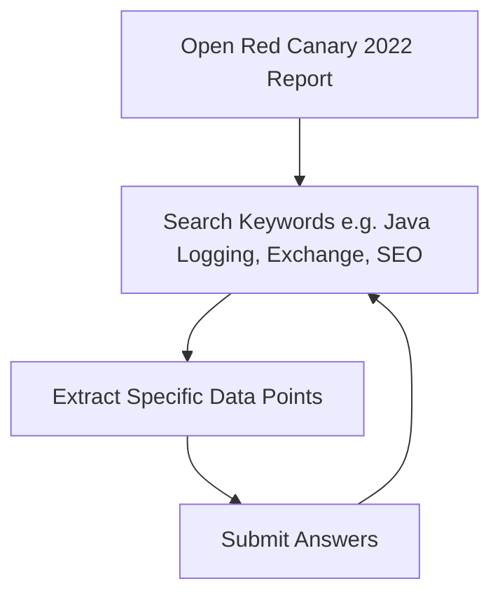

![[The Report - BTLO Walkthrough-1783796741142.webp]]

# 1. Overview

This challenge **The Report** involves analyzing a **Red Canary's 2022 Threat Detection Report** to answer specific tasks about the what cyber threats are observed in late 2021 and early 2022.

> **BTLO challenge link: https://blueteamlabs.online/home/challenge/the-report-a6dd340dba**

### Tools used
- **A browser** or **PDF viewer** to read the provided PDF report.

# 2. Analysis

> [!quote]- Scenario
> *You are working in a newly established SOC where still there is lot of work to do to make it a fully functional one. As part of gathering intel you were assigned a task to study a threat report released in 2022 and suggest some useful outcomes for your SOC.*

### T-1. Name the supply chain attack related to Java logging library in the end of 2021 (Format: AttackNickname)

The supply chain attack related to the Java logging library in late 2021 was **Log4j**:  
![[Pasted image 20260712011046.png]]

### T-2. Mention the MITRE Technique ID which effected more than 50% of the customers (Format: TXXXX)

The MITRE technique ID that affected more than 50% of customers was **T1059** (known as Command and Scripting Interpreter):  

![[Pasted image 20260712011423.png]]

### T-3. Submit the names of 2 vulnerabilities belonging to Exchange Servers (Format: VulnNickname, VulnNickname)

The two vulns belonging to Exchange Servers were **ProxyLogon** and **ProxyShell**:  

![[Pasted image 20260712011742.png]]

### T-4. Submit the CVE of the zero day vulnerability of a driver which led to RCE and gain SYSTEM privileges (Format: CVE-XXXX-XXXXX)

The CVE for the zero-day vulnerability of a driver leading to RCE and SYSTEM privileges was **CVE-2021-34527**:  

![[Pasted image 20260712012009.png]]

### T-5. Mention the 2 adversary groups that leverage SEO to gain initial access (Format: Group1, Group2)

The two adversary groups leveraging SEO for initial access are **Gootkit** and **Yellow Cockatoo**:  

![[Pasted image 20260712012157.png]]

### T-6. In the detection rule, what should be mentioned as parent process if we are looking for execution of malicious js files [Hint: Not CMD] (Format: ParentProcessName.exe)

In the detection rule, the parent process for the execution of malicious `.js` files is `wscript.exe`:  

![[Pasted image 20260712012450.png]]

### T-7. Ransomware gangs started using affiliate model to gain initial access. Name the precursors used by affiliates of Conti ransomware group (Format: Affiliate1, Affiliate2, Afilliate3)

The precursors used by affiliates of the Conti ransomware group are **Qbot**, **Bazar**, and **IcedID**:  

![[Pasted image 20260712012627.png]]

### T-8. The main target of coin miners was outdated software. Mention the 2 outdated software mentioned in the report (Format: Software1, Software2)

The two outdated software main targets for coin miners were **JBoss** and **WebLogic**:  

![[Pasted image 20260712012724.png]]

### T-9. Name the ransomware group which threatened to conduct DDoS if they didn't pay ransom (Format: GroupName) 

The ransom group that threatened to conduct DDoS attacks if ransom was not paid was **Fancy Lazarus**:  

![[Pasted image 20260712012854.png]]

### T-10. What is the security measure we need to enable for RDP connections in order to safeguard from ransomware attacks? (Format: XXX)

The security measure to enable for RDP connections to safeguard from ransomware attacks is **MFA**:  

![[Pasted image 20260712012957.png]]

# 3. SOC Flow
My steps taken to analyze the report against a standard SOC incident response lifecycle:

