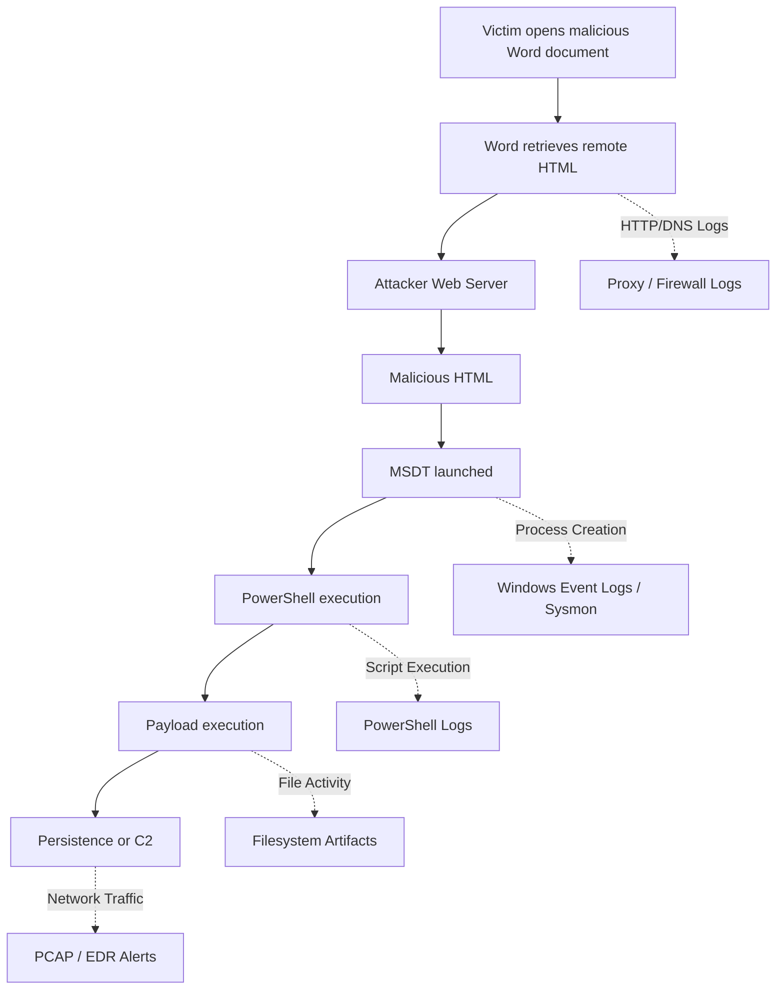

![[Diagnostic - HTB Walkthrough-1782531644360.webp]]

# 📓 Overview

The "Diagnostic" lab is a #forensic challenge and rated as #easy difficulty. It's about investigating how the phishing links are directing to the same server, and compromising the victim's systems by using the Microsoft Windows Support Diagnostics Tool's (MSDT) flaw.

### Tools used

- [VirusTotal](https://www.virustotal.com/gui/home/upload) to analyze known malformed files and CVEs.
- `curl` (Client URL) to fetch server data and information.
- [CyberChef](https://gchq.github.io/CyberChef/) to decode obfuscated codes.

# 💻 Forensic

## 1. Initial analysis

> [!quote]- Challenge Scenario
> Our SOC has identified numerous phishing emails coming in claiming to have a document about an upcoming round of layoffs in the company. The emails all contain a link to diagnostic.htb/layoffs.doc. The DNS for that domain has since stopped resolving, but the server is still hosting the malicious document (your docker). Take a look and figure out what's going on.

Looking at the first, there seems to be no challenge files provided but only the target host. Accessing the target server on the browser responds with "404 Not found", though it's active:

![[Diagnostic - HTB Walkthrough-1782533344914.webp]]

I move on to scan network service information and specific port `154.57.164.69:31308` using `nmap`:

```bash
# Aggressive network scanning
> sudo nmap -sV -sC -O -T4 --min-rate 5000 154.57.164.69 -p 31308

PORT      STATE SERVICE VERSION
31308/tcp open  http    Werkzeug httpd 2.1.2 (Python 3.9.13)
|_http-title: 404 Not Found
|_http-server-header: Werkzeug/2.1.2 Python/3.9.13
Aggressive OS guesses: Linux 4.15 - 5.19...

```

So the results shows that it's a Python web-server **Werkzeug HTTP daemon 2.1.2** running on port `31308`. It possibly looks like a **development server** running for production use due to the presence of Werkzeug (a WSGI utility library for python).

## 2. Evidence triage

The scenario mentions that all phishing emails direct link to `http://diagnostic.htb:31308/layoffs.doc`, which seems the attacker's hosting a suspicious file:

```bash
# Downloading the suspicious file
> curl 154.57.164.69:31308/layoffs.doc --output layoffs.doc

# Finding useful file meta info
> exiftool diagnostic.doc

File Name                       : diagnostic.doc
Warning                         : Install Archive::Zip to decode compressed ZIP information
File Type                       : ZIP
File Type Extension             : zip
MIME Type                       : application/zip
...
```

All the `.doc` files are basically **Office Open XML** (OOXML) and are simply ZIP archives containing **XML files and medias**. Attackers often manipulate those internal file hierarchy by replacing legitimate files with malicious ones:

```bash
# Extracting .docx's XML files
> unzip diagnostic.doc -d output
Archive:  diagnostic.doc
   creating: output/_rels/
   creating: output/docProps/
   creating: output/word/
  inflating: output/[Content_Types].xml
  ...
```

Before inspecting each XML manually, I uploaded `layoffs.doc` file on **VirusTotal** to gather any known CVE information or Mitre's signatures:

![[Diagnostic - HTB Walkthrough-1782545023614.webp]]

Looking at the [CVE-2022-30190](https://www.cvedetails.com/cve/CVE-2022-30190/) (**Follina**), it's a RCE that takes advantage of **Microsoft Windows Support Diagnostic Tool** (MSDT) vuln, then run arbitrary code with the privileges of the calling application (Word, for this scenario):

![[Diagnostic - HTB Walkthrough-1782545240178.webp]]

## 3. Examination

I used a sandbox like **Any.Run** to open the doc for dynamic analysis:

![[Diagnostic - HTB Walkthrough-1782549404690.webp]]

> *Though it's not necessary, you can still rely on static analysis using **VirusTotal** or manually inspecting the XML files.*

First, the malware tried to retrieve malicious file from this URL `http://diagnostic.htb:30510/223_index_style_fancy.html!` (since it's in completely isolated VM and out of HTB network, it's unable to connect it).  

This means there's an another malicious file on the attacker's host that we can try looking it up using `curl`:  

![[Diagnostic - HTB Walkthrough-1782564273945.webp]]

After opening the malicious doc file, this obfuscated (encoded `Base64`) payload will executed on victim's browser to launch MSDT protocol with specific parameters.  

Once executed, the payload will run multi-stage PowerShell attack chain on the victim's machine. We can see the decode payload using **CyberChef**:  

![[Diagnostic - HTB Walkthrough-1782565131627.webp]]

## 4. Extracting Flag

As you may have noticed, we can see the hidden codes that might reveal the flag:  

```powershell
${f`ile} = ("{7}{1}{6}{8}{5}{3}{2}{4}{0}"-f'}.exe','B{msDt_4s_A_pr0','E','r...s','3Ms_b4D','l3','toC','HT','0l_h4nD')

{7} --> HT
{1} --> B{msDt_4s_A_pr0
{6} --> toc
{8} --> 0l_h4nD
{5} --> l3
{3} --> r...s
{2} --> E
{4} --> 3Ms_b4D
{0} --> }.exe
```


# ⚔ MITRE ATT&CK | SOC view

| TID       | Tactic         | Technique                                     |
| --------- | -------------- | --------------------------------------------- |
| T1566.001 | Initial access | Phishing: Spearphishing Attachment            |
| T1059.001 | Execution      | Command and Scripting Interpreter: PowerShell |
| T1203     | Execution      | Exploitation for Client Execution             |




## 🛡 Remediation 

#### 1. Disabling MSDT URL Protocol

> An alternate used before the **June 2022 cumulative Windows Updates** patch has been released.

Run CMD prompt as administrator and disable MSDT's URL protocol:

```powershell
reg delete HKEY_CLASSES_ROOT\ms-msdt /f
```

#### 2. Attack Surface Reduction (ASR)
For endpoints using Microsoft Defender, enabling the ASR rule to reject all Office application from creating child processes can prevent this attack.

# 💭 Lessons learned
To be aware of this incident, I learned that
- Expending network visibility (alert on any known development frameworks in network traffics).
- Automating patching SLAs, training employees to be aware of emotion lures.
- Creating ASR rule for defense-in-depth.
- And automated IP-Based blocking (though DNS resolve is down, malicious IPs might still be active)  
can help detecting threats and prepare better defenses in SOC operations.