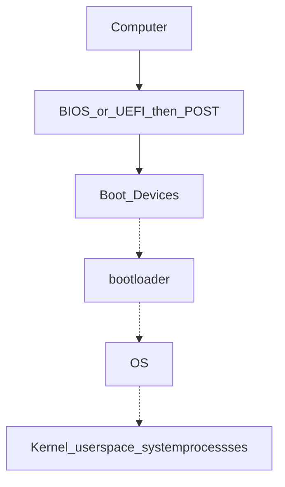
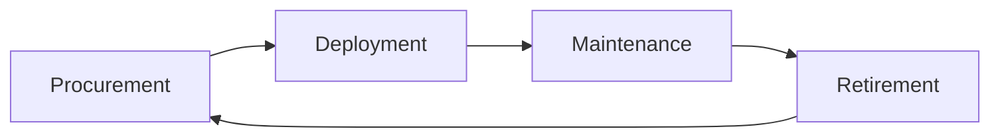

# Course 1 - IT Support Fundamentals

## Module 1: Introduction

IT support mindset - computing technology, it's about people

- Logic gates `NOT, AND, OR, XOR, NAND, XNOR`

## Module 2: Hardware

**Common CPU** → Intel Core i7, AMD Athlon, Snapdragon 810, Apple A8
_Always ensure that is CPU compatible with Motherboard_

### 2 Major type of CPU

- **LGA Socket** - pins coming out of the Motherboard
- **PGA Socket** - pings coming out of the processor
  CPU has **32** bit or **64** bit architecture

For numerical accuracy → **Decimal nomenclature** < **Binary nomenclature**

```
KB → 1,000 bytes
KiB → 1,024 bytes (Kibibytes)
```

Common power adaptor → 2.1 AMPS
500W enough for Desktop computers

| Version | Speed    | Actual Data Transfer Speed |
| ------- | -------- | -------------------------- |
| USB 2.0 | 480 Mb/s | 35-40 MB/s                 |
| USB 3.0 | 5 Gb/s   | 300 MB/s                   |
| USB 3.1 | 10 Gb/s  | 1.2 GB/s                   |

**DC** (Direct Current) - one direction
**AC** (Alternating Current) - back and forward directions

**Common voltages** → 110-120 VAC (voltage of AC), 220-240 VAC

**Power Supply** → 20-24 pins to connect wires

**System on chip** (SoC)
**BYOD** - _Bring your own device_, policy of permitting

#### Types of Cables

- **Plane Old Telephone Service** (POTS) - telephones, dial-up, alarm systems
- **Digital Subscriber Line** (DSL) - RJ-45
- **Cable Internet**
- **Fibre-optic Cable** - long-distance, higher speed, ISPs
- **Punch Down Blocks** - quick and easy way to connect wiring

**4-pin Molex** - Fan speed

### How Devices work with CPU

**I/O** devices → drivers (BIOS), which is stored in a tiny chip called **ROM** → CPU

**UEFI** - Unified Extensible Firmware Interface
**POST** - Power On Self Test

#### Display Monitors

- **LCD** - Liquid Crystal Display
- **LED** - Light Emitting Diodes
- **IPS** - In Plane Switching (Touchscreens)
- **Twisted Nematic** - _low, fast fresh rates_
- **VA** - Vertical Alignment
- **OLED, AMOLED** - Inorganic mini LEDs (mLEDs)

##### North Bridge

High speed communications: RAM, PCI Express, video cards, high bandwidth devices

##### South Bridge

Lower bandwidth communications: SATA drives, USB ports, audio interfaces, network connections

**SATA**: Serial AT Attachment, that is a computer bus interface for <mark style="background: #BBFABBA6;">storage devices</mark>

## Module 3: Operating System

How OS works

```
User Space
- Apps
↕
Kernel Space
- Process manager --- memory optimisation
- Memroy manager
- File manager
- I/O manager
↕
Hardware - drivers - for e.g. keyboard, headphones
```

**Metadata** - Owner, date, ...

**Time slice** - allocation for CPU to process (works with pages)
Kernel creates processes

> [!TIP] Shell
> Most remote accessed with CLI, not GUI everytime.
> Bash - _Born Again Shell_

## Module 4: Networking

**Logs** - record event system



### Networks

**IP** - right address, **TCP** - delivers
**ICANN** - Internet Corporation for Assigned Names and Numbers

_When you type an address in browser, DNS looks IP and search address_

**IPv4** - 32 bits
**IPv6** - 128 bits
**NAT** - Network Address Translation

### Security

**COPPA** - Children's Online Privacy Protection Act

## Module 5: Software

- **PowerShell** (`.ps1`) - Built on .NET platform and used for automating system management on Windows.
- **Batch Scripts** (`.bat`) - Simple tasks, calling a set of programs on startup
- **Visual Basic Script** (`.vbs`) - Old and replaced by PowerShell.
- **Shell Script** (`.sh`) - executing programs on Unix systems on BASH, Bourne Shell, KSH, C schell

Application software, system software, firmware (permanently stored on computer component)
**Script** is interpreted by CPU

## Module 6: Troubleshooting

_Ask right questions_
Shrink the problem to focus on a scope
Ask what you mean it's stop working, when, and how.
Your time and your user time is **important**

you'll encounter the same issue over and over again
Don't rely on _auto-pilot_
Gather data so you understand the issue - don't reply

Always find the **root cause**
you gonna need passionate | problem-solving (tools | resources) | Communication (Knowing their needs)

<mark style="background: #BBFABBA6;">Twist your styles</mark> on different situations because you will meet different types of people - build a trust in communication - ask your manager to know approach and restrictions of the company
**Great Customer Service**

- Empathy - The action you take by looking at it from their perspective is what **empathy** all about.
- If your tone is **Friendly and curious** - users have more positive experience

### Great Success

- Exhibiting empathy
- Being conscious of your tone
- Acknowledging the person you're talking to
- Developing trust with the user

Instead of going awkward while troubleshooting (on call/text/email), say <mark style="background: #BBFABBA6;">"I gotta research on this issue, would you mind waiting 5 mins?"</mark>
Builds more confident between you and the user
Say sorry for **repeative questions.**

### Interaction

When user asks so many questions while you troubleshooting, say <mark style="background: #BBFABBA6;">"I'd be happy to answer all of your questions, but I wanna look up for this now. Your questions will be wrote down so I won't forget!"</mark>

### Dealing with Difficult Situations

Take a deep breath, look around for people who are more engaged with you that pays attention. Ask yourself why you're heated up, and calm down.

> User get frasturated with same questions over and over again.
> _why the calender app doesn't open? it doesn't just load when you press to open or not syncing?_

Try to pause before you speak for 5 to 10 secs, ask your **why the user talking over me? or did I miss anything?** then think about what you want to say.

### Tickets System (Documentation)

You need to <mark style="background: #ABF7F7A6;">document your works</mark> to remember how you did:

- It keeps the user in the loop
- Helps you audit your steps in case you need to go back and see what you did.

**Update documentations** (concise as possible -- they are technical, not short story)

Documentation should be straight, clear problems, questions, specific steps.
**Ticketing or bug system**:

- User entry: question
- Support specialist entry: specific troubleshooting process to manage them

## Technical Interview

Make your **Resume** (first introduction to the company) clear to read and strong fit for job apply. Read carefully the **Job Description**

Simplified breif summary of your all experiences _Created acccounts, deleted accounts --- Administered and maintained all user accounts_

> Action Verb + specific task + quantifiable point

Also add personal projects that you're interested.

**Make your online presence Professional**

> Always pretend you're in an interview -- makes you confident and can say more out loud.

Practice with non-technial people -- practice to break down complex topic into simple and explain with basic terms.

> Try explaining the same concept in different ways -- allows for natural conversation

#### Creating Your **Elevator Pitch**

A short description about yourself like <mark style="background: #ABF7F7A6;">meeting in elevator</mark>

> [!NOTE] What, where, looking forward
> "_Hello! I'm Martin, I'm in my first year at NiT University, studying Diploma in Computing. I enjoy learning about security and helping in Networking though I'm still inexperienced, so I'm looking forward to putting my tech skills into practice by working as an Security Operation Analystic after I graduate._"

**Having a good problem-solving strategy is more important than knowing all the answers** --- say how you'll research the solution if you don't know.

Be prepared to explain a concept when you choose over another. Take notes, break down concepts.

### Good Night Sleep

- Be yourself, be fully present to your interviewer.
- Also an opportunity to ask the interviewer to ask for things you care about.

In secnarios -- <mark style="background: #D2B3FFA6;">get the pirorities right.</mark>

---

# Course 2 - The Bits and Bytes of Computer Networking

## Module 1 - Introduction to Networking
**Protocol** - Defined sets of standards for communication.  

![[Notebook/attachments/Pasted image 20250903185544.png| 500]]

##### Physical Layer
Physical devices that interconnect computers, about signal are sent between networks.
- *e.g. Cabling, connectors*
##### Data Link Layer (Network Interface)
Responsible for defining a common way of interpreting these signals so network devices can communicate.
- *e.g. Ethernet standards*
##### Network Layer (Internet Layer)
Allows different networks to communicate with each other through devices. 
- **Internetwork** - A collection of networks connected connected through **routers**.
- Responsible to deliver through routers. *(e.g. Routers, IP)*
##### Transport Layer
Sorts out which client and server programs are supposed to get that data.
Mostly **TCP/UDP** responsible for ensuring data gets to right application running on those nodes.
##### Application Layer
The interface between end-user applications and the underlying network services. (e.g. Browser)

![[Notebook/attachments/25_08_30_22-37-17.png| 500]]

### Cables
Common forms of copper twisted-pair cables - **Cat5, Cat5e,** and **Cat6**.

![[Notebook/attachments/25_08_30_22-48-51.png]]

**Crosstalk** - When an electrical pulse on one wire is accidentally detected on another wire. (Cat5 is replaced by Cat5e)
**Fiber cables** - Contain individual optic fiber - tiny tubes made out of glass (width of human hair). Mostly seen in data centers and ensures quicker, no potential data loss - but expensive.

![[Notebook/attachments/25_08_30_23-05-40.png| 400]]

### Hubs, Switches and Routers
**Hub** - broadcasts them out to all other connected ports<mark style="background: #FFF3A3A6;"> without analyzing or processing</mark> the data. Forwards all incoming data to every other connected device. Nodes in the network of hub can only send data one at a time.

**Switch** - communicates by forwarding data packets <mark style="background: #FFF3A3A6;">based on MAC addresses</mark>, and intelligently directs data frames only to the specific device.

**Router** - uses IP to transmit IP packets contains both the data and source & destination IP addresses. Directing traffic efficiently by <mark style="background: #FFF3A3A6;">examining packet headers and consulting its routing table </mark>to determine the best path for each packet - across different networks.
- *Routers are Global Guides for getting traffic to the right places in a world of large complex internet. (e.g. between you and web server)*

![[Notebook/attachments/25_08_30_23-20-08.png| 500]]

**Border Gateway Protocol (BGP)** - Routers share data via BGB, letting them learn about the <mark style="background: #FFF3A3A6;">most optimal paths</mark> to forward traffic.

### Servers and Clients
Each node is primarily an either Server or Client.
![[Notebook/attachments/25_09_02_13-09-17.png| 400]]
Even though **Mail server** acts as a server, it is a client of **DNS server**.

### Moving Bits Across the Wire
**Bit** - Smallest representation of data (`1` or `0`).
**Modulation** - A way of varying the voltage of this charge moving across the cable (line coding).

### Twisted Pair Cabling and Duplexing
**Duplex** - The concept that information can flow in both directions.
**Simplex** - unidirectional.
![[Notebook/attachments/25_09_02_13-17-57.png| 400]]

### Ethernet Over Twisted Pair Technologies
- **UTP** - The most common and least expensive - business and home networks. Basic protection against <mark style="background: #BBFABBA6;">electromagnetic interference (EMI), radio frequency interference (RFI), and crosstalk interference.</mark>
- **STP** - Uses a <mark style="background: #BBFABBA6;">braided aluminum/copper shielding</mark> to encase the **four** twisted underneath. (industrial environment)
- **FTP** - Foiled twisted pair: uses a<mark style="background: #BBFABBA6;"> thin foil shield</mark> that wraps around the bundle of twisted pair wires. (industrial environment)
- **Straight-through cable** - pins on one end are wired to the <mark style="background: #BBFABBA6;">same corresponding pins</mark> on the other end (pin-to-pin wiring scheme).
- **Crossover Cables** - typical setup for T568A on one end and T568B on the other (<mark style="background: #BBFABBA6;">direct device-to-device communication</mark> under older Ethernet standards like 10BASE-T and 100BASE-TX). 

### Network Ports and Patch Panels
**RJ45** - Registered Jack, used primarily for Ethernet networking to link devices.

| ![[Notebook/attachments/Pasted image 20250903142814.png\| 180]] | ![[Notebook/attachments/Pasted image 20250903143147.png\| 250]] | ![[Notebook/attachments/Pasted image 20250903143310.png\| 250]] |
| ------------------------------------------- | ------------------------------------------- | ------------------------------------------- |

**Patch panel** - as a central point for organising and managing the <mark style="background: #BBFABBA6;">vast network of cables</mark>. Administrators can easily establish, modify, or terminate links between different network components.
*Structured cabling is important in enterprise networking - clear where cables terminate.*

![[Notebook/attachments/2025-09-03-143537_hyprshot.png| 400]]

### Cabling Tools

| Picture                                     | Description                                                                                                                                                                                                                                             |
| ------------------------------------------- | ------------------------------------------------------------------------------------------------------------------------------------------------------------------------------------------------------------------------------------------------------- |
| ![[Notebook/attachments/Pasted image 20250903145257.png\| 200]] | **Crimper**<br>Securely attaching connectors, such as RJ45 connectors, to the ends of Ethernet cables without soldering - <mark style="background: #ABF7F7A6;">squeeze down or crimp wires</mark>.                                                      |
| ![[Notebook/attachments/Pasted image 20250903144844.png\| 200]] | **Cable Stripper**<br>To remove the <mark style="background: #ABF7F7A6;">protective rubber coating</mark> from Ethernet cables (UTP and STP) to expose the individual conductors for termination with connectors like RJ45 plugs or keystone jacks.<br> |
| ![[Notebook/attachments/Pasted image 20250903153340.png\| 200]] | **Wi-Fi Analyzer**<br>Visualizes the RF environment, identify sources of interference, and <mark style="background: #ABF7F7A6;">optimize wireless network performance</mark> in an area. Collects data about the WiFi and its circumstances.            |
| ![[Notebook/attachments/Pasted image 20250903153657.png\| 200]] | **Toner Probe**<br><mark style="background: #ABF7F7A6;">Finding Ethernet</mark> and other internet connectors (Cat 5, Cat 6, ...) through walls, ceilings, or within cable bundles where they are not physically accessible.                            |
| ![[Notebook/attachments/Pasted image 20250903154329.png\| 200]] | **Punch Down Tool**<br>Punching down wires into <mark style="background: #ABF7F7A6;">punch down panels or jacks</mark>. First the protective covering is taken off the wires, then the wires are punched into place.                                    |
| ![[Notebook/attachments/Pasted image 20250903155001.png\| 200]] | **Cable Tester**<br>To <mark style="background: #ABF7F7A6;">detect common wiring faults</mark> - open connections (breaks in a wire), shorts (where wires touch unintentionally), crossed pairs, reversed pairs, and incorrect wiring.                  |
| ![[Notebook/attachments/Pasted image 20250903160843.png\| 200]] | **Loopback Plug**<br>Hardware diagnostic tool used in networking to <mark style="background: #ABF7F7A6;">test the functionality</mark> of physical ports and interfaces                                                                                 |
| ![[Notebook/attachments/Pasted image 20250903161119.png\| 200]] | **Network Tap**<br><mark style="background: #ABF7F7A6;">Monitors and captures data</mark> flowing through a network, providing a non-intrusive, passive method for accessing network traffic.                                                           |

### Ethernet and MAC Addresses
**MAC** - Media Access Control, a <mark style="background: #BBFABBA6;">globally unique identifier</mark> attached to network interface.
- 48-bit, six groups of two hexadecimal numbers.
- First **three** octets - Organizationally Unique Identifier (OUI)
![[Notebook/attachments/Pasted image 20250903191342.png| 500]]

### Unicast, Multicast, and Broadcast

| Name          | Description                                                                                                                                                                                                                                                                                                                                                                                                                                                                                                                                                                                                                      |
| ------------- | -------------------------------------------------------------------------------------------------------------------------------------------------------------------------------------------------------------------------------------------------------------------------------------------------------------------------------------------------------------------------------------------------------------------------------------------------------------------------------------------------------------------------------------------------------------------------------------------------------------------------------- |
| **Unicast**   | <mark style="background: #ABF7F7A6;">One-to-one communication model.</mark><br><br>*e.g. `4A-30-10-21-10-1A`, the first octet is `4A` in hexadecimal - `01001010`. The least significant bit (the rightmost) is `0` - this is a **unicast address**.*<br><br>This frame will be sent to all devices on the collision domain, but only the device with the matching MAC address will receive and process it.<br><br>![[Notebook/attachments/Pasted image 20250903223126.png\| 200]]                                                                                                                                                                   |
| **Multicast** | <mark style="background: #FFB8EBA6;">One-to-many communication model.</mark><br><br>*e.g. `01:00:5E:00:01`, the first octet is `01` - `0000 0001` in binary. The least significant bit is `1` - it is a multicast address. This specific address falls within the range `01:00:5E:00:00` to `01:00:5E:7F:FF`, which is reserved for IPv4 multicast addresses.*<br><br>While the switch treats the frame as multicast and floods it to all ports, the receiving NICs decide whether to accept the frame based on whether they are subscribed to that specific multicast group.<br><br>![[Notebook/attachments/Pasted image 20250903222851.png\| 200]] |
| **Broadcast** | <mark style="background: #ADCCFFA6;">One-to-all communication model.</mark><br><br>On the data link (Layer 2), a broadcast is identified by a destination MAC address `FF:FF:FF:FF:FF`, which all devices on the network recognize as a broadcast intended for everyone.<br><br>The message is delivered to every device on the local network, although only the relevant device(s) will process it, while others will typically ignore it.<br><br>![[Notebook/attachments/Pasted image 20250903223052.png\| 200]]                                                                                                                                   |

### Dissecting an Ethernet Frame
**Data packet** - any single set of binary data being sent across.
Data packets in Ethernet level, it is **Ethernet frame** - highly structured collection of information in specific order.

![[Notebook/attachments/Pasted image 20250903233048.png]]

| Unit                            | Bytes      | Description                                                                                                                                                                                                                                                                                                                                                                                         |
| ------------------------------- | ---------- | --------------------------------------------------------------------------------------------------------------------------------------------------------------------------------------------------------------------------------------------------------------------------------------------------------------------------------------------------------------------------------------------------- |
| **Preamble**                    | `7`        | 8 bytes, first 7 bytes act partially as <mark style="background: #FFF3A3A6;">buffer between frames</mark> and can be used by the network interfaces to <mark style="background: #FFF3A3A6;">synchronize internal clocks</mark> they use to regulate the speed at which they sent data.                                                                                                              |
| **Start Frame Delimiter (SFD)** | `1`        | Signals to a receiving device that the preamble is over, and the <mark style="background: #FFF3A3A6;">actual frame contents will now follow</mark>.                                                                                                                                                                                                                                                 |
| **Destination Address**         | `6`        | The hardware address of the <mark style="background: #FFF3A3A6;">intended recipient</mark>.                                                                                                                                                                                                                                                                                                         |
| **Source Address**              | `6`        | Where the frame originated from.<br>*MAC Address: 48 bits, or 6 bytes long.*                                                                                                                                                                                                                                                                                                                        |
| **Ether-type**                  | `4`        | Used to describe the protocol of the <mark style="background: #FFF3A3A6;">contents of the frame</mark>.                                                                                                                                                                                                                                                                                             |
| **VLAN (Virtual LAN)**          | `2`        | If a VLAN header is present, the Ether-type field follows it.                                                                                                                                                                                                                                                                                                                                       |
| **Payload**                     | `46-1,500` | The <mark style="background: #FFF3A3A6;">actual data</mark> being transported - 46 to 1,500 bytes long - data contains from Network, Transport, and Application layers.                                                                                                                                                                                                                             |
| **Frame Check Sequence (FCS)**  | `4`        | Checksum value for the entire frame.<br>- **Cyclical redundancy check (CRC)** - Important concept for data integrity. Checksum <mark style="background: #BBFABBA6;">number should be same</mark> anytime performing against a set of data.<br>	- In Ethernet frame, it can ensure if the data transmission is <mark style="background: #BBFABBA6;">corrupted</mark> and needs re-transmissions.<br> |


## Module 2: The Network Layer
### IPv4 Addresses

| ![[Notebook/attachments/Pasted image 20250904111523.png\| 300]]                                                             |
| ------------------------------------------------------------------------------------------------------- |
| IP address represented in **32-bits** long and **4 octets** - (normally represented in decimal `0-255`) |

> IP addresses belong to **networks**, **not to the devices** attached to those networks.
> Same MAC address - but <mark style="background: #ABF7F7A6;">different IP address</mark> assigned to it.
- **DHCP** (Dynamic Host Configuration Protocol) - **Dynamic IP address** mainly used for clients.
- **Static IP address** - mostly reserved  for servers.

### IPv4 Datagram and Encapsulation
**IP Datagram** - <mark style="background: #BBFABBA6;">structured series of fields</mark> that are strictly defined.

![[Notebook/attachments/2025-09-04-124455_hyprshot.png| 500]]

| Unit                       | Bits | Description                                                                                                                                                                                                                      |
| -------------------------- | ---- | -------------------------------------------------------------------------------------------------------------------------------------------------------------------------------------------------------------------------------- |
| **Version**                | `4`  | Indicates what version of IP version is being used - common is IPv4                                                                                                                                                              |
| **Header Length**          | `4`  | Declares how long the entire header is - almost always 20 bytes in dealing with IPv4                                                                                                                                             |
| **Service Type**           | `16` | Specify details about quality of service (QoS).<br><mark style="background: #FFF3A3A6;">Routers</mark> can decide which IP datagram maybe more important <mark style="background: #FFF3A3A6;">based on the Service Type</mark>.  |
| **Total length field**     | `16` | Indicates the total length of the IP datagram.                                                                                                                                                                                   |
| **Identification**         | `16` | Groups messages together.<br>- The IP layer <mark style="background: #FFF3A3A6;">splits data into individual packets</mark> when amount of data is larger than a single datagram.<br>![[Notebook/attachments/Pasted image 20250905170710.png\| 300]] |
| **Flags**                  | --   | Indicates if a datagram is allowed to be <mark style="background: #FFF3A3A6;">fragmented</mark> or has already been fragmented.                                                                                                  |
| **Fragment Offset**        | --   | Indicates the starting position of the data in a fragment.<br>![[Notebook/attachments/Pasted image 20250905171834.png\| 300]]                                                                                                                        |
| **TTL** (Time to live)     | 8    | Indicates <mark style="background: #FFF3A3A6;">how many routers hops</mark> a datagram.<br>![[Notebook/attachments/Pasted image 20250905172926.png\| 300]]                                                                                           |
| **Protocol**               | 8    | Contains data about what transport layer protocol is being used. (*e.g. TCP, UDP*)                                                                                                                                               |
| **Header Checksum**        | 13   | Checksum of the contents of the entire IP datagram header.                                                                                                                                                                       |
| **Source IP Address**      | 32   | Sender of the packet                                                                                                                                                                                                             |
| **Destination IP Address** | 32   | Final or intermediary recipient                                                                                                                                                                                                  |
| **Options**                | --   | Used to set special characteristics for datagrams - testing purposes.                                                                                                                                                            |
| **Padding**                | --   | A series of zeros used to ensure the header is the correct total size.                                                                                                                                                           |
The entire concept of datagram is <mark style="background: #BBFABBA6;">encapsulated</mark> as the payload of Ethernet frame.
![[Notebook/attachments/Pasted image 20250905175940.png| 400]]

### IPv4 Address Classes
IP Addresses - **network ID** and **host ID**.
![[Notebook/attachments/Pasted image 20250905181633.png| 500]]

### Address Resolution Protocol (ARP)
**ARP** - A protocol used to <mark style="background: #BBFABBA6;">discover the hardware address</mark> of a node with a certain IP address.
**ARP table** - A list of IP addresses and the MAC addresses associated with them.

> ARP table entries generally expire after a short amount of time to ensure changes int he network are accounted for.

| ![[Notebook/attachments/Pasted image 20250905182408.png\| 400]] | ![[Notebook/attachments/Pasted image 20250905184343.png\| 400]] |
| ------------------------------------------- | ------------------------------------------- |

### Subnetting
Dividing a large network into **smaller**, more **manageable** networks.
> Incorrect subnetting setups are common problem - IT support might run into.

| ![[Notebook/attachments/Pasted image 20250905212653.png\| 400]] | ![[Notebook/attachments/Pasted image 20250905212721.png\| 200]] |
| ------------------------------------------- | ------------------------------------------- |

### Subnet Masks

| ![[Notebook/attachments/Pasted image 20250905213555.png\| 400]] |
|:-------------------------------------------:|
| ![[Notebook/attachments/Pasted image 20250905213628.png\| 300]] |

### CIDR (Class-Inter Domain Routing)
A method for allocating IP addresses and routing internet traffics.
**Demarcation point** - Describes where one network or system ends and another one begins.

### Basic Routing Concepts

| ![[Notebook/attachments/Pasted image 20250905215812.png\| 400]] |
| ------------------------------------------- |
| ![[Notebook/attachments/Pasted image 20250905223258.png\| 400]] |

### Routing Tables

![[Notebook/attachments/Pasted image 20250912202059.png| 500]]
 
 **Destination Network** - Contain a row for each network that the routers knows about.
 **Next Hop** - The IP address of the next router that should receive data intended for the destination networking quesiton.
 **Total hops** - There will be lots of paths at all points, it can change overtime, it finds the shortest path and tracking.
 **Interface** - Which of the interface to forward.

### Interior Gateway Protocols
**Routing protocols** - special protocols the routers use to speak to each other and share information.
- **Interior gateway protocols** - **Link state routing protocols** (algorithm) and **distance-vector protocols**
- **Exterior gateway protocols** - Used for exchange of information between independant autonomous systems.

### Exterior Gateways, Autonomous Systems, and the IANA

![[Notebook/attachments/Pasted image 20250912205653.png| 400]]

**IANA** - Internet Assigned Numbers Authority, non-profit organization that helps manage things like IP address allocation. Alongside, also responsible for **ASN**.
**ASN** - Autonomous system number, numbers assigned to individual autonomous systems.

### Non-Routable Address Space
The ranges of Is set aside for use by anyone that cannot be routed to. Every devices connected to the network doesn't have to communicate

**RCH 1918** - 10.0.0.0/8, 172.16.0.0/12, /192.168.0.0/16 free for anyone to use in internal networks (AS).


## Module 3: The Transport and Application Layers
### The Transport Layer
**Multiplexing** - Ability to direct traffic toward many different receiving services.
**Demultiplexing** - Taking traffic and delivering it to the proper receiving service.

Through ports, **ports** (16 bits) are used to direct traffic to specific services - running on a networked computers.
![[Notebook/attachments/Pasted image 20250913221557.png| 500]]

### Dissection of a TCP Segment
![[Notebook/attachments/Pasted image 20250915144803.png| 400]]
- **Sequence number** - used to reassemble the message at the receiving end of the segments that are received out of order.
- **Acknowledgement number** - an acknowledgement for the previous bytes being received successfully.
- **Data offset field** - communicates how long the TCP header for this segment is.
- **Window** - window size of the sending TCP in bytes.
- **Checksum** - checksum for error control. It is mandatory in TCP as opposed to UDP. 
- **Urgent** - used to point to data that is urgently required that needs to reach the receiving process at the earliest.

### TCP Control Flags and the Three-way Handshake
#### Control Flags -
- **URG** (urgent)
- **ACK** (acknowledged)
- **PSH** (push): Instructs the receiving network stack to immediately deliver the data to the application layer without waiting for the buffer to fill up with more data.
- **RST** (reset): Reset the connection
- **SYN** (synchronize): Synchronize sequence numbers - used when first establishing and make sure the receiving end knows to examine the sequence number field.
- **FIN** (finish): connection can be closed and terminate.

![[Notebook/attachments/Pasted image 20250915153511.png| 400]]
Once the three-way handshake is complete, the TCP connection is established:
> A sends a TCP segment to B with a `SYN` flag sent.
> A: "Let's establish a connection and look at my `sequence number` field, so we know where this conversation starts."
> 
> B then responds with a TCP segment, where both `SYN` and `ACK` flags are set.
> B: "Sure, let's establish a connection and I acknowledge your `sequence number`."
> 
> Then, A responds again with just the `ACK` flag set.
> A: "I acknowledge your acknowledgement. Let's start sending data."

Since both sides have now send `SYN/ACK` pairs to each other, a TCP connection in this state is operation in **full duplex**.
![[Notebook/attachments/Pasted image 20250915155027.png| 300]]

**Handshake**  - ensure that they're speaking the same protocol, and able to understand each other.

### TCP Socket States
 **Socket** - The instantiation (implementation defined somewhere) of an end-point in a potential TCP connection.
 
| State            | Description                                                                                                                                 |
| ---------------- | ------------------------------------------------------------------------------------------------------------------------------------------- |
| **LISTEN**       | A TCP socket is ready and listening for incoming connections. Seen on server-sides only.                                                    |
| **SYN_SENT**     | A synchronization request has been sent, but the connection hasn't been established yet. Seen on client-sides only.                         |
| **SYN_RECEIVED** | A socket previously in a LISTEN state has received a synchronization request and sent a SYN/ACK back. Server-side only.                     |
| **ESTABLISHED**  | The TCP connection is in working order and both sides are free to send each other data. Both side: Client and Server side.                  |
| **FIN_WAIT**     | A FIN has been sent, but the corresponding ACK from the other end hasn't been received yet.                                                 |
| **CLOSE_WAIT**   | The connection has been closed at the TCP layer, but the the application that opened the socket hasn't released its hold on the socket yet. |
| **CLOSED**       | The connection has been fully terminated and that no further communication is possible.                                                     |
State names can be vary on on OS to OS.

### Connection-oriented and Connectionless Protocols
**Connection-oriented protocol**: Establishes a connection, and uses this to ensure that all data has been properly transmitted. In transport layer, every data transimitted is acknowledged.
**Connectionless protocol**: UDP doesn't rely on the connection.

### System Ports VS Ephemeral Ports
 - Network Services listens to specific ports for incoming data requests.
 - Ports are used in Transport Layer - establish a network connection & deliver data - TCP "segment" used.
 - Once a TCP segment tells a service to listen for requests through a port, that listening port becomes a **socket**.
#### Three categories of ports
Ports represented by a single 16-bit (65535 different port IDs)

- **System Ports**: ports  `1` through `1023`. Reserved for common applications - FTP (port `21`) and Telnet over TLS/SSL (port `992`). 
> Modern OSs do not use system ports for outbound traffic.
- **User Ports**: ports `1024` through `49151`. Vendors register user ports for specific server applications - by IANA but not all.
- **Ephemeral Ports (Dynamic or Private Ports)**: ports `49152` through `65535`. Used as temporary ports for private transfers - outbound, only clients uses.
##### How TCP is used to ensure data integrity
TCP segment specifices ports connected for network data transfer - other info about data being transferred (along requested data). The TCP protocol sends acks between service-client to show that sent data received.
Then uses **checksum** verification.
##### Ports security
Malicious actors might also use port scanning to search for open and unsecured ports or to find weak points in your network security. Use a firewall and only open sockets as needed.

### Firewalls
Blocks traffic that meets **certian criteria** - independant network devices.
![[Notebook/attachments/Pasted image 20250927225642.png| 500]]

### The Application Layer and the OSI Model
- Has many standardized Protocols to work with - all need to be in same protocol in order to communicate.
OSI Model is often used in academic settings and various networking certification organizations.
**Session layer** - facilitate the communication between actual applications and the transport layer.
**Presentation layer** - responsible for making sure that the unencapsulated application layer data is able to be understood by the application in question - encryption and compression.

### All the Layers Working in Unison
![[Notebook/attachments/Pasted image 20250928123547.png| 700]]


## Module 4: Networking Services
**DNS** - A global and highly distributed network service that resolves strings of letters into IP addresses for you.
**Domain Name** - The term we use for something that can be resolved by DNS.
![[Notebook/attachments/Pasted image 20250930163634.png| 400]]
### The Many Steps of Name Resolution
- IP address
- Subnet mask
- Gateway for a host
- A name server configured (DNS server)
**Anycast** - route traffic to different destinations depending on the factors (location, congestions, or link health).
**Top-Level Domain (TLD)** - represents the top of the hierarchical DNS name resolution system (facebook.*com*, to point a look up server, the organization itself that runs the site).

#### Name Resolution
- **Caching and Recursive name servers** - to store known doamin name lookups for a certain amount of time. Recursive name servers perfrom full DNS resolution requests.
![[Notebook/attachments/Pasted image 20250930170716.png| 500]]

### DNS and UDP
**DNS using UDP** - grand total of 8 packets, while TCP is 44 packets at minimum.
![[Notebook/attachments/Pasted image 20250930213510.png| 500]]

### Resource Record Types
**A** Record - Used to point a certain domain name at a certain IPv4 IP address. Uses Round Robin to balance multiple traffics.
- *One computer lookup microsoft.com - 10.1.1.1, 10.1.1.2, 10.1.1.3, 10.1.1.4. On next one computer, but in changed order - 10.1.1.2, 10.1.1.3, 10.1.1.4, 10.1.1.1.*

- **Quad A** Record - Similar to A Record, but returns an IPv6.
- **CNAME** Record (Canonical Name) - Used to redirect traffic from one donmain name to another.
> By setting up a CNAME that points microsoft.com at `www.microsoft.com`, you'd only have to change the A record `www.microsoft.com`.

- **Mail Exchange** (MX) - This resource record is used in order to deliver email to the correct server.
- **Service Record** (SRV) - Used to define the location of various specific services. Can be defined to return the specifics of many difference services.
- **Text Record** (TXT) - Originally intended to be used only for associating some descriptive text with a domain name for human consumption.

### Anatomy of a Domain Name
`www.google.com` - `.com` is a the last part of domain name - **TLD (Top Level Domain)**
- **ICANN** (The Internet Corporation for Assigned Names and Numbers) - sister organization of **IANA** - helping to control both the global IP spaces along with the global DNS system.
- **Domains** - demarcate where control moves from a **TLD** name server to an authoritative name server. `www.google.com - google`
- `www` portion is known as **sub-domain**
**Fully Qualified Domain Name** (FQDN) - combine all of these parts together.
Complete FQDN is limited to total 255 characters.

### DNS Zones
Allowing for easier control over **multiple levels** of a domain.
![[Notebook/attachments/Pasted image 20251001223909.png| 500]]
*Each office has around 200 people with their own uniquely named desktops, this would be 600 **A Records** to keep track of in a single zone.
Instead, split up into their own zone - each with their own DNS zone.*
> A total of **4 Authoritative name servers** will be required - one for `largecompany.com` and one for each of the subdomains.

- **Zone Files** - Simple configuration files that declare all resource records for a particular zone.
- **Start of Authority** (SOA) - Declares the zone and the name of the name server that is authoritative for it.
- **NS Records** (usually find along with SOA) - Indicate other name servers that might also be responsible for this zone.
- **Reverse Lookup Zone Files** - These let DNS resolvers ask for an IP and get the FQDN associated with it returned.
- **Pointer Record** (PTR) - Resolves an IP to a name.

### Overview of DHCP
Every clients in modern TCP/IP-based networks needs:
1. IP Address
2. Subnet mask
3. Gateway
4. Name Server

- **DHCP** (Dynamic Host Configuartion Protocol) - An application layer, automates the configuration process of hosts on a network.
- **Dynamic Allocation** - A range of IP addresses is set aside for client devices and one these IPs is issued to these devices when they request one.
- **Assignment Allocation** - A range of IP addresses is set aside for assignment purposes.
- **Fixed Allocation** - Requires a manually specified list of MAC address and their corresponding IPs.
- **Network Time Protocol** - Used to keep all computers on a network synchronized in time.

### DHCP in Action
Application layer protocol - relies on Transport, Network, Data link, and Physical.
- **DHCP Discovery** - the process by which a client configured to use DHCP attempts to get network configuration information. Has 4 steps.

##### 1. DHCP Server Discovery
DHCP listens on **UDP port 67** - DHCP discovery message are always sent from **UDP port 68.**
- This broadcast message is delivered to every node in LAN.
- If DHCP is present, the request message will be recieved.

![[Notebook/attachments/Pasted image 20251004131219.png| 400]]

##### 2. DHCP Offer
Since DHCP offer is also broadcast, it reach every machine on the network. The original client would recognize that was intented for itself - *by inclusion of MAC address in broadcast message.*

![[Notebook/attachments/Pasted image 20251004132216.png| 400]]

##### 3. DHCP Request
"I'd like to have an IP that you offered to me." IP hasn't assigned yet, and again sent. DHCP server receives the DHCP request message - then DHCP ACK.

![[Notebook/attachments/Pasted image 20251004132729.png| 400]]

##### 4. DHCP Acknowledgement
Client use the configuration information and set up its own network layer configuration.

![[Notebook/attachments/Pasted image 20251004132848.png| 400]]

**DHCP Lease** - Certain amount of time availabe to client before it expires. Which then you can have another IP pool by DHCP.

### Basic of NAT
**NAT** - technology allows a gateway (router or firewall), to rewrite the source IP of an out going IP datagram while retaining the original IP in order to rewrite it into the response.

**IP Masquerading** - Hides actual IP when it gets to router sending to Computer 2 in network B, knowing it only comes from router, actually computer 1 in network A sends it.

### NAT and the Transport Layer
**Port Preservation** - A technique where the source port chosen by a client is the same port used by the router.
> Outbound connections choose a source port at random from **Ephemeral ports** (49,152 through 65,535).

![[Notebook/attachments/Pasted image 20251004161102.png| 400]]

**Port Forwarding** (Transport layer) - A technique where specific destination ports can be configured to always be delivered to specific nodes. This allows for complete **IP Masquerading**.

![[Notebook/attachments/Pasted image 20251004163236.png| 400]]

### IPv4 Exhaustion
IANA assigns IP address blocks to the five **Regional Internet Registries (RIRs)**.
- AFRINIC- Africa
- ARIN - USA, Canada, and parts of the Caribbean
- APNIC - Most of asia, australia, New Zealand, and Pacific Island nations
- LACNIC - Central America, South America, and the remaining parts of the Caribbean not covered by ARIN.
- RIPE - Europe, Russia, Middle East, and portions of Central Asia.
> Your computer gets its IP address directly from an **RIR**, not the IANA.


![[Notebook/attachments/Pasted image 20251004170519.png| 400]]

### Virtual Private Networks
The **Tunnelling Procotols**. Works by using the payload session at the Transport layer.

![[Notebook/attachments/Pasted image 20251004171417.png| 400]]

### Proxy Services
A server that acts on behalf of a client in order to access another service. 

**Reverse Proxy** - A service that might appear to be a single server to external 
clients, but actually represents many servers living behind it. (*Like load balancing*)

![[Notebook/attachments/Pasted image 20251004184352.png| 400]]

> Proxies are any server that acts a intermediary between a client and another server.

## Module 5: Connecting to the Internet

### Dial-up and Modems
A dial-up connection uses POTS (Plain Old Telephone Service - analog) for data transfer, and gets its name because the connection is established by actually dialing a phone number.

![[Notebook/attachments/Pasted image 20251004215204.png| 400]]

**Baud Rate** - A measurement of how many bits can be passed across a phone line in a second.
**Modems** take data - interpret and turn into **audible wavelengths** that can be transmitted over POTS.

### What is Broadband
Any connectivity tech that isn't dial-up internet.
**T-Carrier Tech** - Originally invented by AT&T in order to transmit multiple phone calls over a single link.
> 24 Telephone channels - 64 Kbps - total bandwidth of 1.544 Mbps - for both voice/data transmission.

### T-Carrier Tech
Invented by AT&T.
**T1** - Transmission System 1
### Digital Subscriber Lines (DSL)
For more faster internet - voice-to-voice call speeds

![[Notebook/attachments/Pasted image 20251004221311.png| 300]]

DSL the two common types were
- **ADSL** - Asymmetric Digital Subscriber Line, different speed for outbound and incoming data - faster download speed and slower upload speed.
- **SDSL** - Symmetric Digital Subscriber Line, same upload and download speed, upper cap of **1.544 Mb/s** **(same as T1 line)**. Further developments - **HDSL** -High-bit-rate Digital Subscriber Line.

### Cable Broadband
**Cable Modem** - The device that sits at the edge of a consumer's network and connects it to the cable modem termination system, or CMTS.

![[Notebook/attachments/Pasted image 20251004222542.png| 500]]

### Fiber Connections
- **FTTX** - Fiber To The X, where X can be one of many things.
- **FTTN** - Fiber To The Neighborhood, data delivery to a single physical cabinet.
- **FTTB** - Fiber To The Building/Basement/Business, data delivery to an individual building.
- **FTTH** - Fiber To The Home, data deliver to each individual residence in a neighborhood or apartment building.

- (FTTH and FTTB may also refer to as) **FTTP** - Fiber To The Premises, instead of modems, the demarcation point for fiber tech is known as ONT.

**Optical Network Terminator (ONT)** - Converts data from protocols the fiber network can understand, to those that more traditional, twisted-pair copper networks can understand.

> ONT serves as the demarcation point between the wide-area network (WAN) provided by the internet service provider (ISP) and the local area network (LAN) at the subscriber's premises.

### BroadBand Protocols
Broadband communications require a set of instructions, rules, and communication to various network layer protocols to support operation.

#### Point to Point Protocol (PPP)
A byte-oriented protocol - for high-traffic transmissions. At Data Link layer, between two devices on same network. Designed to link devices - endpoints do not need be same vender.
##### Configuring PPP
- **Multilink** connection provides a method for spreading traffic across multiple distinct PPP connections.
- **Compression** increase throughput by reducing the amount of data in the frame.
- **Authentication** occurs when connected devices exchange authentication messages using one of two methods:
	- **Passoword Authentication Protocol (PAP)** - hard to obtain plaintext from if passwords are compromised.
	- **Challenge Handshake Authentication Protocol (CHAP)** - three-way handshake authentication periodically confirms the identity of the clients.
- **Error Detection** - Frame Check Sequence (FCS) and looped link detection.
	- **Frame Check Sequence (FCS)** - number included in the frame calculated over the Address, Control, Protocol, Information, and Padding fields used to determine if been data loss during transmission.
	- **Looped Link Detection** in PPP detects looped links using magic numbers - A **magic number** is generated randomly at each end of the connection, when looped message is received, the device checks the magic number against its own.  If the line is looped, the number will match the sender's magic number, and the frame is discarded.

##### Sub-Protocols for PPP
Two sub-protocols occur on Network Layer when the network decides what physical path the information will take - set for the endpoints.
- **Network Control Protocol (NCP)** used to negotiate optional configuration parameters and facilities for the Network Layer. There's NCP for each higher layer protocol used by the PPP.
- **Link Control Protocol (LCP)** initiates and terminates connections automatically for hosts - configures the interfaces at each end like magic numbers and selecting for optional authentication.

![[Notebook/attachments/Pasted image 20251005194537.png| 500]]

- **Flag**: a single byte and lets the receiver know beginning of the frame. Depending on encapsulation - may or may not be a start or end flag.
- **Address**: a single byte, contains broadcast address.
- **Control**: a single byte required for various purposes, also allows a connectionless data link.
- **Protocol**: one to three bytes - identify the network protocol of datagram.
- **Data**: info you need to transmit stored and has a limit of 1,500 bytes/frame.
- **FCS**: 2 or 4 bytes used to verify data is intact upon receipt at endpoint.

##### Encapsulation
Prcoess which each layer takes data from previous layer and adds **headers and trailers** for the next layer to interpret.

![[Notebook/attachments/Pasted image 20251005231035.png| 500]]

Process is reversed in other endpoint - De-encapsulation.

#### Point to Point Protocol over Ethernet (PPPoE)
A way of encapsulating PPP frames inside an ethernet frame. PPPoE is solution for tunneling packets over DSL connection service provider's IP network and from there to the rest of the internet. Provides (like PPP) authentication, encryption, and compression, though primarily uses PAP.

- Common use case is PPPoE using DSL services - PPPoE modem-router connets to DSL service or when a PPPoE DSl modem is connected to a PPPoE-only router using Ethernet cable.
- PPP is strictly point-to-point, so frames can only go to intended destination. PPPoE requires ethernet connections step - multi-access enabled (every node connects to another) - **Discovery Stage** - establishes a session ID to identify the hardware address. Ensures data gets routed to correct place.

> PPP encapsulates data, so any PPP configured devices can communicate without issue.
> PPPoE is an extra layer of encapsulation for standard PPP frames, to enable data to be sent over ethernet connections.

### Wide Area Network Technologies (WAN)
*You're as a sole IT support, you setup a router and configure it to perform NAT. Connect DNS and DHCP server to make network configuration easier. You sign a contract with a ISP (delivers link to internet). You configure VPN server accessiable via port forwarding. Can have employees to connect the office from anywhere.*

![[Notebook/attachments/Pasted image 20251006145028.png| 400]]

*Your CEO decides new office open - with WAN*

**WAN** - Acts like a single network, but spans across multiple physical locations. Usually require to contract a link with ISP across the internet.


| ![[Notebook/attachments/Pasted image 20251006152622.png\| 400]]                                                                                                                                                                                                                    | ![[Notebook/attachments/Pasted image 20251006152900.png\| 400]]                                                                                                                                    |
| -------------------------------------------------------------------------------------------------------------------------------------------------------------------------------------------------------------------------------------------------------------- | ----------------------------------------------------------------------------------------------------------------------------------------------------------------------------- |
| One network at one side and another network on the other.<br>Each of those networks ends at a **demarcation point** - where the ISPs network takes over<br>The area between each demarcation point and the ISP's actual core network is called **Local Loop**. Local loop would be like a **T carrier line or high speed optical connection** to the provider's local regional office. Connects to ISP's core network and internet at large. s  |

### WAN Protocols V2
WANs connected through internet connections provided by ISPs in each locale. Regional WANs can be formed by connecting multiple LAN sites using equipment cables leaded form regional ISP.  Security for WANs across the public internet can be configured through VPNs.

#### Physical VS Software-Based WANs
- **WAN router** (Border/Edge routers): Intermediate systems to route data amongst LAN member groups fo WAN (WAN endpoints) using private connection. Facilitates na organization's access to a carrier network. Has digital modem interface for the WAN - works at OSI Link Layer, and Ethernet interface for LAN.
- **Software-Defined WAN** (SD-WAN): Software developed to address unique needs of cloud-based WAN envs. Used alone or in conjuction with traditional WAN. Simplifies how implemented, managed, and maintained. Overall cost is less than equipping and maintaining a traditional WAN. SD-WANs reduce operational costs by replacing the need for expensive lines leased from an ISP by linking regional LANs together to build a WAN.
#### WAN Optimization
- **Compression**: Reduce file size through algorithms. Need apps that offer same compression/decompression algorithm to encode and decode.
- **Deduplication**: Prevents being stored multiple times within a network. One copy is kept in central location. All other "copies" are actually file pointers to the single copy of the file.
- **Protocol Optimization**: Improves the efficiency of networking protocols - that need higher bandwidth and low latency.
- **Local Caching**: Reduce the need to resent the same info every time the file is accessed. **Traffic Shaping** controls the flow of network traffic:
	-  **bandwidth throttling** - traffic volume during peak use times.
	- **rate limiting** - capping max data rates/speeds.
	- **use of complex algorithms** - classifying and priortizing data.

#### WAN Protocols
Used in conjunction with WAN routers - distinguish betwen private LAN and the related public WAN.
- **Packet Switching**: Data transmission - messages broken into multiple packets. Each packet contains header - info on how to reassemable and intended destination. As mesaure to prevent corruption - packets triplicated - sent separartely over optimal routes through internet. Once reach destination, they reassembled. Triplicate copies are compared with another to detect and correct any data corruption occurred during transmission (at least 2/3 of copies should match). If can't be reassembled and/or corruption is evident in all three copies, destination requests to resend.
- **Frame Relay**: Old tech designed for Integrated Services Digital Network (ISDN) lines. However, now used in other network interfaces. Frame Relays used to transmit data between endpoints of a WAN through a packet switching (works at OSI data link and physical layers). **Frame Relay Network** transport packets in frames for faster communication and minimize error checks.
	- **Permanent Virtual Circuits (PVCs**) - Long-term data connections. Stays open even when data is not being transmitted.
	- **Switched Virtual Circuits (SVCs)** - Temporary session connections for sporadic communications.
- **Asynchronous Transfer Mode (ATM)**: older, encodes data using asynchronous time-division multiplexing. Encoded packaged into small, fixed-sized cells. Can send over long distance, useful for WAN communications. Uses routers as end-points between ATM networks. Replaced for most part by IP.
- **High Level Data Control (HLDC)**: Encapsulation or Data Link protocol delivers frames through network - start/end flags, controls, FCS, and protocol used. Developed use multiple protocols to replace **Synchronous Data Link Control (SDLC)** - used only one protocol. Has three modes to define relationship:
	- **Normal Response Mode (NRM)** - Primary node must give permission to secondary node to transmit.
	- **Asynchronous Response Mode (ARM)** - Primary node allows the secondary node to initiate communication.
	- **Asynchronous Balaned Mode (ABM)** - Both nodes can act as either primary or secondary nodes. Each initiate communications without permission.
- **Packet over Synchronous Optical Network (SONET) or Synchronous Digital Hierarchy (SDH)**: Communiation protocol used for WAN transport - defines how P2P links over fiber optics cables.
- **Multiprotocol Label Switching (MPLS)**: Optimizing network routing. Repalces inefficient table lookups for long network addrs wiht short path labels - directs data from node to node.

### Intro to Wireless Networking
Most common: 2.4 GHz and 5 GHz. Specifications for how should wireless communicate is defeined by **IEEE 802.11 standards**:
- 802.11b
- 802.11a
- 802.11g
- 802.11n
- 802.11ac

**Frequency band** - A certain section of the radio spectrum.
> In North America, FM radio transmissions operate between 88 and 108 MHz (FM Broadcast Band).

802.11 defining how we operate at both **Physical** and the **Data Link** layers.

![[Notebook/attachments/Pasted image 20251007140336.png| 500]]

- **Frame Control** - 16 bits, describes how should be processed *e.g version used.*
- **Duration/ID** - how long total frame is, so reciever knows how long should to listen.
- **Sequence Control Field** - 16 bits, sequence numbers - keep track of ordering frames.
- **Data Payload** - all data of protocols further up the stack.
- **FCS** - checksum - cyclical redundancy check.

- **Receiver Address** - MAC address of AP that should receive the frame.
- **Transmitter Address** - MAC address of whatever has just transmitted the frame.
> In lots of situations, destination and receiver addr might be the same. Usually, source and transmitter addr also the same. But depends on arch.

**Wireless Access Point** - bridges the wireless and wired portions of a network.

### Wi-Fi 6
- **Channel Sharing** - shortens time it takes to send.
- **Target Wake Time (TWT)** - speed and increases battery life.
- **Multi-User MIMO (Multiple Input/Output)** - transfer simultaneously for high bandwidth apps.
- **160 MHz Channel Utilization** - bandwidth capability.
- **1024 Quadrature Amplitude Modulation** - Combines two signals into a single channel - more data encoded.
- **Orthogonal Frequency Division Multiple Access (OFDMA)** - bandwidth splitting.
- **Transmit Beamforming** - higher data rates by targeting each connected device.

### Alphabet Soup: Wi-Fi Standards
802.11 Wireless-Fidelity (Wi-Fi) standards - alphabet-coded updates: a, b, g, n, ac, ad, af, ah, ax, ay, and az.

**2.4 GHz**
- 150 feet (45 m) to 300 feet (92 m), through solid objects. But, bad interference with BlueTooth/Microave 2.4 GHz freq.
**5 GHz**
- More channels, fewer interference, 2 Gbps speed. But, limited 50 feet (12 m) to 100 feet (30 m).

![[Notebook/attachments/Pasted image 20251007150710.png| 500]]

### IoT Data Transfer Protocols
- Request/Response Model, Publish/Subscribe Model (hosts|clients)

IoT collects physical location (*temp*), equipment data (*maintainance status*), and metered data (*electricity usage*).
- **HTTP/HTTPS**: Information transfer on WWW with TCP or UDP - ports 80 or 8080.
- **Machine-to-Machine (M2M)**: low-power devices, machines, and systems. **Representational State Transfer (REST), Service-oriented Architectures (SOA), Message Oriented Protocols**.
- **Message Queue Telemetry Transport (MQTT)**: data-centric interaction protocol - uses simple publish-subscribe model. Supports QoS, TCP, Secure Sockets Layer (SSL) and Transport Layer Security (TLS).
- **Constrained Application Protocol (CoAP)**: Applications like building automation and smart energy management.
- **Advanced Message Queuing Protocol (AMQP)**: Open standard for message apps in different organizations and/or platforms.
- **Extensible Messaging and Presence Protocol (XMPP)**: Decentralized, open standard for chat and collaboration tools.
- **Data Distribution Server (DDS)**: API standard and middleware protocol from Object Management Group - Application Layer, uses publish-subscribe communication model.

### Wireless Network Configurations
- **Ad-hoc Networks** - directly speack to each other.
- **WLANs** - one or more APs as a bridge between wired and wireless.
- **Mesh** - kind of hybrid.

### Wireless Channels
**Channels**: Individual, smaller sections of the overall freq band used by wireless network. Importantly, helps to avoid **Collision Domains**.

For example, dealing with 802.11b network, channel 1 operates at 2.412 MHz. Since channel width is 22 MHz, signal really lives between 2.401 MHz and 2.423 MHz.
Some channels overlap, but some are far to won't interfere with each other.

![[Notebook/attachments/Pasted image 20251007161453.png| 500]]

Some APs only perform this analysis when startup. Others dynamically change their channel as needed.
You can still experience heavy channel congestion - in dense urban areas with lots of wireless networks.

### Wireless Security
**Wired Equivalent Privacy (WEP)** - Encryption technology for very low level of privacy. (40 bits)
> The more bits in a key, the longer it takes for someone to crack the encryption.

**Wi-Fi Protected Access (WPA)** - uses 128 bit key as default.
**WPA2** - widely used in modern and update to original WPA - 256-bit key.

**MAC Filtering** - You configure your APs to only allow for connections from a specific set of MAC addrs belonging to devices you trust.

### WPA3 Protocols & Encryption
Intened to replace WPA2 with more new features and repairs.
#### WPA3-Personal
- **Natural Password Selection**: easier to remember.
- **Increased Ease of Use**: doesn't need to change the way connect.
- **Forward Secrecy**: if passwd stolen, continue to protect transmitted data.
- **Simultaneous Authentication of Equals (SAE)**:  Improves than WPA2-Personal Pre-Shared Key (PSK) handshake protocol. Uses PSK to generate a **Pairwise Master Key (PMK)**: password-based authentication and shared between WAP and Wdevice. Complex, multi-stage process for proving to one another each possess the PMK.
SAE authentication reduces brute force attacks, corrects weakness exploited - Key Reinstallation Attacks (KRACKS).
#### WPA3-Enterprise
For business networks with multiple users, able to addressed exploited weaknesses with improvements.
- **Galois/Counter Mode Protocol (GCMP-256)**: Advanced Encryption Standard (AES) with GCMP-256-bit encryption replaces WPA2 128-bit AES-Counter Mode Protocol (CCMP) Cipher Block Chaining Message Authentication (CBC-MAC) - integrity and confidentiality. Takes more computing power, the protocol makes harder for Meddler-in-the-Middle attack.
- **Opportunistic Wireless Encryption (OWE)**: Improves WPA2 wireless encryption standard of 802.1x Open Authentication and Extensible Authentication Protocol (EAP). In WPA2, EAP required additional support to help it encrypt and authenticate. In WPA3 protocol, OWE replaces EAP with a solution that encrypts and authenticate all wireless traffic. Also, replaces Wi-Fi passwords by assigning a unique key to each device that has permission to access the network. This tech repairs weaknesses found in restaurants, coffee shops, hotels, and airports.
- **Wi-Fi Device Provisioning Protocol (DPP)**: Improves WPA2 Wi-Fi Protected Setup (WPS). WPA3's DDP uses QR codes of NFC tags to grant passwordless Wi-Fi access.
- **384-bit Hashed Message Authentication Mode (HMAC) with Secure Hash Algorithm (SHA)**.
- **Elliptic Curve Diffie-Hellman Exchange (ECDHE) and Elliptic Curve Digital Signature Algorithm (ECDSA)**: WPA3 uses for key management and authentication for faster performance. Supported by most browsers. This tech replaces WPA2 4-way handshake.

### Cellular Networking
Like Wi-Fi cellular networking operates over **radio waves** - specifically reseverd for cellular transmissions.
Travels long distances - usually over kilometers or miles. Built on cell concept, each cell is assigned a specifc frequency band for use. Neighboring cells are setup to use bands that don't overlap. (*WLAN with multiple APs*)

| ![[Notebook/attachments/Pasted image 20251007223017.png\| 300]] | ![[Notebook/attachments/Pasted image 20251007222939.png\| 400]] |
| ------------------------------------------- | ------------------------------------------- |

## Module 6: Troubleshooting and the Future of Networking

### Ping: Internet Control Message Protocol
ICMP is mainly used by routers or remote hosts to communicate why transmission failed.

![[Notebook/attachments/Pasted image 20251008151025.png| 400]]
- **Type**: What type of msg is delivered - *destination unreachable or time exeeded.*
- **Code**: Indicates more specific reason - *port unreachable*.
- **Rest of the header**: Optionally used for something.
The payload for an ICMP packet exists entirely so that the recipient of the message knows which of their transmissions caused the error being reported.

> ICMP is not made for human interactions, but for automatically used between network devices.

**Ping**: lets you send a special type of ICMP message called an **Echo Request**. (*Hey! Are you there?).
> If destination is up and running, it replies ICMP **Echo Reply** message type.

### Traceroute
A utility that lets you discover the path between two nodes, and gives you information about each hop along the way.

![[Notebook/attachments/Pasted image 20251008162241.png| 500]]

Linux/MacOS: `traceroute`, `mtr` (act as long running trace routes) and Windows: `tracert`, `pathping`.

> In CLI, number of the hop in each line and the round trip time for all **three** packets. **IP** of the device at each hop and a **hostname** if traceroute can resolve one.

### Test Port Connectivity
- `netcat` or `nc` - Linux/MacOS
- `Test-NetConnection` - Windows

##### Linux/MacOS
`-z` zero IO mode, `-v` verbose (talkative) best for used in scripts.

```bash
> nc -z -v google.com 80
google.com [74.125.24.139] 80 (http) open
```

Tries to establish TCP connection to `google.com` on specified port `80`:
```bash
nc [options] <host> <port>
```

Gives more output text than just verbose - detailed:
```bash
nc -vv <host> <port>
```

Some protocol require specific source port - this lets you specify:
```bash
nc -p <localport> <host> <port>
```

Executes a program after connection estabilished:
```bash
nc -e <program> <host> <port>
```

Prevents DNS lookup - use when you have an IP addr and numeric port, and to avoid overhead of DNS:
```bash
nc -n <addr> <port>
```

##### Powershell
Test with specific port `-port`.
```powershell
C:\Windows\system32> Test-NetConnection google.com                                                                                               ComputerName           : google.com
RemoteAddress          : 142.251.10.100
InterfaceAlias         : Ethernet
SourceAddress          : 192.168.1.102
PingSucceeded          : True
PingReplyDetails (RTT) : 62 ms  
```

Tests ping and diagnostic info for connection from host `google.com` on port `80`:
```powershell
Test-NetConnection -ComputerName google.com -Port 80
```

Detailed results:
```powershell
Test-NetConnection -InformationLevel "Detailed"
```

Test connection from remote host, and specific port:
```powershell
Test-NetConnection -ComputerName [remote host] -Port [port number]

## Combined
Test-NetConnection -ComputerName www.google.com -Port 80 -InformationLevel Detailed
```

Route diagnostics to connect to a remote host - *with admin privileges*:
```powershell
Test-NetConnection -ComputerName [remote host] -DiagnoseRouting

## With routing constraints
Test-NetConnection -ComputerName [remote host] -constrainInterface [interface number] -DiagnoseRouting -InformationLevel "Detailed"
```

E.g. Employee having trouble connecting to website, but other sites are loading fine in the browser:
```powershell
Test-NetConnection -ComputerName www.example.com -Port 80 -InformationLevel Detailed
```

### Name Resolution Tools
`nslookup`: displays what server was used to perform the request and the resolution result.

```bash
> nslookup coursera.org
Server:		192.168.40.11
Address:	192.168.40.11#53

Non-authoritative answer:
Name:	coursera.org
Address: 18.161.180.115
```

```
## Interactive mode
> nslookup
> server 8.8.8.8 ## change default name server
> set type=MX ## default A record to quad A or other record types e.g. txt
> set debug ## detail
```

### Public DNS Server
Level 3 public DNS servers
- `4.2.2.1`
- `4.2.2.2`
- `4.2.2.3`
- `4.2.2.4`
- `4.2.2.5`
- `4.2.2.6`
> **ICANN** the top-level organization manages the global DNS.

Most businesses also run their own DNS server to resolve names for internal hosts, instead of IP, being able to name refering to a printer.
![[Notebook/attachments/Pasted image 20251009194710.png| 400]]

**Public DNS server**: Name servers specifically set up so that anyone can use them, for free.
Google public DNS servers: `8.8.8.8` and `8.8.4.4`

Most public DNS servers are available globally through **anycast**.

Always do your research before configuring the devices to use one DNS server. Hijacking outbound DNS requests with **faulty responses** is an easy way to **redirect** users to malicious sites.
![[Notebook/attachments/Pasted image 20251009194148.png| 600]]

### DNS Registration and Expiration
**Registrar**: An organization responsible for assigning individual domain names to other organizations or individuals.
![[Notebook/attachments/Pasted image 20251009195907.png| 500]]

The recipient registrar will generate a unique string of characters to prove that you own the domain and you're allowed to transfer it to someone else.
![[Notebook/attachments/Pasted image 20251009195941.png| 600]]

### Hosts Files
A flat file that contains, on each line, a network address followed by the host name it can be referred to as.

A **loopback** address always points to itself - A way of sending network traffic to yourself.
- IPv4: `127.0.0.1`, mostly you seen followed by `::1 localhost`
- IPv6: `::1`

### What is The Cloud?
**Cloud Computing**: A technological approach where computing resources are provisioned in a shareable way so that lots of users get what they need, when they need it.
- A new model in computing where large clusters of machines let us use the total resources available in a better way.
**Virtualization**: A single physical machine (host), could run many individual virtual instances (guests).
**Hyprervisor**: A piece of software that runs and manages VMs, while also offering these guests a virtual operating platform that's indistinguishable from actual hardware.

![[Notebook/attachments/Pasted image 20251009211304.png| 450]]

**Public Cloud**: A large cluster of machines run by another company.
**Private Cloud:** Used by a single large corparation and generally physically hosted on its own premises.
**Hybrid Cloud**: Situations companies run things like their most sensitive proprietary tech on a private cloud, while entrusting their less-sensitive servers to a public cloud.

### Everthing/X as a Service
- **Infrastructure as a Service (IaaS)**: You shouldn't have to worry about building your own network or your own servers.
- **Platform as a Service (PaaS)**: A subset of cloud computing where a platform is provided for customers to run their services.
- **Software as a Service (SaaS)**: A way of licensing the use of software to others while keeping that software centrally hosted and managed. (*e.g Gmail for Business, Office 365 Outlook*)

### IPv6 Addressing and Subnetting
**IPv5** was an experimental protocol that introduced the concept of connections. But, later better handled by Transport layer at TCP.

IPv4: 32 bit and IPv6: 128 bit

**Notation Method for Shortening - 2 rules**
- You can remove any **leading zeros** from a group.
- Any number of consecutive groups composed of just zeros can be replaced with **two colons**.

```
## Example IPv6 address
2001:0db8:0000:0000:0000:ff00:0012:3456

## Applied first rule
2001:0db8:0:0:0:ff00:12:3456

## Second rule
2001:db8::ff00:12:3456
```

**Loopback** address in IPv4 - `127.0.0.0`
in IPv6 - 31 zeros with a one at the end:
```
0000:0000:0000:0000:0000:0000:0000:0001 (or) ::1
```

##### Other Reserved Address Ranges
- Beginning with `FF00:` is used for **Multicast**
	- A way of addressing groups of hosts all at once.
- Beginning with `FE80::` is

| IPv6 Beginning With | Purpose                      | Description                                                                                        |
| ------------------- | ---------------------------- | -------------------------------------------------------------------------------------------------- |
| FF00:               | Multicast                    | A way of addressing groups of hosts all at once.                                                   |
| FE80::              | Link-local Unicast Addresses | Allow for local network segment communications and are configured based upon a host's MAC address. |

> Unlike IPv4, there was never any need to think about splitting it up because it is so huge.
> Network engs might want to split it for administrative purpose, IPv6 subnetting uses the same CIDR notation.

![[Notebook/attachments/Pasted image 20251009232236.png| 400]]

### IPv6 Headers

![[Notebook/attachments/Pasted image 20251009234805.png| 400]]

- **Version**: 4-bit, defines what IP version is in use.
- **Class**: 8-bit, type of traffic contained within IP datagram, allows for different classes of traffic to receive different priorities.
- **Flow label**: 20-bit, used in conjuction with traffic **Class** for routers to make decisions about QoS level for specific datagram.
- **Payload Length**: 16-bit, how long the data payload section of datagram is.
- **Next Header Field**: (unique concept to IPv6), what kind of header is immediately after this current one. (like chain of headers form)
> IPv6 is four times larger than IPv4, it takes longer to transmit across a link. The header is built to short as possible.
> Way to do that, take all of the **optional field** and **abstract** them away from header itself.
- **Hop limit**: 8-bit, that's identical in purpose to the TTL field in an IPv4 header.
- **Source Address and Destination Address**: each 128 bit.
> If the Next Header field specified another header, it would follow at this time. If not a **Data Payload**, the same length specified in Payload Length field would follow.

### IPv6 and IPv4 Harmony
**IPv6 Tunnels**: Servers take incoming IPv6 traffic and encapsulate it within traditional IPv4 datagram. 
> They consist of IPv6 tunnel servers on either end of a connection.

![[Notebook/attachments/Pasted image 20251009235753.png| 500]]

**IPv6 Tunnel Broker** - Companies that provide IPv6 tunneling endpoints for you, so you don't have to introduce additional equipment to your network. (So no additional equipment for your network needed) 
> It's still new and envolving, there're lots of competing protocols. The future of networking is the adoption to IPv6 as the main protocol at the Network Layer. One day will no tunnels will be need for specific IPv6 communications.

### IPv6 and IPv4 Harmony
Tunnels are created using IPv6 servers on either end of a network connection. <mark style="background: #BBFABBA6;">A tunnel server at one end takes incoming IPv6 traffic</mark> and encapsulates it within a traditional IPv4 datagram.
> **Encapsulation** - the process of transporting a data packet inside the payload of another packet. 

![[Notebook/attachments/Pasted image 20251010170123.png| 500]]

#### Three Types of Tunnels
- **6in4/Manual Protocol** encapsulate IPv6 packets <mark style="background: #ABF7F7A6;">immediately inside an IPv4 packet</mark>, without using additional headers to configure the setup of the tunnel endpoints - Manually - Predictable and eaxy to debug. But, makes 6in4/manual protocl difficult to depoly if NAT is used on host.
- **Tunnel Setup Protocol** specifies rules for negotiating the setup parameters between tunnel endpoints - allows for variety of tunnel encapsulation methods and wider deployment than possible with **6in4/Manual Protocol**.
- **Anything in Anything (AYIYA)** protocol defines a method for encapsulating any protocol in any other protocol. Was developed for **tunnel brokers** (network tunnel service). Specifies encapsulation, identification, checksum, security, and management operations - can used once the tunnel is established. Allows users behind NAT/dynamic address to maintain connectivity even when **roaming** between network.

> Each protocl has pros and cons, depends on nature of communcating.

### Interview Role Play: Networking
Problem: **Network was down and can't access to company's internal website.**

Before fixing things, make sure you what excatly the problem.
> Are you receiving error message?
> Can you tell me the URL? So that I can test that out.
> What OS are you using?
> I want you to navigate to command prompt - Start menu > search CMD.
> Try `ipconfig/o`, what is IP address?
> 
> **IP Address** is a unique numerical address given to computing devices to communicate on the internet to other computers.
> 
> Does the machine use DHCP?
> 
> **DHCP** is Dynamic Host Configuration Protocol automatically assigns IP addresses to computing devices, and it can also send network configurations, too. It'd be important because if the IP address is getting assigned statically, then we have to go in and change it, but it should be getting assigned automatically.
> DHCP can be configured incorrectly or you could be connected to the wrong network.


---

# Course 3 - Operating Systems - Becoming a Power User

## Module 1: Navigating the System

Command-line interpreter in **Linux** - **shell**
Language interact with - **Bash**

```powershell
## Manual entry for commands
Get-Help ls -Full

## Shows system and hidden files
ls -Force C:\
```

**Absolute path**: One that starts from the main directory.
**Relative path**: The path from your current directory. `cd ..`

```powershell
mkdir my` cool` folder ## mkdir "my cool folder"

## Bash
mkdir my\ cool\ folder
```

Check powershell history with `Ctrl + R`

```powershell
PS C:\Users\miniMinn> Stop-Service sshd
bck-i-search: ssh_
```

**Wildcard**: A character that's used to help select files based on a certain pattern.

```powershell
rm important_text.txt -Force
rm important_text.txt -Recurse
```

`cat` - concatenate

```powershell
## Stops showing contents once the terminal screen is full | scrollable
more large_text.txt

cat lists.txt -Head 10 ## first ten lines
cat lists.txt -Tail 10 ## last ten lines
```

```bash
$ less large_text.txt ## similar to `more` on Windows
```

Hotkeys: `g` - beginning of content, `G` end of content

```powershell
Start notepad '.\New Text.txt'
```

Alias of commands (e.g. `ls` how does actually run)

```powershell
PS C:\Users\miniMinn\Windows_Lab> Get-Alias ls
CommandType     Name                                               Version    Source
-----------     ----                                               -------    ----
Alias           ls -> Get-ChildItem
```

Searching contents in files, or command `sls`

```powershell
Select-Strings New *.txt
```

Searching within directories

```powershell
ls ./ -Recurse -Filter *.exe ## search only for .exe in current directory
```

```bash
$ grep text *.txt
```

IO, and pipline

```powershell
echo new_word > text.txt

## Pipeline
cat words.txt | sls ht
```

`>` overrides, `>>` append

`1: stdout` - the output `<`
`2: stderr` - the error `2>`

```powershell
## Redirect error message
rm secured.txt 2> errors.txt

rm secrued.txt 2> $null
```

```bash
$ ls /fake/dir 2>/dev/null
```


## Module 2: Users and Permissions

**Windows Domain** - A network of computers, users, files, ... that are added to a central database.
**User Account Control (UAC)** - A feature in Windows that prevents unauthorized changes to a system.

```powershell
## Get users list info
Get-LocalUser

## Get groups info
Get-LocalGroup

## Get memebers info
Get-LocalGroupMember <Group_Name>
```

##### Linux | Bash

**su** in bash means "substitute user" or "switch user" to temporarily become another user. Default is **root**.

```bash
$ sudo su - ## Change full environment/path | login shell switch
$ sudo su   ## Retains current environment/path

## View groups info
$ cat /etc/group

## View users info
$ cat /etc/passwd
```

Groups info viewing:

- `sudo:x:27:miniminn` - Group name, password (hashed), group ID, and list of users
  Users info viewing:
- `sudo:x:0:0:root:/root:/bin/bash` - Username, password (hashed, stored in different file), user ID/UID (sudo default is `0`)

Change user password Bash, it's securely scrambled, then stored in a special privileged file - `/etc/shadow`

```bash
$ passwd <user_name> ## Stored in /etc/shadow
```

Forcing user password to change on next logon:

```bash
## Immediately expire a user's password
## So it made them set a new password next time they login
$ sudo passwd -e <user_name>
```

Adding/Deleting user account:

```bash
## Creating
$ sudo useradd <user_name>

## Deleting
$ sudo userdel <user_name>
```

###### File Permissions

```bash
drwxr-xr-x miniminn miniminn 4.0 KB Thur Sep 26 11:04:46 2025 My_Directory
```

- `d` - file type (directory, regular file, ...)
- `rwxr-x-r-x` - Permissions of Owner, Group, and Other
- `miniminn miniminn` - User, Group

###### Modifying Permissions

The owner - `u`
The group the file belongs to - `g`
Other users - `o`

```bash
## Giving executable permission to the onwer
$ chmod u+x <file_path>

## Removing permission
$ chmod u-x <file_path>

## Other permissions | execute, read, write
$ chmod u+rwx <file_path>
```

The numerical equivalent of **rwx**:

- `4` for **read**
- `2` for **write**
- `1` for **execute**

```bash
## 7 for Owner, 5 for our Group, and 4 for all other user
$ chmod 754 <file_path>
```

Changing the owner of the file:

```bash
$ sudo chown <user_name> <file_path>

## Verify
$ ls -l <file_path>
```

Chaning the Group of file belongs to:

```bash
$ sudo chgrp <group_name> <file_path>

## Verify
$ ls -l <file_path>
```

###### SetUID, SetGID, Sticky Bit

**SetUID** - Enable files to be run by the permissions of the **owner** of a file, that's why you can run `passwd` by **root permission** to change your password:

```bash
## We can run `passwd` as regular user, but it's owned by root
$ ls -ld /etc/shadow
-rw------- root root ... /etc/shadow

## Verify
$ ls -ld /bin/passwd
-rwsr-xr-x root root ... /bin/passwd
```

In `-rwsr-xr-x`, `s` stands for **SetUID**

> When `s` is substituted, it allows to run the file with the permissions of the owner of the file.

```bash
## Which runs as TTY (group) as you see here
$ ls -ld /usr/bin/wall
.rwxr-sr-x root tty ... /usr/bin/wall
```

The numerical equivalent of **special permissions**:

- `4` or `s` - **SUID** - Run with owner's privileges.
- `2` or `g` - **GUID** - Run with group's privileges.
- `1` or `t` - **Sticky Bit** - Only the file owner can delete or modify files in a directory.

Enabling **SUID** - Run with owner's privileges:

```bash
## -rwsr-xr-x
$ chmod 4755 <file_path>
```

Enabling **GUID** - Run with group's privileges:

```bash
## ... miniminn linux_lab ...
$ chmod 2755 <file_path>
```

Enabling **Sticky Bit** - Makes anyone can write, but can't delete anything:

```bash
## -rwxr-xr-t
$ chmod 1
$ ls /usr/bin/passwd -l
.rwsr-xr-x root root ... /usr/bin/passwd
```

##### Windows | Powershell

> **Net** - A legacy command-line utility in Windows used for managing network resources, users, groups, and services.

Change user password on Powershell:

```powershell
net user <user_name> *
Type a password for the user: ****
```

Add user:

```powershell
net user <user_name> * /add
## Type password

## Confirm account created
Get-LocalUser

## Asking to change password in next login
net user <user_name> /logonpasswordchg:yes

## Add new user | change password in next login
net user <user_name> "password" /add /logonpasswordchg:yes
```

Deleting user:

```powershell
net user <user_name> /del ## Or
Remove-LocalUser <user_name>
```

###### File Permissions

File and directory permissions are assigned using **ACLs** (Access Control List). For now, **Discretionary ACL** or **DACLs**.
Windows files and folders can also have **System ACLs** or **SACLs** assigned to them.

Command-line utility - `ICACLs` or **Improved Change ACLs**

```powershell
> ICACLs ~\Desktop
C:\Users\miniMinn\Desktop\ NT AUTHORITY\SYSTEM:(I)(OI)(CI)(F)
                           BUILTIN\Administrators:(I)(OI)(CI)(F)
                           DESKTOP-5TOOLJF\miniMinn:(I)(OI)(CI)(F)
```

**NTFS** permissions can be inherited.
![[Notebook/attachments/Pasted image 20251015145621.png| 500]]

###### Modifying Permissions

Adding permissions or adding users to a file/folder through GUI: **Right click > Properties > Security > Add > ...**

Through Powershell:

```powershell
## Letting everyone see file
icacls <path_file> /grant "Everyone:(OI)(CI)(R)"

## Letting only Authenticated User to see | Authenticated Group
icacls <path_file> /grant "Authenticated Users:(OI)(CI)(R)"

## Removing
icacls <path_file> /remove "Everyone"

## Verify permissions
icacls <path_file>
```

###### Special Permissions

`WD`: Create Files/Write Data
`AD`: Create Folders/Append Data
`S`: Synchronize


## Module 3: Package and Software Management

##### Linux | Bash

```bash
## Installing
$ sudo dpkg -i program.deb

## Uninstalling | Remove
$ sudo dpkg -r program

## Verifying if program is installed
$ dpkg -l | grep <name>
```

###### Archive | Tar, Gzip

| **Flag** | **Meaning**                                                                         |
| -------- | ----------------------------------------------------------------------------------- |
| `-c`     | **Create**: Creates a new archive.                                                  |
| `-x`     | **Extract**: Extracts files from an archive.                                        |
| `-t`     | **List**: Lists the contents of an archive.                                         |
| `-f`     | **File**: Specifies the name of the archive file.                                   |
| `-v`     | **Verbose**: Provides detailed output during the operation.                         |
| `-z`     | **Gzip**: Compresses or decompresses using Gzip.                                    |
| `-j`     | **Bzip2**: Compresses or decompresses using Bzip2.                                  |
| `-C`     | **Change Directory**: Changes to a specified directory before performing an action. |

Creating a compressed archive:

```bash
$ tar -cvzf my_archive.tar.gz "my_directory"
```

Extracting to a specific directory:

```bash
$ tar -xvf my_archive.tar -C "/destination/path"
```

###### Package Manager | APT

- The repository source file in Ubuntu - `/etc/apt/sources.list`
  - `sudo apt update` - updates the source lists for latest software.
  - `sudo apt upgrade` - installs the latest software from latest updated source.
- Arch Linux - `/etc/pacman.d/mirrorlist`

###### Devices and Drivers

- `/dev/sda` - First SCSI drive
- `/dev/sr0` - First optical disk drive
- `/dev/usb` - USB device
- `/dev/usbhid` - USB mouse
- `/dev/usb/lp0` - USB printer
- `/dev/null` - discard

Some of the Linux device categories include:

- **Block devices**: Devices that can hold data, such as hard drives, USB drives, and filesystems.
- **Character devices**: Devices that input or output data one character at a time, such as keyboards, monitors, and printers.
- **Pipe devices**: Similar to character devices. However, pipe devices send output to a process running on the Linux machine instead of a monitor or printer.
- **Socket devices**: Similar to pipe devices. However, socket devices help multiple processes communicate with each other.

```bash
## Verifying currnet version of OS
$ uname -r

## Full OS update | Debian
$ sudo apt update && sudo apt full-upgrade
```

##### Windows | PowerShell

- **Executable file (.exe)** - Contain instructions for a computer to execute when they're run.
- **Microsoft Install Packge (.msi)** - Guides a program called the **Windows Installer** in the installation, maintenance, and removal of programs on the Windows OS.

```powershell
\path\to\setup.exe
```

- `/log:[path to log file]`: Enables verbose logging (more detailed information recorded in the log file) for the update installation.
- `/lang:lcid`: Sets the user interface to the specified locale when multiple locales are available in the package.
- `/quiet`: Runs the package in silent mode.
- `/passive`: Runs the update without any interaction from the user.
- `/norestart`: Prevents prompting of the user when a restart of the computer is needed.
- `/forcerestart`: Forces a restart of the computer as soon as the update is finished.

**Package Archives** - The core or source software files that are compressed into one file. `WinRAR, .tar, 7zip`

```powershell
Compress-Archive -Path <file_path> <output_path>
```

###### Dynamic Link Library (DLL)

Contains reusable code - to help conserve disk space and use RAM efficiently. App only uses when it needs - eliminating the need to update the entire library. DLL updates are installed once for use by any number of apps.

Common DLLs used by Windows:

- **.drv files** - Devices drivers manage the operation of physical devices (_e.g. printers_)
- **.ocx files** - Active X controls provide controls (_like the program object for selecting a date from a calendar_).
- **.cpl files** - Control panel files manage each of the functions found in the Windows Control Panel

###### Package Manager

```powershell
## Finding package
Find-Package sysinternals -IncludeDependencies

## Installing package
Install-Package -Name sysinternals

## Verifying if it is installed
Get-Package -name sysinternals

## Uninstalling package
Uninstall-Package -name sysinternals
```


## Module 4: Filesystems

Two main partition table schemes:

- **Master Boot Record (MBR)** - Mostly in Windows, Old Standard
  - 2 TB max volume size
  - (only 4) Primary partitions
- **GUID Partition Table (GPT)** - New standard, required by UEFI
  - 2 TB or greater volume size
  - One type of partition
  - Unlimited partitions

##### Linux | Bash

`parted` - supports GPT and MBR:

```bash
## List connected disks
$ sudo parted -l

## Manage specific disk
$ sudo parted /dev/sdb  ## e.g. USB flash drive

## See disk again
$ (parted) print

## Making the label GPT
$ (parted) mklabel gpt

## Partition
$ (parted) mkpart primary ext4 1MiB 5GiB

## Format partition
$ sudo mkfs -t ext4 /dev/sdb1
```

###### Mounting and Unmounting a Filesystem in Linux

File System Table **fstab**: A Linux configuration table to simplify **mounting** and **unmounting** file systems in Linux.

| Filesystem                               | Mount Point                        | Type                                                         | Options                                                   | Dump                              | Pass                                          |
| ---------------------------------------- | ---------------------------------- | ------------------------------------------------------------ | --------------------------------------------------------- | --------------------------------- | --------------------------------------------- |
| `/dev/sda1`                              | `/`                                | `ext3`                                                       | `nouser`                                                  | `0`                               | `1`                                           |
| `/dev/sda2`                              | `swap`                             | `swap`                                                       | `defaults`                                                | `0`                               | `0`                                           |
| `/dev/hda1`                              | `/mnt/shared`                      | `ntfs`                                                       | `rw, noexec`                                              | `0`                               | `2`                                           |
| The Universally Unique Identifier (UUID) | Directory location of mount point. | The filesystem types _e.g. ext2, ext3, ext4, JFS, VFAT, ..._ | Restriction options _e.g. nouser, noexec, auto, ro, sync_ | Turn on backup operations or off. | Order which should be check by `fsck` utility |

```bash
$ lsblk
NAME   MAJ:MIN RM   SIZE RO TYPE MOUNTPOINTS
sda      8:0    0 476.9G  0 disk
├─sda1   8:1    0   512M  0 part /boot
└─sda2   8:2    0 476.4G  0 part /
zram0  253:0    0   3.8G  0 disk [SWAP]
```

- **MAJ:MIN** - 1 = RAM, 3 = IDE hard drive, 8 = SCSI hard drive, 9 = RAID metadisk. **MIN** is ID number used by the device driver for the major number type (sub-partitions).
- **RM** - `0` not removable or `removable`
- **SIZE** - storage avaiable
- **RO** - `0` read-write, `1` read-only
- **Type** - `disk` hard drive, `part` disk partition
- **MOUNTPOINT** - location where the device is mounted. Blank entry means not mounted.

###### Swap

```bash
$ sudo parted /dev/sdb
$ (parted) mkpart primary linux-swap 5GiB 100%
$ (parted) print

## Activiation
$ sudo mkswap /dev/sdb2 ## Enter path here
$ sudo swapon /dev/sdb2
```

###### Files

![[Notebook/attachments/Pasted image 20251023122128.png| 400]]

```bash
## Third files indicates the amount of hard links the file has - 0 means the file is completely removed from the computer
$ ls -l file
-rw-rw-r-- 1 miniminn cindy 0 Oct 5 16:40 file

## Creating softlink
$ ln -s file file_softlink

## Creating hardlink
$ ln file file_hardlink
```

```bash
## Shows how much free space left
$ df
```

###### Filesystem Repair

`fsck` (Filesystem Check) - Auto repairing the disk

```bash
$ sudo fsck /dev/sdb
```

Enabling **fsck** on boot:

```bash
## Debian and Ubuntu
- Edit the rcS file: $ sudo vi /etc/default/rcS
- FSCKFIX=yes

## CentOS
- Create or edit a file: $ sudo vi /etc/sysconfig/autofsck
- Add following line: AUTOFSCK_DEF_CHECK=yes
```

##### Windows | PowerShell

- **Cluster** (allocation unit size): The minimum amount of space a file can take up in a volume or drive.
- **Volume**: A single accessible storage area with a single file system; this can be across a single disk or multiple.
- **Partition**: A logical division of a hard disk that can create unique spaces on a single drive. Generally used for allowing multiple operating systems.

![[Notebook/attachments/Pasted image 20251020170928.png| 400]]
**\*Example**: If the cluster size is 4kb and the file you're trying to store is 4.1kb, that file will take up 2 clusters - losing 3.9 kb of space for use on a single file.\*

```powershell
Diskpart ## opens up new window

## List current disks
DISKPART> list disk

## Identify and select specific disk
DISKPART> select disk <disk_number>

## Wiping disk
DISKPART> clean

## Creates blank partition
DISKPART> create partition primary

## Select freshly created partition | which is 1
DISKPART> select partition 1

## Making it active
DISKPART> active

## Format in NTFS filesystem
DISKPART> format FS=NTFS label=My-USB quick
```

###### Swap

**Virtual Memory** - works with paging mechinasm on hard drive.
See paging details: _Control Panel > System > Advanced system settings > System properties > Advaced tab > Performance - Settings > Advaced tab_.

###### Files

A component of **NTFS** is the Master File Table (**MFT**) - serves as the **central data structure** for storing metadata about all files and directories on the volume.

| ![[Notebook/attachments/Pasted image 20251023115805.png\| 400]] | ![[Notebook/attachments/Pasted image 20251023120137.png\| 400]] |
| ------------------------------------------ | ------------------------------------------ |

Meaning the OSs treats symbolic link just like the original files:

```powershell
## Created ~\Desktop\Links\file_1.txt and file_1_shortcut.lnk

notepad.exe file_1_shortcut.lnk ## content outputs aren't readable

## Creating symbolic link
mklink file_1_symlink file_1.txt ## readable
```

**Hardlinks** points out the file record number and not the file name, so the original file name can be changed and the link will still works:

```
## Creating hardlink
mklink /H file_1_hardlink file_1.txt
```

###### Filesystem Repair

**Data Buffer** - A region of RAM that's used to temporarily store data while it's being moved around. _(e.g. Essentail to eject the USB drives before unplugging)_. Else, causes **Data corruption**.

> **Journaling** - Logging these changes NTFS creates a history of actions it's taken. The **recovery initiation** will use this logs.

![[Notebook/attachments/Pasted image 20251023125458.png| 200]]

```powershell
## Checking disk to fix any problems with flag /F
chkdsk /F <drive> ## Run as administrator
```


## Module 5: Process Management

##### Linux | Bash

```bash
## Listing current processes
$ tasklist
```

###### Reading Process Information

```bash
## Getting snapshot of current processes
$ ps -x
    PID TTY      STAT   TIME COMMAND
    650 ?        Ss     0:07 /usr/lib/systemd/systemd --user
    652 ?        S      0:00 (sd-pam)
    660 ?        Ss     0:00 /usr/bin/dbus-broker-launch --scope user
```

- **PID** - Process ID.
- **TTY** - Terminal associated with the process.
- **STAT** - R: running, T: stopped, S: interruptible sleep.
- **TIME** - Total CPU time the process has taken up.

```bash
## Getting snapshot of current process -all processes -full details
$ ps -ef
UID          PID    PPID  C STIME TTY          TIME CMD
root           1       0  0 11:17 ?        00:01:06 /sbin/init
root           2       0  0 11:17 ?        00:00:00 [kthreadd]
```

- **UID** - User ID who runs the command.
- **PPID** - Parent ID which launches the process.
- **C** - Children process of parent.

Another way view current processes running:

```bash
## Remember that everything is a file on Linux
$ ls -l /proc

## More detail
$ cat /proc/<PID>/status
Name:	gdbus
Umask:	0022
State:	S (sleeping)
Tgid:	1080
Ngid:	0
Pid:	1101
...
```

###### Managing Processes

```bash
## Hey there process, I don't need you complete so could you stop what you're doing? | cleanup | SIGTERM signal
kill <PID>

## Hey, it's time to die mr. process! | no cleanup | SIGKILL signal
kill -KILL <PID>

## suspending | SIGSTP signal
kill -TSTP <PID>

## resuming | SIGCONT signal
kill -CONT <PID>
```

###### Resource Monitoring

```bash
## See top CPU used processes
$ top

## Seeing OS's uptime | load average
$ uptime
16:02:24 up 1 day,  4:44,  1 user,  load average: 1.34, 1.36, 1.19

## See current processes -all -userlist -root's
$ ps -aux
```

##### Windows | Powershell

```powershell
## Getting PID of specific process
Get-Process

## Getting top 3 most CPU used processes
Get-Process | Sort CPU -descending | Select -first 3 -Property ID,ProcessName,CPU
Id ProcessName        CPU
-- -----------        ---
2732 MsMpEng     295.265625
1500 svchost        264.125
4540 explorer      72.78125
```

Terminating process in command-line:

```powershell
taskkill /pid 5868 /pid 1241 /pid 1253
```

**Process Explorer** - A utility Mircosoft created to let IT Support Specialists, system administrators and other users look at running processes.


## Module 6: Operating Systems in Practice

##### Linux | Bash

###### File Transfer

**Secure Copy Protocol (SCP)**: A utility for securely transferring files between a local host and a remote host, or between two remote hosts, uses SSH protocol for encryption and authentication.

```bash
$ scp /path/file hostname@ipaddress:/path/directory
```

###### Linux Logs

All logs are stored at `/var/log`:

- `/var/log/auth.log` - Authentication related logs.
- `/var/log/kern.log` - Kernel message logs.
- `/var/log/dmesg` - System startup message logs. (e.g. To check boot errors)
- `/var/log/syslog` - Stores events, but no off events, to contain comprehensive info.
  > The commonly seen timestamp formats uses **Unix Epoch time**.

**Logrotate** - A utility to automate the management of log files on Linux systems, simplifying the process of **rotating, compressing, removing, and mailing** log files, typically run daily via a cron job or systemd timer.

- `/etc/logrotate.conf` for global settings and `/etc/logrotate.d/` for application-specific configurations.

###### Working with Logs

Find specific word or what word could relate to the problem:

```bash
$ lesss /var/log/syslog | grep error
```

> Another way, checking the logs in **real time**.

```bash
$ tail -f /var/log/syslog
```

In Arch Linux, the default logging system is systemd-journald, which stores logs in the `/var/log/journal/`.

###### OSs Deployment Methods

`dd` - A powerful utility for low-level data copying and conversion, primarily used for tasks like <mark style="background: #BBFABBA6;">disk cloning, creating disk images, backing up partitions, and writing ISO files to USB drives</mark>.

Searching for large files:

```bash
## Search size of all, sort, top 5
$ sudo du -a ./path | sort -n -r | head -n 5
```

##### Windows | Powershell

**Mirosoft Terminal Services** `mstsc.exe` - used to connect and create RDP connections to remote computers.

> Enable **Remote Desktop** in _Settings > Remote desktop_ and connect it with using `mstsc.exe`.

Common SSH Clients:

- **PuTTY**: Windows, protocols: SCP, SSH, Telnet, rlogin, and raw socket connection.
- **SecureCRT**: Cross-platform, protocols: SSH1, SSH2, Telnet, and Telnet/SSL.
- **SmarTTY**: With a multi-tabbed interface to allow multiple simultaneous connections, protocols: SSH and SCP
- **mRemoteNG**: Remote desktop system with a tabbed interface for multiple simultaneous connetions, protocols: RDP, VNC, SSH, Telnet, HTTP/HTTPS, rlogin, Raw Socket Connections, Powershell remoting.
- **MobaXterm**: Remote access system, Unix and Linux, Windows, protocols: SSH, X11, RDP, VNC.

The PuTTY package comes with a tool called the **PuTTY Secure Copy Client**, or **pscp.exe**.

```powershell
pscp.exe C:\Users\user_name\Desktop\file.txt username@104.131.122.215:
```

Giving full permissions everyone on the network to a folder `ShareMe` (requires Administrative privillages):

```powershell
net share ShareMe=C:\Users\user_name\Desktop\ShareMe /grant:everyone,full
```

###### The Windows Event Viewer

Execute the software with `eventvmr.msc`.

###### OS Deployment Methods

- **NinjaOne Backup** - Cloud-based cloning, backup, and data recovery service, for managed service providers (MSPs) and remote workplaces.
- **Acronis Cyber Protect Home Office** - Desktop and mobile device cloning, works with Windows, Apple, and Android.
- **Barracuda Intronis Backup** - Cloud-based cloning and backup service, can integrate with professional services automation (PSA) and remote monitoring and management (RMM) packages.
- **ManageEngine OS Deployer** - Software for replications, migrations, standardizing system configs, security, and more. Creates images of Windows, MacOS, and Linux OSs with all drivers, system configs, and user profiles.
- **EaseUS Todo Backup** - Free Windows-compatible software for differential, incremental, and full backups, as well as disaster recovery, supports copying from NAS, RAID, and USB drives.

###### Windows Troubleshooting

- Is the problem unique to one computer or all computers on the network?
- Does the problem affect a single user or all users?
- Is the problem related to a particular application? Is that application up-to-date?

---
# Course 4 - System Administration and IT Infrastructure Services

---

## Module 1: What is System Administration?

**IT infrastructure** encompasses the software, the hardware, network, and services required for an organization to operate in an enterprise IT environment.

Also called as **SysAdmin:**

- Network administrators
- Database administrators

#### Servers Revisited

A server can provide services to multiple users, and a client can use multiple services:
![[Notebook/attachments/image.png| 400]]

Different types of form factors for servers:
![[Notebook/attachments/image 1.png| 400]]
**KVM Switch -** Keyboard, video, and mouse to control multiple computers/servers from a single set of peripherals:
![[Notebook/attachments/image 2.png| 400]]

#### Organizational Policies

Having documentation of policies readily available to your employees will help them learn and maintain those policies.

#### User and Hardware Provisioning

Life cycle of Hardware used in infrastructures:



#### Vendor Life-Cycle for Custom Services and Products

Service vendors (businesses) offer specialized services, products, skilled labor to other businesses. Hiring temporary contractors on an as-needed basis can be a **disruptive**.
Vendor life-cycle management is an end-to-end standardization for conducting business partnerships with vendors:

##### Phase 1 - Pre-contract

1. Vendor identification and engagement
2. Vendor qualification and risk mitigation
3. Vendor evaluation and selection - asking and ensuring

After selection, the organization will negotiate a statement of work (**SoW**) and contract terms with the vendor:

- Vendor information management and on-boarding

##### Phase 2 - Contract delivery

1. Performance management monitoring
2. Risk management
   a. Supply chain risk management
   b. Product upgrade limitations and other risks
3. Vendor relationship management

##### Phase 3 - Post-contract

1. Vendor off-boarding (Warranties, Post-contract support)
2. Post-contract support

#### With Great Power Comes Great Responsibility

> [!TIP]
> Avoid using administrator rights for tasks that don’t require them.

- Respect privacy of others.
- Think before you type. `script | Start-Transcript`

#### IT Change Management Plans

- Person/team responsible for the change (at least one person in charge).
- Change priority (critical security patches vs normal feature update).
- Change description (giving an overview of planned changes).
- Purpose of the change (explains why the change is necessary).
- Scope of the change ( describe the extend of the changes - locations, departments, individuals, vendors, partners, …).
- Change rollback or backout plan (in case of primary plan failures).
- Technical evaluation (records the results of any testing performed on the proposed changes in a lab or sand-boxed environment).
- Systems affected by the change (lists all IT resources - that will experience direct or indirect changes as a result of the change rollout).
- Anticipated impact of changes (describes how the planned changes are expected to impact the affect systems).
- Resources needed to implement the change (outline any training).
- Risk level for change (how much risk is involved).
- Change instruction (details each step of the planned changes).

##### Change board approvals

Some large organization may have Change Advisory Board (**CAB**) - assist with mitigating risk, adjustments to meet business goals.

- **User acceptance**

#### Recording Your Actions

Know what you’re going to do with a plan, and store the actions.

```bash
## Linux
$ script session.log

## Windows
Start-Transcript -Path C:\Transcript.txt
```

If you’re going to graphically, **document** the actions or record video tools like **OBS** or **VLC.**

#### Never Test in Production

**Test Environment -** A virtual machine running the same configuration as the production environment, but isn’t actually serving any users of the service.
**Secondary or Stand-by Machine** - This machine will be exactly the same as a production machine, but won’t receive any traffic from actual users until you enable it to do so.

#### Assessing Risk

> [!NOTE]
> In general, the more users your service reaches, the more you’ll want to ensure that changes aren’t disruptive.

The more important your service is to your company’s operations, the more you’ll work to keep the service up.

#### Fixing Things the Right Way

**Reproduction case -** Creating a road map to retrace the steps that led the user to an unexpected outcome.

1. What steps did you take to get to this point?
2. What’s the unexpected (bad) result?
3. What’s the expected result?

## Module 2: Network and Infrastructure Services

#### Types of IT Infrastructure Services

![[Notebook/attachments/image 3.png| 500]]

- **IaaS** (Amazon Web Services, Linode, Windows Azure, Google Compute Engine)
- **NaaS**
- **SaaS**
- **PaaS**

#### Remote Access Revisited

SSH server is just a process that listens for incoming SSH connections.

```bash
## Both client and server has to be installed openssh
$ sudo apt-get install openssh-client

## Client
$ ssh <username>@<ip_address>
```

#### FTP, SFTP (Secure), and TFTP (Trivial)

![[Notebook/attachments/image 4.png| 500]]

#### NTP

Network Time Protocol is used to keep the clock synchronized on machines connected to a network.

#### Network Support Services Revisited

**Intranet** - An internal network inside a company; accessible if you’re on a company’s network.
**Proxy Server** - Acts as an intermediary between a company’s network and the internet. (can also be used to monitor logs | security)

#### DNS for Web Servers

![[Notebook/attachments/image 5.png| 500]]

```bash
## Hostnames in Linux
$ cat /etc/hosts
```

#### Managing Services

```bash
## Linux
$ sudo service ntp stop/start
$ sudo date -s "DD-MM-YYYY 00:00:00"
$ date
```

```powershell
## Windows
Get-Service wuauserv ## Windows Updates Service
Get-Service wuauserv | Format-List *
Stop-Service wuauserv
Get-Service wuauserv ## Check status
Start-Service wuauserv
Get-Service ## Check all services

## For GUI
Search > Services > see all services (Windows update utility)
```

#### Configuring Services in Linux

The configuration files for the installed services are located in the `/etc` directory.
`lftp` is an FTP client program that allows us to connect to an FTP server.

```bash
$ sudo service vsftp status
$ lftp ## You can see current local directory contents

## Change to allow anonymous connections
## /etc/vsftpd.conf - no to yes
## Then reload services to re-read the configurations
$ sudo service vsftpd reload
```

#### Configuring DNS with `dnsmasq`

```bash
$ sudo apt install dnsmasq
$ dig www.example.com@localhost
$ sudo service dnsmasq stop
$ sudo dnsmasq -d -q ## debug mode, log quries it executes
$ dig www.example.com@localhost ## Go back to see, dns receives this request

$ cat myhosts.txt ## with a list of your own IP addresses
$ sudo dnsmasq -d -q -H myhosts.txt
## NXDOMAIN - non-existent Domain
```

#### Configuring DHCP with `dnsmasq`

```bash
$ ip address show eth_srv ## eth_srv is example
$ ip address show eth_cli
$ sudo dnsmasq -d -q -C dhcp.conf

## Second terminal
$ sudo dhclient -i eth_cli -v
$ dig localhost instance-1.example
```

## Module 3: Software and Platform Services

#### Communication Services

**IRC (Internet Relay Chat) -** Slack
**XMPP (Extensible Messaging and Presence Protocol) -** Pidgin and ADM.

> [!NOTE]
> Remember that the **A record** is used for hostnames, but for email servers, we use **MX** for the **mail exchange record.**

#### Email Protocols

- **POP3** (Post Office Protocol) - retrieving emails from server to **local** device.
- **IMAP** (Internet Message Access Protocol) **-** keeps emails on server and synchronizes across multiple devices. \*\*\*\*
- **SMTP** (Simple Mail Transfer Protocol) - sending between mail servers.
  ![[Notebook/attachments/image 6.png| 500]]

#### Spam Mitigation and Management Solutions

- Domain Keys Identified Mail (**DKIM**)
- Sender Policy Framework (**SPF**)
- Domain-based Message Authentication, Reporting, and Conformance (**DMARC**)

> [!TIP]
> When considering software licenses, it’s important to review the **terms and agreements.**
> Software used as a **consumer** won’t be the same as software used as a **business**.

### Web Server Security Protocols

**Hyper Text Transfer Protocol Secure (HTTPS)** - The secure version of HTTP, which makes sure the communication your web browser has with the website is secured through encryption. Also referred to as **HTTP/TLS** or **HTTP/SSL**.

**TLS** (Transport Layer Security | More secure) is the successor to **SSL** (Secure Sockets Layer).

Verfied with **certificates.**

#### Network File Storage

**NFS** (Network File System) - a protocol that enables files to be shared over a network. (easiest to install on Linux server)

![[Notebook/attachments/image 7.png| 400]]

Use **Samba** service for Windows Machines. **SMB** (Server Message Block) on top of its TCP/IP protocol, that Samba implements.

**NAS** (Network Attached Storage) - Computers that are optimized for file storage.

#### Print Services

**CUPS** - (Linux) Common Unix Printing Service, can be used via web browser.
Most common printing languages are **Printer Control Language** and **PostScript.** Either be Device-dependent or independent for print process.

- **PCL** is device-dependent both the printer and computer are responsible for creating parts of the printed data.
- **PS** mostly used in Macintosh systems and device-indenpendent.

##### Basic Settings

- Orientation
- Print Quality
- Tray settings - different paper types and sizes.
- Duplex - both sides of the paper, or one side (Simplex).

##### Network Scan Services

- **Email** - scanned directly from the printer to email.
- **SMB** protocol - allows a document to be a shared resource once scanned by the printer.
- **Cloud Services** - scanned from the printer and uploaded directly to the cloud.

##### Printer Security

- User authentication
- Badges - physical card a user must scan at the printer.
- Secured prints - enter user-created code at the printer.
- Audit logs - tracking the date and time of use.

#### Load Balancers

Monitor and route network traffic flowing to and from a pool of physical/virtual servers. Load balancers can be hardware (e.g., load balancing routers) and software (e.g., Citrix ADC Virtual Platform).

##### Terminology

- **Client** - sends requests
- **Host/node** - receives network traffic from ADC.
- **Member** - identified by IP address + TCP port of the app
- **Pool/cluster/farm** - a grouping of hosts/nodes or members offering services.
- **Application Delivery Controllers** (ADC) - physical appliances, virtual appliances, or software provides load balancing services.
- **Path-based routing** - routes traffic based on URL paths.
- **Listener** - checks network traffic for client requests and forwards them to target groups.
- **OSI Model** - depicts the seven layers of data communications.
- **Front end -** includes ADC systems and virtual servers that act as proxies for client communications with ADC system and back end servers.
- **Back end -** normally includes pool/cluster/farm system, disk storage systems.
- **Distributed applications** - multiple networked computers.
- **Containerization** - deploy and run distributed applications through application virtualization. (faster solution than older load balancing solutions).
- **Availability Zones (AZs)** - Regional data centers.
- **Elastic Load Balancer (ELB) -** the use of more than on AZ.
- **SSL/TLS** - network protocols for encrypted communication.

![[Notebook/attachments/image 8.png]]

**HTTP Status Codes** that start with **4xx** indicate an issue on the **client-side. 5xx** indicate an issue on the **server-side. 2xx** tells successful.

#### Typical Cloud Infrastructure Setups

**Autoscaling** allows the service to increase or reduce capacity as needed, while the service owner only pays for the cost of the machines that are in use at any given time.
![[Notebook/attachments/image 9.png]]
![[Notebook/attachments/image 10.png]]
![[Notebook/attachments/image 11.png]]

- **Software as a Service (SaaS) -** usable by browser or application instead of having to download software to device - through login. Stores user data online instead of user’s physical equipment. Typically uses a subscription model for its services. Hacking is concern since the full-service run in cloud.
- **Platform as a Service (PaaS)** - offers hardware and software in the cloud to develop and deploy applications or cloud based services - makes buying, developing, configuring, managing, and install software/hardware unnecessary.
- **Infrastructure as a Service (IaaS)** - On-demand - provides VMs, containers, networks, and storage. Reduces the need to purchase hardware and allows to centralize infrastructure for faster disaster recovery.

##### Additional Cloud Services

- **VPN as a Service (VPNaaS)** - cloud-based connection.
- **Function as a Service (FaaS)** - let developers to build directly in the cloud - without maintaining a server.
- **Data as a Service (DaaS)** - uses APIs to deliver data from various sources on demand.
- **Blockchain as a Service (BaaS)** - newer and uses non-centralized system - encrypted, connected blocks of information for higher security.

## Module 4: Directory Services

#### Centralized Management

A central service that provides instructions to all of the different parts of my IT infrastructure.

**AAA** - Centralized Authentication, Authorization, and Accounting.

![[Notebook/attachments/image 12.png]]

> [!TIP] Role-Based Access Control (RBAC)
> If you or another person change roles in the company, then all you have to do is change the groups that you are a part of, not the rights taht you have to directly access resources.

#### LDAP

**Lightweight Directory Access Protcol** - used to access information in directory services like over a network.

- Active Directory
- OpenLDAP

The example format of LDAP entry:

```bash
## dn = Distinguished name
## CN = Common name of the object (person name)
## OU = Organizational unit (group)
## DC = Domain component (example.com splited into this)
dn: CN=Devan Sri-Tharan, OU=Sysadmin, DC=example, DC=com
```

LDAP donotation is used for entries in directory services to describe attributes using values.

#### LDAP Authentication

**Bind operation** - authenticates clients to the directory server.

![[Notebook/attachments/image 13.png]]

- Anonymous
- Simple
- SASL (Simple Authentication & Security Layer)

**Kerberos** - a network authentication protocol that’s used to authenticate user identity, secure the transfer of user credentials, and more.

#### Active Directory (AD)

The native directory service for Microsoft Windows.

- **Group Policy Objects (GPO)** - are ways to manage the configuration of Windows machines.
- **Active Directory Administrative Center (ADAC)** - a tool that we’ll use for lots of the everyday tasks.
- **Organizational Unit (OU)** - a folder or directory for organizing objects within a centralized management system.

#### Managing Active Directory Users and Groups

**Security Account Manager (SAM)** - a database in Windows that stores usernames and passwords.

```powershell
## Creating new group for AD in PowerShell
New-ADGroup
	-Description:"All members of the Research Dept."
	-GroupCategory:"Security"
	-GroupScope:"e,DC=com"
	-SamAccountName:"Researchers"
	-Server:"dcl.example.com"
```

#### User Accounts and Groups

##### Group Type

**Security group -** contain user accounts, computer accounts or other security group.
**Distribution group -** only designed to group accounts and contacts for email communication. You can’t user distribution group for assigning permission to resources.

##### Group Scope

**Domain Local** - used to assign permission to a resource.
**Global -** used to group accounts into a role.
**Universal** - used to group global roles in a forest.

#### Joining an Active Directory Domain

In file explorer, click on system and look for to join AD, with username and password.
In PowerShell:

```powershell
Add-Computer -DomainName "example.com" -Server "dc1"
## Prompt shows up to enter credentials
## Requires reboot (or restart command)
```

**Functional Levels** - describes what features supports:

```powershell
Get-AdForest ## Forest mode properties
Get-AdDomain ## Domain mode properties
```

#### Group Policy: Group Policy Object (GPO)

A set of policies and preferences that can be applied to a group of objects in the directory.

> [!TIP]
> When you **link** a GPO, all of the computers or users under that domain, site, or OU will have that policy applied.
> A GPO can contain **computer configuration, user configuration,** or both.

**Policies** - settings that are reapplied every few minutes, and aren’t meant to be changed even by the local administrators.
**Group Policy Preference -** settings that, in many cases, are meant to be a template for settings.

![[Notebook/attachments/image 14.png| 500]]
**Windows Registry** - a hierarchical database of settings that Windows, and many Windows applications, use for storing configuration data.

#### Group Policy Creation and Editing

Windows software - **Group Policy Management Console (GCMP)** or `gpmc.msc` (open from Server Manager menu list).

![[Notebook/attachments/image 15.png| 400]]

#### Group Policy Inheritance and Precedence

When a computer is processing the Group Policy Objects that apply to it, all of these policies will applied to **precedence** rules.

#### Group Policy Troubleshooting

One of the most common issues you might encounter is when a user isn’t able to login to their computer, isn’t able to authenticate to the Active Directory domain.

> The SRV records that we’re interested in are `_ldap._tcp.dc._msdcs.[DOMAIN.NAME](http://DOMAIN.NAME)` , where `DOMAIN.NAME` is the DNS name of our domain.

```powershell
Resolve-DNSName -Type SRV -Name _ldap._tcp.dc._msdc.example.com
```

![[Notebook/attachments/image 16.png]]

For time relative difference issues, you can manually force a domain computer to re-sync by `w32tm /resync` .

#### Group Policy Troubleshooting: Common Issues

A common issue that you might have to troubleshoot is when a GPO-defined policy or preference **fails to apply to a computer.**

Something that you created a GPO to configure won’t be configured on one or more computers. The Group Policy Engine usually tries to make GPO application faster by only applying changes to a GPO instead of the whole GPO. You can force all GPOs to be applied completely with `gpupdate /force` or `gpupdate /force /sync`.

Changes are commonly only applies when the user logs on or reboots the computer.

Knowing which domain controller you’re connected to is useful info to have if you suspect a replication issue:

```powershell
## PowerShell
> $env:LOGONSERVER
\\DC1

## CMD Prompt
> echo %LOGONSERVER%
\\DC1
```

Get a summary report:

```powershell
gpresult /R

## Full summary like get for GPMC
gpresult /H FILENAME.html

```

##### Terminology

Important terminology used with Microsoft Windows Server Group Policies:

- **Group Policy Object (GPO):** A set of Active Directory (AD) Group Policy configurations that controls the appearance and behaviors for groups of computer systems and/or groups of end users.
- **Group Policy Management Console (GPMC):** A console that is used to create, manage, edit, and link GPOs. The GPMC provides thousands of options for computer and user settings such as Control Panel items, Registry settings, and environmental variables. Policy settings are refreshed every 90 minutes, so changes are not applied immediately. The GPMC can be used to create GPOs that control registry-based policies and software installations, as well as options for:
  - security
  - maintenance
  - scripts
  - folder redirection
- **Active Directory (AD) containers:** AD containers can be linked to GPOs. AD containers include:
  - **Sites:** Physical sites or aspects of a network, which are linked to AD Domains. Can be used to group and connect geographically dispersed locations into the same domain.
  - **Domain:** A collection of objects in an AD network, such as computers, users, and groups. Can contain multiple AD Sites and be linked to multiple GPOs.
  - **Organizational Unit (OU):** Collectively groups end users, computers, groups, and/or other OUs. OUs can reflect an organization’s hierarchy and business divisions. For example, an organization might have separate OUs for executives, administration, accounting, IT, sales, marketing, vendors, etc.
- **GPOs process order:** Windows will apply GPOs in the following order:
  1. The Local GPO.
  2. GPOs linked to Sites.
  3. GPOs linked to Domains.
  4. GPOs linked to OUs.
- **Resultant Set of Policies (RSoPs):** A report of AD Group Policy settings that indicates how all GPO settings are hierarchically inherited by end users and computers. RSoP reports can be collected for evaluation using RSoPs logging.
- **Windows Management Infrastructure (MI) and Windows Management Instrumentation (WMI):** MI is the next generation of WMI. However, both MI and WMI are fully supported by Microsoft and MI is backwards-compatible with WMI. MI/WMI provide the operations infrastructure and management data in Windows. They also are used for scripting administrative tasks to run on remote systems.

##### Group Policy troubleshooting tools

The following command line tools can be used for troubleshooting Group Policy issues:

- **gpresult:** Displays the RSoP report or values for a computer and user account. This information can help to ascertain which configuration settings have been applied and which settings were overridden. A few of the switches available to the gpresult command include:
  - `/s` _host_ Displays the RSoP values of a remote computer.
  - `/u` _user-account -_ Displays the RSoP values of an end-user.
  - `/p` **\***password -\* Displays the RSoP values of an end-user password policy.
  - `/r` - Displays the RSoP summary of applied GPOs.
  - `/z` - Turns on verbose mode to display details of the RSoP applied settings.
- **gpedit:** The Group Policy Editor, which is a robust tool for changing Registry settings related to the Control Panel, Settings, user profiles, system configurations, third-party software, and more.
  - **gpupdate:** Command that can be used to force a new or edited GPO to be applied immediately using the `/force` switch. If the policy setting requires the users to logoff or reboot, the switches `/logoff` or `/boot` can be added to the command.

Additionally, system event logs are important tools for most Windows troubleshooting issues:

- **Event Viewer and Windows Logs:** The Windows Event Viewer is an invaluable tool for viewing Windows Logs. These tools help IT Support specialists track system problems and events related to items like applications, user logins, security, and systems.
- **System log:** Records Windows OS events like hardware conflicts, driver load failures, service load failures, network issues, and more.
- **Application log:** Records application processes and utilities events/errors.
- **Security log:** Records system security audit information.
- **Setup log:** Records installation events and errors.

#### Mobile Device Management (MDM)

**Remote Wipe:** A factory reset that you can trigger from your central MDM, rather than having to do it in person on the device.

#### What is OpenLDAP?

Another popular directory service that’s used today open-source **Lightweight Directory Access Protocol.** It can be used on any OS. However, since **Active Directory** is Microsoft’s proprietary software for directory services, it is recommended to use on Windows instead of opening an LDAP.

```bash
## Installation
sudo apt-get install slapd ldap-utils

## Configuration - Follow instructions
sudo dpkg-reconfigure slapd
```

#### Managing OpenLDAP

Easier to manage open LDAP through a web browser and tool like **PHP LDAP admin**.
To begin using command line tools, you need to use something known as LDIF - just a text file that lists <mark style="background: #BBFABBA6;">attributes and values</mark> that describe something:

```bash
## Example
dn: uid=cindy, ou=Engineer, dc=example, dc=com
objectClass: inetOrgPerson
description: Cindy works in the Engineering department.
cn: Cindy
uid: cindy
```

Once you've written your LDIF files, depending on what task you want to do to your directory, you'd run commands like these:

- `ldapadd`: Takes the input of an LDIF file and adds the context of the files.
- `ldapmodify`: Modifies an existing object.
- `ldapdelete`: Will remove the object that the LDIF file refers to.
- `ldapsearch`: Will search for entries in your directory database.

## Module 5: Data Recovery & Backups

#### What is Data Recovery

The process of trying to restore data after an unexpected event that results in data loss or corruption.

> [!TIP]
> When an unexpected event occurs, your main objective is to **resume normal operations** as soon as possible, while minimizing the disruption to business functions.

The best way to be prepared for a data-loss event is to have a well-thought-out **disaster plan and procedure** in place. Disaster plans should involve **making regular backups** of any and all critical data that's necessary for your ongoing business processes.

> A **post-mortem** is a way for you to document any problems you discovered along the way, and most importantly, the ways you fixed them so you can make sure they don't happen again.

#### Backing Up Your Data

| ![[Notebook/attachments/Pasted image 20260204115413.png]] | ![[Notebook/attachments/Pasted image 20260204115440.png]] |
| ------------------------------------ | ------------------------------------ |

**Rsync**: A file transfer utility that's designed to efficiently transfer and synchronize files between locations or computers. Rsync supports compression and can use SSH to securely transfer data over a network.

Using SSH, it can also synchronize files between remote machines, making it super useful for simple autmated backups.

#### Types of Backup

> It's a good practice to perform infrequent full backups, while also doing more frequent differential backups.

While a **differential backup** files that have been changed or created since the last full backup, an incremental backup is when only the data that's changed in files since the last incremental backup is backed up.

Compression saves backup space.

**Redundant Array of Independent Disks (RAID)**: A method of taking multiple physical disks and combining them into one large virtual disk. RAID is not a replacement for backup, it is a storage solution.

#### User Backups

![[Notebook/attachments/Pasted image 20260207133935.png]]
Backups for the clients is a bit more challenging as they will not be in the office all the time. Cloud solutions with syncing includes:

- Google Drive
- Apple iCloud
- DropBox

#### What's a Disaster Recovery Plan?

A collection of documented procedures and plans on how to react and handle an emergency or disaster scenario, from the operational perspective.

- **Preventive Measures:** Any procedures or systems in place that will proactively minimize the impact of a disaster - regular backups.
- **Detection Measures:** Meant to alert you and your team that a disaster has occurred that can impact operations.
  - Environmental sensors
  - Flood sensors
  - Temp and humidity sensors
  - Evacuation procedures
- **Corrective or recovery measures**: Those enacted after a disaster has occurred.

#### Designing a Disaster Recovery Plan

Allows you to prioritize certain aspects of the organizations that are more at risk if there's an unforeseen event.

- [x] Perform Risk Assessment
- [x] Determine Backup and Recovery Systems
- [x] Determine Detection & Alert Measures & Test Systems
- [x] Determine recovery measures

#### What's a Post-Mortem?

We create a **post-mortem** after an incident, an outage, or some event when something goes wrong, or at the end of a project to analyze how it went.

#### Writing a Post-Mortem

![[Notebook/attachments/Pasted image 20260207144011.png]]
To go into more details:
![[Notebook/attachments/Pasted image 20260207144308.png]]

#### Interview Role Play: Sys Admin

An example of what Sys Admin interview looks like.
**Objective:** In total, we have about 100 machines that we want to install to. Half are going to get one application and the other half is going to get another. What are some ways that we can accomplish this?

**Active Directory** organizes users, groups and computer permissions to restrict certain resources in the enterprise environment. It's also used to deploy software and it's also used to control the environment.

Mainly:

- Asking follow-up questions
- Defining terms

---
# Course 5 - IT Security - Defense Against The Digital Dark Acts

## Module 1: Understanding Security Threats

#### The CIA Triad

A guiding model for designing information security policies.

- **Confidentiality**: Keeping things hidden - _password protections, limit access, ..._
- **Integrity**: Keeping out data accurate and un-tampered with - _received data should remain the same throughout its entire journey._
- **Availability**: The information we have is readily accessible to those people that should have it. _being prepared if your paper is lost or system shutdown._

#### Essential Security Terms

- **Risk**: The possibility of suffering a loss in the event of an attack on the system.
- **Vulnerability**: A flaw in a system that could be exploited to compromise the system.
- **0-day Vulnerability (Zero day)**: A vulnerability that is not known to the software developer or vendor, but is known to an attacker.
- **Exploit**: Software that is used to take advantage of a security bug or vulnerability.
- **Threat**: The possibility of danger that could exploit a vulnerability.
- **Hacker**: A hacker in the security world is someone who attempts to break into or exploit a system.
- **Attack**: An actual attempt at causing harm to a system.

#### Malicious Software

A type of malicious software that can be used to obtain your sensitive information, or delete or modify files.

- **Virus**: The virus attaches itself to some sort of executable code like a program.
- **Worms**: Similar but instead of having to attach themselves onto something to spread, worms can live on their own and spread through channels like the network. (_e.g., ILoveYou_)
- **Adware**: Software that displays advertisements and collects data.
- **Trojan**: Malware that disguises itself as one thing but does something else.
- **Spyware**: A type of malware that's meant to spy on you.
- **Keylogger**: A common type of spyware that's used to record every keystroke you make.
- **Ransomware**: A type of attack that holds your data or system hostage until you pay some sort of ransom (_e.g., WannaCry ransomware attack in May, 2017_).

Hacker can also steal computer' resources like CPU.

- **Botnet**: Designed to utilize the power of the internet-connected machines to perform some distributed function.
- **Backdoor**: A way to get into a sytem if the other methods to get in the system aren't allowed (secret entry access).
- **Rootkit**: A collection of software or tools that an admin would use.
- **Logic bomb**: A type of malware that's intentionally installed.

#### Anti-malware Protection, Malware Removal

If a computer is performing poorly or acting strangely, it might be infected with malware. IT professionals need to know how to isolate, remove, and repair infected devices.

##### Gather and Verify

First gather information when the symptoms started and if the user has downloaded any unusual files.

- Running slower than normal
- Restarts on its own multiple times
- Uses all or a higher than normal amount of memory

Use **resource manager** to identify any unusual program running and investigate it.

##### Quarantine Malware

Distributed botnets can communicate with bad actors. Disconnect any network connections to separate or quarantine the infected device form the rest of the network. Automatic backups might restore the system with files infected by malware, so you should be careful of enabling or disabling backup system.

##### Remove Malware

First, run offline malware scan while disconnected from local network. All anti-virus/anti-malware programs rely on threat definition files (do a complete update). Monitor the computer again to confirm no further issues.

Make sure and reconfigure the computer to won't happen again. After all, manually create a safe restore point.

##### Malware Education

- Keep the computer and software updated
- Use a non-administrator account whenever possible
- Think twice before clicking links or downloading anything
- Be careful about opening email attachments or images
- Don't trust pop-up windows that ask to download software
- Limit your file-sharing
- Use antivirus software

#### Network Attacks

A **DNS Cache Poisoning attack** works by tricking a DNS server into accepting a fake DNS record that will point you to a compromised DNS server. It then feeds you fake DNS addresses when you try to access legitimate websites.

- Can spread to other DNS servers

**Meddler-in-the-middle** attack: commonly the session hijacking or cookie hijacking.
**Rogue AP**: An access point that is installed on the network without the network administrator's knowledge.
**Evil Twin** attack: Similar to Rogue AP, is for you to connect to a network that is identical to yours. Once we connect to it, they will be able to monitor our traffic.

#### Denial-of-Service

An attack that tries to prevent access to a service for legitimate users by overwhelming the network or server.

- **Ping of death** (PoD): Send a malformed ping to a computer. Ping would be larger in size than what the internet protocol was made to handle - buffer overflow - causes crash and execution of malicious code.
- **Ping Flood**: Sends SYN request, when servers responds with SYN/ACK, but the attacker would reject or not respond with ACK - causes many half-open connections and server resource usage will be full.

**Distributed Denial-of-service** attack (DDoS): A DoS attack using multiple systems.

#### Client-Side Attacks

- **Cross-site scripting (XSS)** attack: A type of injection attack where the attacker can insert malicious code and target the user of the service. (targets user)
- **SQL Injection** attack: Unlike XSS, it targets the entire website if it's using SQL database. Attackers can potentially run SQL commands that allow them to delete website data.

#### Password Attack

Utilize software like password-crackers that try and guess your password.

- **Brute force**: Continuously tries different combinations of characters and letters until it gets access (_abc123!@#, ABC1, etc,._).
- **Dictionary Attack**: Instead of combinations, it tries out words that are commonly used passwords (_banana, 1vent0r, etc,._).

A strong password with a mix of capitals, letters, numbers and special characters can prevent this attack.

#### Deceptive Attacks

- **Social Engineering**: An attack method that relies heavily on interactions with humans instead of computers (phishing | spear phishing attacks).
- **Spoofing**: A source masquerading around as something else.
- **Baiting**: Enticing the victim to do something (e.g, Leaving a USB drive somewhere in hope that someone out there will plug it into their machine).
- **Tailgating**: Gaining access into a restricted area or building by following a real employee in.
- **Whaling**: A whale target is typically someone in a position of power (wealthly, high-level government employee, etc.) that they have ability to pay high ransomware fees.
- **Vishing**: Uses Voice over IP (VoIP) to make phone calls or leave voice messages pretending to be from reputable companies in order to trick victims into revealing personal information.

##### Targeted and in-person deceptive attacks

- **Shoulder surfing**: Shoulder surfing happens when a person looks over a victim’s shoulder to watch them enter login credentials, credit card numbers, or other sensitive information.
- **Tailgating**: A form of social engineering in which an unauthorized party gains physical access to a restricted area by simply following a person or group of persons who have authorized access.
- **Impersonation**: Might happen over email, text messaging, or a phone call. The attacker impersonates someone who should have access to an organization’s computer network.
- **Dumpster Diving**: Involves the attacker literally digging through the trash of an individual or organization to hunt for confidential information.
- **Evil twin**: Installing Wi-Fi routers that appear to belong to an organization's network. These Wi-Fi access points may not require a password and might appear to offer a stronger signal than the real Wi-Fi router.

#### Physical Security

1. **Guards** monitoring controlled access points.
2. **Door locks** restrict access with key or security badge.
3. **Equipment locks** can restrict the movement of sensitive equipment.
4. **Video surveillance** to record activities for playback.
5. **Alarm systems** notify security by sounding and alarm.
6. **Motion sensors** detect movement within a controlled area - triggers alarm systems.

##### Protecting the entry points of a building

- **Access Control vestibules**: Interlocking doors or gateways to prevent unauthorized individuals from following authorized individuals into controlled facilities.
- **Badge readers**: They identify each user by the badge they present to the device.

##### Protecting the outside of a building

- **Bollards** are sturdy, short, vertical posts placed to restrict access of vehicles to a controlled area.
- **Fences** are physical barriers, with many different designs, that enclose controlled areas to establish a perimeter and keep out external threats.

---

## Module 2: Pelcgbybtl (Cryptology)

#### Cryptography

Hiding messages from potential enemies. Overarching discipline that covers the practice of coding and hiding messages from third parties - referred to as cryptology. Works by a **Encryption algorithm** and a **key**.

> The opposite of this, looking for hidden messages or trying to decipher coded message is referred to as cryptanalysis.

- **Ecryption**: The act of taking a message, called plain-text, and applying an operation to it, called a cipher, so that you receive a garbled, unreadable message as the output, called ciphertext.
- **Cryptosystem**: A collection of algorithms for key generation and encryption and decryption operations that comprise a cryptographic service should remain secure - even if everything about the system is known, except the key.
- **Frequency analysis**: The practice of studying the frequency with which letters appear in a ciphertext.
- **Steganography**: The practice of hiding information from observers, but not encoding it.

The system should remain secure even if your adversary knows exactly what kind of encryption systems you're employing, as long as your **keys remain secure**.

#### Future of Cryptanalysis

**Cryptanalysis** uses technology to improve the process of encrypting data and innovates new ways to defend companies from attacks that can access and decode their data.

Many modern encryption algorithms are based on large prime number factorization - hard to do by hand. Evolved to create harder algorithms but also makes easier to crack (Modern quantum computers).

- **Known-Plaintext Analysis (KPA)** requires access to some or all of the plaintext of the encrypted information. The analyst's goal is to examine the known plaintext to determine the key used to encrypt the message.
- **Chosen-Plaintext Analysis (CPA)** requires that the attacker knows the encryption algorithm or has access to the device used to do the encryption. The analyst can encrypt one block of chosen plaintext with the targeted algorithm to get information about the key.
- **Ciphertext-Only Analysis (COA)** requires access to one or more encrypted messages. No information is needed about the plaintext data, the algorithm, or data about the cryptographic key. (Intelligence agencies face this challenge when intercepting encrypted communications with no key)
- **Adaptive Chosen-Plaintext Attack (ACPA)** is similar to a chosen-plaintext attack. Unlike a CPA, it can use smaller lines of plaintext to receive its encrypted ciphertext and then crack the encryption code using the ciphertext.
- **Meddler-in-the-Middle (MITM)** uses cryptanalysts to insert a meddler between two communication devices or applications to exchange their keys for secure communication. The meddler replies as the user and then performs a key exchange with each party. The users or systems think they communicate with each other, not the meddler.

##### Results from a cryptanalysis attack

- **Instance deduction** - discovers additional plain or cipher text. While the key isn’t found to break the code, the additional plaintext or ciphertext can be used to cause problems or continue attacks.
- **Information deduction** - obtains some information about plain or cipher text not previously known. The additional information can lead to more information about the encryption key.
- **Distinguishing algorithm** - distinguish the encryption algorithm from a random alteration. This information reveals clues about the encryption algorithm.
- **Global deduction** where the attacker finds an algorithm that is functionally equivalent to the one used in the key. This algorithm is then used to decrypt all information and messages.
- **Total break** - gaining the entire key.

#### Symmetric Cryptography

The algorithm that they use the same key to encrypt and decrypt messages.

- **Substitution Cipher**: An encryption mechanism that replaces parts of your plaintext with ciphertext.
- **Stream Cipher**: Takes a stream of input and encrypts the stream one character or on digit at a time, outputting one encrypted character or digit at a time.
- **Block Cipher**: Takes data in, places it into a bucket or block of data that's a fixed size, then encodes that entire block as one unit.

Example, it can be seen when inspecting the 802.11 frame of a web encrypted wireless packet:
![[Notebook/attachments/Pasted image 20260213131112.png]]

#### Symmetric Encryption Algorithms

**Data Encryption Standard (DES)**: Designed in the 1970s by IBM, with some input from the US National Security Agency. Adopted as official **FIPS** (Federal Information Processing Standard for the US).

**DES** is a symmetric block cipher that uses 64-bit key sizes and operates on blocks 64-bits in size. Though the key size is technically 64-bits in length, 8-bits are used only for parity checking, a simple form of error checking.

> This means that real world key length for DES is only 56-bits.

Key length is super important in cryptography since it essentially defines the maximum potential strength of the system.

**Advanced Encryption Standard** (AES): Also a symmetric block cipher, similar to DES in which it replaced. Uses 128-bit blocks, twice the size of DES blocks, and supports key lengths of 128-bit, 192-bit, or 256-bit.

Because of the large key size, brute-force attacks on AES are only theoretical right now, because the computing power required (or time required using modern technology) exceeds anything feasible today.

> When considering various encryption algorithms is **speed** and **ease of implementation**.

**RC4** (Rivest Cipher 4): A symmetric stream cipher that gained widespread adoption because of its simplicity and speed.

**GCM** (Galois/Counter Mode): works by taking randomized seed value, incrementing this, and encrypting the value, creating sequentially numbered blocks of ciphertext.

**Seed value**: A secret value that is used to initialize a process that is generated by software using one or more values.

#### Asymmetric Cryptography (public key ciphers)

They uses different keys to encrypt and decrypt.

- **Confidentiality**: since encrypted
- **Authenticity**: granted by digital signatures
- **Non-repudiation**: author of the message isn't able to dispute the origin.
  ![[Notebook/attachments/Pasted image 20260213135124.png]]
  Both shared their public keys, but private keys are kept secret. When Daryll sends message, it is encrypted by Suzanne's public key. When Suzanne receives the encrypted message, it is decrypted by her private key.

#### Asymmetric vs. Symmetric Cryptography

- **MAC**: A bit of information that allows authentication of a received message, ensuring that the message came from the alleged sender and not a third party masquerading as them.
- **HMAC**: Keyed-hash message authentication code.
- **CMACs**: Cipher-Based Message Authentication Codes.
- **CBC-MAC**: Cipher block chaining message authentication codes.

#### Asymmetric Encryption Algorithms

![[Notebook/attachments/Pasted image 20260213161021.png]]

**Elliptic curve cryptography (ECC)**: A public-key encryption system that uses the algebraic structure of elliptic curves over finite fields to generate secure keys.

Both Diffie-Hellmen and DSA have elliptic curve variants, referred to as ECDH and ECDSA, respectively.

#### Hashing

(Or a hash function) A type of function or operation that takes in an arbitrary data input and maps it to an output of fixed size, called a hash or digest.
![[Notebook/attachments/Pasted image 20260219000648.png]]

You feed in any amount of data into a hash function and the resulting output will always be the same size, but the output should be **unique to the input**, such that two different inputs should never yield the same output.  
Hashing can also be used to identify duplicate data sets in databases or archives to speed up searching of tables or to remove duplicate data to save space.

Cryptographic hashing is distinctly different from encryption because cryptographic hash functions should be one directional. The ideal cryptographic hash function should be **deterministic**, meaning that the same input value should always return the same hash value.

**Hash Collisions**: Two different inputs mapping to the same output.

Hashing example, we can see that a small difference like changing to all lower case results wildly different output:

```bash
echo 'Hello Mom' | md5sum
2b6fa33b32023e88dc3fd3f43982d8f2  -
echo 'hello mom' | md5sum
ea893bac2d5652173cedf7c86526acf5  - ## Small change, different hash
echo 'Hello Mom' | md5sum
2b6fa33b32023e88dc3fd3f43982d8f2  - ## Same input, same hash
```

#### Hashing Algorithms

MD5 hash function had design flaws by hash collisions (2010) - replaced by SHA1.

**A hash collision** occurs when two distinct inputs produce the same output hash value using a hash function.

**SHA1** is part of the Secure Hash Algorithm suite of functions, designed by the nSA, published in 1995. It operates a 512 bit blocks and generates 160 bit hash digest. Used in:

- TLS/SSL
- PGP SSH
- IPsec
- Git (uses hashes to identify revisions and data integrity by detecting corruptions or tampering)
  Now being replaced with SHA2 and SHA3.

A **MIC** is essentially a hash digest of the message in question. Think of it as a check sum for the message, ensuring that the contents of the message weren't modified in transit.

A successful brute force attack, against even the most secure system imaginable, is a function of attacker time and resources.

A rainbow table is just a pre-computed table of all possible password values, and their corresponding hashes - to trade computational power for disk space:

![[Notebook/attachments/Pasted image 20260219214932.png]]

**Password salt**: Additional randomized data that's added into the hashing function to generate a has that's unique to the password and salt combination.

![[Notebook/attachments/Pasted image 20260219215053.png| 200]]

This means now for an attacker, is that they'd have to compute a rainbow table for each possible salt value. Early UNIX systems used fa 12 bit salt:

$$
2^{12}=4096 {\text{ Possible Salts}}
$$

If a large salt is used, the computational and storage requirements to generate useful rainbow tables becomes almost infeasible. Modern systems now uses:

$$
2^{128} = \text{340 undecillion}
$$

Clearly, it raises the bar high enough that a rainbow table attack wouldn't be possible in any realistic time-frame.

#### Public Key Infrastructure

**PKI** is a system that defines the creation, storage and distribution of digital certificates (a file that proves that an entity owns a certain public key):

![[Notebook/attachments/Pasted image 20260219221126.png| 400]]

**CA** (Certificate Authority) is crucial component of a PKI system.  
There's also an **RA** (Registration Authority) that's responsible for verifying the identities of any entities requesting certificates to be signed and stored with the CA.  
A central repository is needed to securely store and index keys, and a certificate management system of some sort makes managing access to stored certificates and issuance of certificates easier.

**SSL/TLS** is a certificate that a web server presents to a client as part of the initial secure setup:
![[Notebook/attachments/2026-02-19-231503_hyprshot.png| 400]]

**Self-signed certificate:** the name implies, these are certificates that are **bound to clients** and are used to **authenticate** the client to the server, allowing access control to an SSL/TLS service.  
With their own internal CA issues and manages client certificates for their service.  
There're also **code signing certificates**: Allowing users of these signed applications to verify the signatures and ensure that the application was not tampered with.

#### Certificates

The X.509 standard is what defines the format of digital certificates.

| Field                                                 | Description                                                                                                                  |
| ----------------------------------------------------- | ---------------------------------------------------------------------------------------------------------------------------- |
| **Version**                                           | What version of the X.509 standard the certificate adheres to.                                                               |
| **Serial Number**                                     | A unique identifier assigned by the CA that allows it to manage and identify individual certificates.                        |
| **Certificate Signature Algorithm**                   | Indicates which public key algorithm is used for the public key and which hashing algorithm is used to sign the certificate. |
| **Issuer Name**                                       | Information about the authority that signed the certificate.                                                                 |
| **Validity**                                          | Contains two sub-fields — **Not Before** and **Not After** — defining the period during which the certificate is valid.      |
| **Subject**                                           | Identifying information about the entity to whom the certificate was issued.                                                 |
| **Subject Public Key Info**                           | Contains two sub-fields defining the public key algorithm and the public key itself.                                         |
| **Certificate Signature Algorithm (Signature Field)** | Must match the algorithm specified in the Subject Public Key Info field.                                                     |
| **Certificate Signature Value**                       | The actual digital signature data.                                                                                           |

A web of trust is where individuals, instead of certificate authorities, sign other individuals public keys:
![[Notebook/attachments/Pasted image 20260219235706.png| 400]]

#### Cryptography in Action

**HTTPS** can also be called HTTP over **SSL/TLS** - since encapsulating the HTTP traffic over an encrypted secured channel utilizing SSL or TLS.

1. A secure communication line, which means data being transmitted is protected from potential eavesdroppers.
2. The ability to authenticate both parties communicating, though typically only the server is authenticated by the client.
3. The integrity of communications, meaning there are checks to ensure that messages aren't lost or altered in transit.

![[Notebook/attachments/Pasted image 20260221220415.png]]

The **session key** is the shared symmetric encryption key used in TLS sessions to encrypt data being sent back and forth.

- **Forward Secrecy**: A property of a cryptographic system so that even in the event that the private key is compromised, the session keys are still safe.
- **Secure Shell (SSH)**: A secure network protocol that uses encryption to allow access to a network service over unsecured networks (a secure replacement for **telnet, rlogin or rexec**).
- **Pretty good privacy (PGP)**: An encryption application that allows authentication of data, along with privacy from third parties, relying upon asymmetric encryption to achieve this.

#### Securing Network Traffic

**Virtual Private Network (VPN)**: A mechanism that allows you to remotely connect a host or network to an internal, private network, passing the data over a public channel, like the internet.  
![[Notebook/attachments/Pasted image 20260221221714.png]]

**IPsec** works by encrypting an IP packet and encapsulating the encrypted packet inside an IPsec packet - then it gets routed to the VPN end-point where the packet is deencapsulated and decrypted then sent to the final destination:  
![[Notebook/attachments/Pasted image 20260221221933.png]]

**IPsec** supports **Transport mode** and **Tunnel mode**:

- When **transport mode** is used, only the payload of the IP packet is encrypted, leaving the IP headers untouched.
- In **tunnel mode**, the entire IP packet, header payload and all, is encrypted and encapsulated inside a new IP packet with new headers.

The **tunnel** is provided by L2TP which permits the passing of unmodified packets from one network to another.  
The **secure channel**, on other hand, is provided by IPsec, which provides confidentiality, integrity, and authentication of data being passed (e.g, OpenVPN).

OpenVPN can operate over either TCP or UDP, typically over port 1194. Supports up to 256 bit encryption through the OpenSSL library.

#### Cryptographic Hardware

![[Notebook/attachments/Pasted image 20260221230359.png]]

A **Trusted Platform Module (TPM)** integrated into the hardware of a computer that's dedicated crypto processor.

- Secure generation of keys
- Random number generation
- Remote attestation
- Data binding and sealing
  Has unique secret RSA key burned into the hardware at the time of manufacture - allows to perform hardware authentication - can detect unauthorized hardware changes to a system.

Data sealing is similar to binding since data is encrypted using the hardware backed encryption key.

**Secure Element**: A tamper resistant chip often embedded in the microprocessor or integrated into the main board of a mobile device. It supplies secure storage of cryptographic keys and provides a secure environment for applications.  
**Trusted Execution Environment (TEE)**: Provides full-blown isolated execution environment that runs alongside the main OS.

Options for implementing FDE:

- PGP (commercial product)
- Bitlocker (Microsoft)
- Filevault 2 (Apple)
- dm-crypt (open-source)

![[Notebook/attachments/Pasted image 20260224211516.png]]

#### Lab Summary: OpenSSL

##### Generating Keys

Generating a 2048-bit RSA private key:

```bash
openssl genrsa -out private_key.pem 2048
```

Generating a public key:

```bash
openssl rsa -in private_key.pem -outform PEM -pubout -out public_key.pem
```

##### Encrypting and Decrypting

Encrypting a text file:

```bash
## Create a file
echo 'Hello mom, this is a secret text.' > secret.txt

## Encryption with public key
openssl rsautl -encrypt -pubin -inkey public_key.pem -in secret.txt -out secret.enc
```

Decryption with private key:

```bash
openssl rsautl -decrypt -inkey private_key.pem -in secret.enc
```

##### Creating a hash digest

A hash digest of a message:

```bash
openssl dgst -sha256 -sign private_key.pem -out secret.txt.sha256 secret.txt
```

Performing a verification:

```bash
openssl dgst -sha256 -verify public_key.pem -signature secret.txt.sha256 secret.txt

## OUTPUT
## If successful and file hasn't been modified
Verified OK
```

#### Lab Summary: Hands-on with hashing

##### MD5

Verifying a valid file:

```bash
## Test file
echo 'Hello mom!' > file.txt

## Generating a hashed file
md5sum file.txt > file.txt.md5

## Take a look at the hash
cat file.txt.md5

7514140760aa7da676090b97bd41ee8a  file.txt

## Verifying hash
md5sum -c file.txt.md5

file.txt: OK
```

Verifying an invalid file:

```bash
## Duplicate to test invalidity
cp file.txt badfile.txt

## Generate hash
md5sum badfile.txt > badfile.txt.md5

## Read hash: Both files currently have the same hash
cat badfile.txt.md5
cat file.txt.md5

## Modify bad file
vim badfile.txt ## add an extra space

## Verify hash: a tiny modification results huge effect in hashing
md5sum -c badfile.txt.md5

badfile.txt: FAILED
md5sum: WARNING: 1 computed checksum did NOT match

## See how different the hash of the edited file is
md5sum badfile.txt > new.badfile.txt.md5
cat new.badfile.txt.md5
```

##### SHA1

```bash
## Test files
shasum file.txt > file.txt.sha1

## Read hash
cat file.txt.sha1

## Verifying hash
shasum -c file.txt.sha1
```

##### SHA256

```bash
## Test files
shasum -a 256 file.txt > file.txt.sha256

## Read hash
cat file.txt.sha256

## Verifying hash
shasum -c file.txt.sha256
```

---

## Module 3: The 3 A's of Cybersecurity: Authentication, Authorization, Accounting

#### Best Practices for Authentication

They're different:

- "authn" (for authentication)
- "authz" (for authorization)

Incorporating **good password policies** into an organization is key to ensuring that employees are securing their accounts with **strong passwords**.

- Length requirements
- Character complexity
- Dictionary words

#### Multifactor Authentication

A system where users are authenticated by presenting multiple peeces of information or objects.

- Something you know = Password / PIN
- Something you have = ATM / Bank card
- Something you are = Biometric ID

An example RSA SecureID token:
![[Notebook/attachments/Pasted image 20260226151405.png| 400]]

Counter-based, incremented every time:
![[Notebook/attachments/Pasted image 20260226151637.png]]

#### Multifactor Authentication Options

**Biometric Authentication**: The process of using unique physiological characteristics of an individual to identify them.

![[Notebook/attachments/Pasted image 20260226152606.png| 400]]

![[Notebook/attachments/Pasted image 20260226153035.png| 400]]

#### Certificates, Part Two

In order to issue client certificates, an organization must setup and maintain CA infrastructure to issue and sign certificates.

**Certificate Revocation List (CRL)**: A signed list published by the CA which defines certificates that have been explicitly revoked.

#### RADIUS

**Remote Authentication Dial-In User Service** - A protocol that provides AAA services for users on a network.

![[Notebook/attachments/Pasted image 20260226155943.png]]

#### Kerberos

A network authentication protocol that uses "tickets" to allow entities to prove their identity over potentially insecure channels to provide mutual authentication.

The authentication tickets let users authenticate to services without requiring username and password authentication for every service individually. A ticket will expire after some time, but it has provisions for automatic transparent renewal of the ticket.

#### TACACS+

**Terminal Access Controller Access-Control System Plus** is primarily used for device administration, authentication, authorization and accounting. Mainly used as an authentication for network infrastructure devices - tend to be high value for attackers.

#### Single Sign-on (SSO)

An authentication concept that allows users to authenticate once to be granted access to a lot of different services and applications.

![[Notebook/attachments/Pasted image 20260227113948.png]]

An example of an SSO system is the OpenID decentralized authentication system:
![[Notebook/attachments/Pasted image 20260227114146.png| 400]]

#### Authorization and Access Control Methods

**Authorization** pertains to describing what the user account has access to, or doesn't have access to.

#### Mobile Security Methods

**Common mobile security threats and challenges**:

- Phishing
- Malicious applications (malware)
- Insecure Wi-Fi and "meddler in the middle" attacks
- Poor update habits for devices and apps
  **Security measures used to protect mobile devices**:
- **Screen Locks**
  - Facial recognition
  - PIN codes
  - Fingerprint recognition
  - Pattern uses
- **Remote wipes**
  - Locator applications
  - OS updates
  - Device encryption
  - Remote backup applications
  - Failed login attempt restrictions
  - Antivirus/Antimalware
  - Firewalls

#### Access Control

**OAuth** is an open standard that allows users to grant third-party websites and applications access to their information without sharing account credentials.

![[Notebook/attachments/Pasted image 20260227122800.png| 400]]

**OAuth** permissions can be used in phishing-style attacks to gain access to accounts, without requiring credentials to be compromised.

![[Notebook/attachments/Pasted image 20260227123128.png]]

#### Access Control List (ACL)

![[Notebook/attachments/Pasted image 20260227123423.png| 400]]

Network ACLs can be defined for incoming and outgoing traffic. They can also be used to restrict external access to systems and limit outgoing traffic to enforce policies or to prevent unauthorized outbound data transfers.

#### Tracking Usage and Access

**Accounting (The final of AAA)**: Keeping records of what resources and services your users accessed, or what they did when they were using your systems.

**TACACS+** is a device access AAA system that manages who has access to your network devices and what they do on them.

Cisco's AAA system supports accounting of:

- Individual commands executed
- connection to and from network devices.
- Commands executed in privileged mode
- Network services and system details like configuration reloads or reboots

Radius accounting kicks off with the network access server sending an **accounting request packet** to the accounting server that contains an event record to be logged:

![[Notebook/attachments/Pasted image 20260227124625.png| 400]]

---

## Module 4: Securing Your Networks

#### Network Hardening Best Practices

The process of securing a network by reducing its potential vulnerabilities through configuration changes and taking specific steps.

**Implicit Deny** is a network security concept where anything not explicityly permitted or allowed should be denied.  
**Analyzing logs** is the practice of collecting logs from different network and sometimes client devices on your network, then performing an automated analysis on them.  
**Logs analysis systems** are configured using user-defined rules to match interesting or atypical log entries.  
**Normalizing log data** is an important step, since logs from different devices and systems may not be formatted in a common way.  
**Correlation analysis** is the process of taking log data from different systems and matching events across the systems.

**Splunk**  
Popular and powerful logs analysis system - very flexible and extensible log aggregation and search system.

![[Notebook/attachments/Pasted image 20260227143143.png]]

**Flood guards** - Provide protection against DoS

![[Notebook/attachments/Pasted image 20260227143555.png]]
A common open-source flood guard protection tool is **Fail2Ban**.

Network separation or VLANs is also a good concept for security:

![[Notebook/attachments/Pasted image 20260227143747.png| 400]]

#### Network Hardware Hardening

![[Notebook/attachments/Pasted image 20260227144024.png| 400]]

If an attacker can manage to deploy a rogue DHCP server on your network, they could hand out DHCP leases with whatever information they want.

The enterprise switches offer a feature called **DHCP snooping**:

![[Notebook/attachments/Pasted image 20260227144257.png]]

DHCP snooping also makes you designate either a trusted DHCP server IP, if it's operating as a DHCP helper, and forwarding DHCP requests to the server, or you can enable DHCP snooping trust on the up-linked port, where legitimate DHCP responses would now come from

**Gratuitous ARP response** - effectively answering a query that no one made.

![[Notebook/attachments/Pasted image 20260227152654.png]]

**EAP-TLS** is an authentication type supported by EAP that uses TLS to provide mutual authentication of both the client and the authenticating server.

![[Notebook/attachments/Pasted image 20260227153055.png]]

#### IEEE 802.1X

##### Authentication

- **Supplicant** - client making request to access LAN/WLAN
- **Authenticator** takes packet from supplicant and sends it to authentication server until session is authenticated. Any other info sent before authentication occurs is dropped.
- **Authentication server** provides a database of info required for authentication, and informs authenticator to deny or permit access.

##### Authentication Methods

- **Shared key system** - shared key or passphrase that is manually set on both device and AP.
- **Open system** - when authentication server has a list of authorized clients to check against when a client requests access. List is usually in the form of MAC addresses but varies by network.

##### Shared Key Authentication Methods

- **Wired Equivalent Privacy (WEP)** - not recommended for secure WLAN. Hackers can capture encrypted form of an authentication response frame, using widely software and using info to crack WEP encryption.
- **Wi-Fi Protected Access (WPA)** - complies with wireless security standard and increase data protection level. Enforcing IEE 802.1X authentication and key-exchange and only works with dynamic encryption keys.
- **Wi-Fi Protected Access 2 (WPA2)** - security enhancement to WPA. Users must ensure mobile and AP are configured using the same WPA version and pre-shared key (PSK).
- **Association** - allows AP to record each mobile device so that data is properly delivered - After authentication is complete.

#### Network Software Hardening

VPNs are commonly used to provide **secure remote access**, and **link wo networks** securely.

Common reverse proxies:

- HAProxy
- nginx
- Apache

#### WEP Encryption and Why You Shouldn't Use It

![[Notebook/attachments/Pasted image 20260227160933.png]]

**Open system** authentication:
![[Notebook/attachments/Pasted image 20260227161212.png]]

#### Let's Get Rid of WEP!

**WPA**: Designed as a short-term replacement that would be compatible with older WEP-enabled hardware with a simple firmware update.

**TKIP (Temporal Key Integrity Protocol)**:

1. A more secure key derivation method was used to more securely incorporate the IV into the per packet encryption.
2. A sequence counter was implemented to prevent replay attacks by rejecting out of order packets.
3. A 64-bit MIC or Message Integrity Check was introduced to prevent forging, tampering, or corruption of packets.

![[Notebook/attachments/Pasted image 20260227161926.png]]

Under WPA, the **pre-shared key** is the Wi-Fi password you share with people when they come over and want to use your wireless network.

#### WPA2

**CCMP** (Counter Mode CBC-MAC Protocol)

![[Notebook/attachments/Pasted image 20260227162712.png]]

**PTK (Pairwise Transient Key)** is generated using the PMK, AP nonce, Client nonce, AP MAC address and client MAC address. Actually made up of five individual keys, each with their own purpose.

- Two keys are used for encryption and confirmation of EAPoL packets, and the encapsulating protocol carries these messages.
- Two keys are used for sending and receiving message integrity codes.
- And finally, there's temporal key, which is actually used to encrypt data.
  Since this type of traffic must be readable by all clients connected to an AP, this GTK is shared between all clients. It's updated and re-transmitted periodically, and when a client disassociates the AP.

![[Notebook/attachments/Pasted image 20260227163327.png| 400]]

#### Wireless Hardening

If 802.1X is too complicated for a company, the next best alternative would be WPA2 with AES/CCMP mode.

A long and complex passphrase that wouldn't be found n a dictionary would increase the amount of time and resources and attacker would need to break the passphrase.

If your company values security over convenience, you should make sure that WPS isn't enabled on your APs.

#### Packet Sniffing (Packet Capture)

The process of intercepting network packets in their entirety for analysis.

**Promiscuous Mode**: A type of computer networking operational mode in which all network data packets can be accessed and viewed by all network adapters operating in this mode.  
**Port Mirroring**: Allows the switch to take all packets from a specified port, port range, or entire VLAN and mirror the packets to a specified switch port.  
**Monitor Mode**: Allows us to scan across channels to see all wireless traffic being sent by APs and clients.

#### Wireshark and TCPDump

**TCPDump** is a super popular, lightweight, command-line based utility that you can use to capture and analyze packets.

**Wireshark** is a great tool for network traffic analysis that provides way more powerful complex filtering and easier navigation.

#### Intrusion Detection/Prevention Systems (IDS/IPS)

IDS or IPS systems operate by monitoring network traffic and analyzing it.

**Network Intrusion Detection System (NIDS)**: The detection system would be deployed somewhere on a network where it can monitor traffic for a network segment or subnet.

![[Notebook/attachments/Pasted image 20260227191623.png| 400]]

**Signatures**  
Unique characteristics of known malicious traffic.  
They might be specific sequences of packets, or packets with certain value encoded in the specific header field.

![[Notebook/attachments/Pasted image 20260227192013.png| 400]]

#### Unified Threat Management (UTM)

##### UTM options and configurations

**UTM hardware and software options**:

- Stand-alone UTM network appliance
- Set of UTM networked appliances or devices
- UTM server software application(s)
  **Extent of UTM protection options**:
- Single host
- Entire network
  **UTM security service and tool options can include**:
- Firewall
- Intrusion detection system (IDS)
- Intrusion prevention system (IPS)
- Antivirus software
- Anti-malware software
- Spam gateway
- Web and content filters
- Data leak/loss prevention (DLP)
- Virtual Private Network (VPN)

##### Stream-based vs. proxy-based UTM inspections

- Stream-based inspection, also called flow-based inspection
- Proxy-based inspection

##### Benefits of using UTM

- Cost-effective
- Flexible and adaptable
- Offers integrated and centralized management

##### Risks of using UTM

- Can become a single point of failure in a network security attack
- Might be a waste of resources for small businesses

---

## Module 5: Defense in Depth

#### Intro to Defense in Depth

The concept of having multiple, overlapping systems of defense to protect IT systems.

#### Disabling Unnecessary Components

- **Attack Vector**: The method or mechanism by which an attacker or malware gains access to a network or system.
- **Attack Surface**: The sum of all the different attack vectors in a given system.

> The less complex something is, the less likely there will be undetected flaws.

Telnet access for a managed switch has no business being enabled in a real-world environment.

#### Host-Based Firewall

Protect individual hosts from being compromised when they're used in untrusted, potentially malicious environments.

A **host-based firewall** plays a big part in reducing what's accessible to an outside attacker.

![[Notebook/attachments/Pasted image 20260227230643.png| 400]]

If the users of the system have administrator rights, then they have the ability to change **firewall rules and configurations**.

#### Logging and Auditing

**SIEMS (Security Information and Event Management Systems)** - A centralized log server with some extra analysis features too.

**Normalization**: The process of taking log data in different formats and converting it into a standardized format that's consistent with a defined log structure.

Once logs are centralized and standardized, you can write automated altering based on rules.

Popular SIEM tools:

- rsyslog
- Splunk Enterprise Security
- IBM Security Qradar
- RSA Security Analytics

#### Windows Defender Guide

##### Microsoft 365 Defender Services

- Defender for Endpoint
- Defender Vulnerability Management
- Defender for Office 365
- Defender for Identity
- Azure Active Directory Identity Protection
- Defender for Cloud Apps

##### Using Microsoft 365 Defender

- Identities
- Data
- Devices
- Apps
- Incidents
- Alerts
- Advanced hunting
- Threat Analytics
- Secure score
- Learning hub
- Reports

#### Antimalware Protection

Lots of unprotected systems would be compromised **in a matter of minutes** if directly connected to the internet without any safeguards or protections in place.

Antivirus software will monitor and analyze things, like new files being created or being modified on the system, in order to watch for any behavior that matches a known malware signature.

> **Antivirus software** is just one piece of our anti-malware defenses.

Binary whitelisting software operates off a white list. It's a list of known good and trusted software and only things that are on the list permitted to run. Everything else if blocked.

![[Notebook/attachments/Pasted image 20260228125945.png| 400]]

Software signing or coding signing:

![[Notebook/attachments/Pasted image 20260228130229.png| 400]]

#### Disk Encryption

![[Notebook/attachments/Pasted image 20260228131349.png| 400]]

**Secure Boot**: Uses public key cryptography to secure these encrypted elements of the boot process - does by integrated code signing and verification of the boot files.

Secure boot is configured with **Platform key**  
The public key corresponding to the private key used to sign the boot files - written to firmware and is used at boot-time verify the signature of the boot files.

> When you implement a full disk encryption solution at scale, it's super important to think about how to handle cases where passwords are forgotten.

**Key Escrow**: Allows the encryption key to be securely stored for later retrieval by an authorized party.

**File-Based Encryption**: Where only some files or folders are encrypted and not the entire disk.

Home directory or file-based encryption only guarantees confidentiality and integrity of files protected by encryption.

#### Software Patch Management

As an IT Support Specialist, it's critical that you make sure that you install software updates and security patches in a timely way, in order to **defend your company's systems and networks.**

The best protection is to have a **good system and policy** in place for your company. Critical infrastructure devices should be approached carefully when you apply updates.

There's always the risk that a software update will introduce a new bug that might affect the functionality of the device.

#### Application Policies

A common recommendation, or even a requirement, is to only support or require the **lastest version** of a piece of software.

It's generally a good idea to **disallow risky classes** of software by policy. Things like file sharing and piracy-related software tend to be closely associated with malware infections.

Understanding **what your users need** to do their jobs will help shape your approach to software policies and guidelines. Helping your users accomplish tasks by recommending or supporting specific software makes for a more **secure environment**.

Browser Extensions that require full access to web sites visited can be risky, since the extension developer has the power to modify pages visited.

---

## Module 6: Creating a Company Culture for Security

#### Security Goals

If your company handles credit card payments, then you have to follow the **PCI DSS**, or **Payment Card Industry Data Security Standard**.

**PCI DSS** objectives:

1. Build a maintain a secure network and systems.
2. Protect cardholder data.
3. Maintain a vulnerability management program.
4. Implement strong access control measures.
5. Regularly monitor and test networks.
6. Maintain a information security policy.

#### Measuring and Assessing Risk

Security is all about determining **risks** or exposure; understanding the likelihood of **attacks**; and designing **defenses** around these risks to **minimize** the impact of an attack.

Security risk assessment starts with **threat modeling**.

Typically, any kind of user data is considered high value, especially if payment processing is involved.

**Vulnerability Scanner**: A computer program designed to assess computers, computer systems, networks or applications for weaknesses.

- Nessus
- OpenVAS
- Qualys

![[Notebook/attachments/Pasted image 20260228202450.png| 400]]

**Penetration Testing**: The practice of attempting to break into a system or a network to verify the systems in place.

#### Privacy Policy

It's about overseeing the access and use of sensitive data.  
It's a good practice to apply the principle of **least privilege** here, by not allowing access to this type of data by default.

Any access that doesn't have a corresponding request should be flagged as a **high-priority potential breach** that needs to be investigate as soon as possible.

**Data-handling policies** should cover the details of how different data is classified.  
Once different data classes are defined, you should create **guidelines** around how to handle these different types of data.

#### User Habits

You can build the world's best security systems, but they won't protect you if the users are going to be practicing **unsafe security**.

You should **never upload confidential information** onto a third-party service that hasn't been evaluated by your company. It's important to **make sure employees use new and unique passwords**, and don't reuse them from other services.

A much greater risk in the workplace that users should be educated on is **credential theft** from phishing emails. If someone entered their password into a phishing site, or even suspects they did, it's important to **change their password** as soon as possible.

#### Third-Party Security

If they have subpar security, you're undermining your security defenses by potentially opening a new avenue of attack. If you can, ask for a third-party security assessment report.

#### Security Training

Helping others keep security in mind will help decrease the security burdens you'll have as an IT support specialist.

#### Incident Reporting and Analysis

The very first step of handling an incident is to **detect it** in the first place. The next step is to **analyze it** and **determine the effects** and scope of damage.

Once the scope of the incident is determined, the next step is **containment.**

- If an account was compromised, change the password immediately.
- If the owner is unable to **change the password** right away, then **lock the account**

**Severity** includes factors like what and how many systems were compromised, and how the breach affects business functions. The impact of an incident is also an important issue to consider.

**Data exfiltration**: The unauthorized transfer of data from a computer.  
**Recoverability**: How complicated and time-consuming the recovery effort will be.

#### Incident Response

**Regulated data**

1. Protected health information
2. Credit card or payment card industry (PCI) information
3. Personally identifiable information (PII)
4. Federal information security management act (FISMA) compliance
5. Export administration regulations (EAR) compliance

**Digital rights management (DRM)**

- Restrict users
- Set expiration dates
- Limit access

**End User Licensing Agreement (EULA)** - specifying certain rights

**Chain of custody** - Tracks evidence movement through its collections, safeguarding and analysis life-cycle.

#### Incident Response and Recovery

Update firewall rules and ACLs if an exposure was discovered in the course of the investigation. Create new definitions and rules for intrusion detection systems that can watch for the signs of the same attack again.

**BYOD (Bring Your Own Device)** policies and solutions:

- Develop BYOD policies
- Enforce BYOD policies with MDM software
- Distribute MDM settings to multiple OSes through EMM systems
- Require multi-factor authentication (MFA)
- Create acceptable use policies for company data and resources
- Require employees to sign NDAs
- Limit who can access data
- Train employees on data security
- Back up data regularly

#### Interview notes

- Network security: disable unnecessary services and consider what are needed
- Know what are allowed and have control on them: whitelisting software
- network monitoring to see traffic
- Have a different network segment to connect unknown machines
- WPA2 encryption: stronger encryption
- Have employees change passwords and strong. Educate them
- Two-factor authentication: having an additional verification more than password: bio-metric, chip or key.
