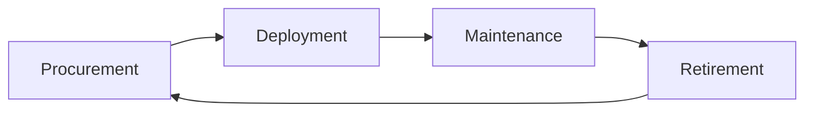

---

## Module 1 - What is System Administration?

**IT infrastructure** encompasses the software, the hardware, network, and services required for an organization to operate in an enterprise IT environment.

Also called as **SysAdmin:**

- Network administrators
- Database administrators

#### Servers Revisited

A server can provide services to multiple users, and a client can use multiple services:
![[attachments/image.png| 400]]

Different types of form factors for servers:
![[attachments/image 1.png| 400]]
**KVM Switch -** Keyboard, video, and mouse to control multiple computers/servers from a single set of peripherals:
![[attachments/image 2.png| 400]]

#### Organizational Policies

Having documentation of policies readily available to your employees will help them learn and maintain those policies.

#### User and Hardware Provisioning

Life cycle of Hardware used in infrastructures:



#### Vendor Life-Cycle for Custom Services and Products

Service vendors (businesses) offer specialized services, products, skilled labor to other businesses. Hiring temporary contractors on an as-needed basis can be a **disruptive**.
Vendor life-cycle management is an end-to-end standardization for conducting business partnerships with vendors:

##### Phase 1 - Pre-contract

1. Vendor identification and engagement
2. Vendor qualification and risk mitigation
3. Vendor evaluation and selection - asking and ensuring

After selection, the organization will negotiate a statement of work (**SoW**) and contract terms with the vendor:

- Vendor information management and on-boarding

##### Phase 2 - Contract delivery

1. Performance management monitoring
2. Risk management
   a. Supply chain risk management
   b. Product upgrade limitations and other risks
3. Vendor relationship management

##### Phase 3 - Post-contract

1. Vendor off-boarding (Warranties, Post-contract support)
2. Post-contract support

#### With Great Power Comes Great Responsibility

> [!TIP]
> Avoid using administrator rights for tasks that don’t require them.

- Respect privacy of others.
- Think before you type. `script | Start-Transcript`

#### IT Change Management Plans

- Person/team responsible for the change (at least one person in charge).
- Change priority (critical security patches vs normal feature update).
- Change description (giving an overview of planned changes).
- Purpose of the change (explains why the change is necessary).
- Scope of the change ( describe the extend of the changes - locations, departments, individuals, vendors, partners, …).
- Change rollback or backout plan (in case of primary plan failures).
- Technical evaluation (records the results of any testing performed on the proposed changes in a lab or sand-boxed environment).
- Systems affected by the change (lists all IT resources - that will experience direct or indirect changes as a result of the change rollout).
- Anticipated impact of changes (describes how the planned changes are expected to impact the affect systems).
- Resources needed to implement the change (outline any training).
- Risk level for change (how much risk is involved).
- Change instruction (details each step of the planned changes).

##### Change board approvals

Some large organization may have Change Advisory Board (**CAB**) - assist with mitigating risk, adjustments to meet business goals.

- **User acceptance**

#### Recording Your Actions

Know what you’re going to do with a plan, and store the actions.

```bash
## Linux
$ script session.log

## Windows
Start-Transcript -Path C:\Transcript.txt
```

If you’re going to graphically, **document** the actions or record video tools like **OBS** or **VLC.**

#### Never Test in Production

**Test Environment -** A virtual machine running the same configuration as the production environment, but isn’t actually serving any users of the service.
**Secondary or Stand-by Machine** - This machine will be exactly the same as a production machine, but won’t receive any traffic from actual users until you enable it to do so.

#### Assessing Risk

> [!NOTE]
> In general, the more users your service reaches, the more you’ll want to ensure that changes aren’t disruptive.

The more important your service is to your company’s operations, the more you’ll work to keep the service up.

#### Fixing Things the Right Way

**Reproduction case -** Creating a road map to retrace the steps that led the user to an unexpected outcome.

1. What steps did you take to get to this point?
2. What’s the unexpected (bad) result?
3. What’s the expected result?

## Module 2 - Network and Infrastructure Services

#### Types of IT Infrastructure Services

![[attachments/image 3.png| 500]]

- **IaaS** (Amazon Web Services, Linode, Windows Azure, Google Compute Engine)
- **NaaS**
- **SaaS**
- **PaaS**

#### Remote Access Revisited

SSH server is just a process that listens for incoming SSH connections.

```bash
## Both client and server has to be installed openssh
$ sudo apt-get install openssh-client

## Client
$ ssh <username>@<ip_address>
```

#### FTP, SFTP (Secure), and TFTP (Trivial)

![[attachments/image 4.png| 500]]

#### NTP

Network Time Protocol is used to keep the clock synchronized on machines connected to a network.

#### Network Support Services Revisited

**Intranet** - An internal network inside a company; accessible if you’re on a company’s network.
**Proxy Server** - Acts as an intermediary between a company’s network and the internet. (can also be used to monitor logs | security)

#### DNS for Web Servers

![[attachments/image 5.png| 500]]

```bash
## Hostnames in Linux
$ cat /etc/hosts
```

#### Managing Services

```bash
## Linux
$ sudo service ntp stop/start
$ sudo date -s "DD-MM-YYYY 00:00:00"
$ date
```

```powershell
## Windows
Get-Service wuauserv ## Windows Updates Service
Get-Service wuauserv | Format-List *
Stop-Service wuauserv
Get-Service wuauserv ## Check status
Start-Service wuauserv
Get-Service ## Check all services

## For GUI
Search > Services > see all services (Windows update utility)
```

#### Configuring Services in Linux

The configuration files for the installed services are located in the `/etc` directory.
`lftp` is an FTP client program that allows us to connect to an FTP server.

```bash
$ sudo service vsftp status
$ lftp ## You can see current local directory contents

## Change to allow anonymous connections
## /etc/vsftpd.conf - no to yes
## Then reload services to re-read the configurations
$ sudo service vsftpd reload
```

#### Configuring DNS with `dnsmasq`

```bash
$ sudo apt install dnsmasq
$ dig www.example.com@localhost
$ sudo service dnsmasq stop
$ sudo dnsmasq -d -q ## debug mode, log quries it executes
$ dig www.example.com@localhost ## Go back to see, dns receives this request

$ cat myhosts.txt ## with a list of your own IP addresses
$ sudo dnsmasq -d -q -H myhosts.txt
## NXDOMAIN - non-existent Domain
```

#### Configuring DHCP with `dnsmasq`

```bash
$ ip address show eth_srv ## eth_srv is example
$ ip address show eth_cli
$ sudo dnsmasq -d -q -C dhcp.conf

## Second terminal
$ sudo dhclient -i eth_cli -v
$ dig localhost instance-1.example
```

## Module 3 - Software and Platform Services

#### Communication Services

**IRC (Internet Relay Chat) -** Slack
**XMPP (Extensible Messaging and Presence Protocol) -** Pidgin and ADM.

> [!NOTE]
> Remember that the **A record** is used for hostnames, but for email servers, we use **MX** for the **mail exchange record.**

#### Email Protocols

- **POP3** (Post Office Protocol) - retrieving emails from server to **local** device.
- **IMAP** (Internet Message Access Protocol) **-** keeps emails on server and synchronizes across multiple devices. \*\*\*\*
- **SMTP** (Simple Mail Transfer Protocol) - sending between mail servers.
  ![[attachments/image 6.png| 500]]

#### Spam Mitigation and Management Solutions

- Domain Keys Identified Mail (**DKIM**)
- Sender Policy Framework (**SPF**)
- Domain-based Message Authentication, Reporting, and Conformance (**DMARC**)

> [!TIP]
> When considering software licenses, it’s important to review the **terms and agreements.**
> Software used as a **consumer** won’t be the same as software used as a **business**.

## Web Server Security Protocols

**Hyper Text Transfer Protocol Secure (HTTPS)** - The secure version of HTTP, which makes sure the communication your web browser has with the website is secured through encryption. Also referred to as **HTTP/TLS** or **HTTP/SSL**.

**TLS** (Transport Layer Security | More secure) is the successor to **SSL** (Secure Sockets Layer).

Verfied with **certificates.**

#### Network File Storage

**NFS** (Network File System) - a protocol that enables files to be shared over a network. (easiest to install on Linux server)

![[attachments/image 7.png| 400]]

Use **Samba** service for Windows Machines. **SMB** (Server Message Block) on top of its TCP/IP protocol, that Samba implements.

**NAS** (Network Attached Storage) - Computers that are optimized for file storage.

#### Print Services

**CUPS** - (Linux) Common Unix Printing Service, can be used via web browser.
Most common printing languages are **Printer Control Language** and **PostScript.** Either be Device-dependent or independent for print process.

- **PCL** is device-dependent both the printer and computer are responsible for creating parts of the printed data.
- **PS** mostly used in Macintosh systems and device-indenpendent.

##### Basic Settings

- Orientation
- Print Quality
- Tray settings - different paper types and sizes.
- Duplex - both sides of the paper, or one side (Simplex).

##### Network Scan Services

- **Email** - scanned directly from the printer to email.
- **SMB** protocol - allows a document to be a shared resource once scanned by the printer.
- **Cloud Services** - scanned from the printer and uploaded directly to the cloud.

##### Printer Security

- User authentication
- Badges - physical card a user must scan at the printer.
- Secured prints - enter user-created code at the printer.
- Audit logs - tracking the date and time of use.

#### Load Balancers

Monitor and route network traffic flowing to and from a pool of physical/virtual servers. Load balancers can be hardware (e.g., load balancing routers) and software (e.g., Citrix ADC Virtual Platform).

##### Terminology

- **Client** - sends requests
- **Host/node** - receives network traffic from ADC.
- **Member** - identified by IP address + TCP port of the app
- **Pool/cluster/farm** - a grouping of hosts/nodes or members offering services.
- **Application Delivery Controllers** (ADC) - physical appliances, virtual appliances, or software provides load balancing services.
- **Path-based routing** - routes traffic based on URL paths.
- **Listener** - checks network traffic for client requests and forwards them to target groups.
- **OSI Model** - depicts the seven layers of data communications.
- **Front end -** includes ADC systems and virtual servers that act as proxies for client communications with ADC system and back end servers.
- **Back end -** normally includes pool/cluster/farm system, disk storage systems.
- **Distributed applications** - multiple networked computers.
- **Containerization** - deploy and run distributed applications through application virtualization. (faster solution than older load balancing solutions).
- **Availability Zones (AZs)** - Regional data centers.
- **Elastic Load Balancer (ELB) -** the use of more than on AZ.
- **SSL/TLS** - network protocols for encrypted communication.

![[attachments/image 8.png]]

**HTTP Status Codes** that start with **4xx** indicate an issue on the **client-side. 5xx** indicate an issue on the **server-side. 2xx** tells successful.

#### Typical Cloud Infrastructure Setups

**Autoscaling** allows the service to increase or reduce capacity as needed, while the service owner only pays for the cost of the machines that are in use at any given time.
![[attachments/image 9.png]]
![[attachments/image 10.png]]
![[attachments/image 11.png]]

- **Software as a Service (SaaS) -** usable by browser or application instead of having to download software to device - through login. Stores user data online instead of user’s physical equipment. Typically uses a subscription model for its services. Hacking is concern since the full-service run in cloud.
- **Platform as a Service (PaaS)** - offers hardware and software in the cloud to develop and deploy applications or cloud based services - makes buying, developing, configuring, managing, and install software/hardware unnecessary.
- **Infrastructure as a Service (IaaS)** - On-demand - provides VMs, containers, networks, and storage. Reduces the need to purchase hardware and allows to centralize infrastructure for faster disaster recovery.

##### Additional Cloud Services

- **VPN as a Service (VPNaaS)** - cloud-based connection.
- **Function as a Service (FaaS)** - let developers to build directly in the cloud - without maintaining a server.
- **Data as a Service (DaaS)** - uses APIs to deliver data from various sources on demand.
- **Blockchain as a Service (BaaS)** - newer and uses non-centralized system - encrypted, connected blocks of information for higher security.

## Module 4 - Directory Services

#### Centralized Management

A central service that provides instructions to all of the different parts of my IT infrastructure.

**AAA** - Centralized Authentication, Authorization, and Accounting.

![[attachments/image 12.png]]

> [!TIP] Role-Based Access Control (RBAC)
> If you or another person change roles in the company, then all you have to do is change the groups that you are a part of, not the rights taht you have to directly access resources.

#### LDAP

**Lightweight Directory Access Protcol** - used to access information in directory services like over a network.

- Active Directory
- OpenLDAP

The example format of LDAP entry:

```bash
## dn = Distinguished name
## CN = Common name of the object (person name)
## OU = Organizational unit (group)
## DC = Domain component (example.com splited into this)
dn: CN=Devan Sri-Tharan, OU=Sysadmin, DC=example, DC=com
```

LDAP donotation is used for entries in directory services to describe attributes using values.

#### LDAP Authentication

**Bind operation** - authenticates clients to the directory server.

![[attachments/image 13.png]]

- Anonymous
- Simple
- SASL (Simple Authentication & Security Layer)

**Kerberos** - a network authentication protocol that’s used to authenticate user identity, secure the transfer of user credentials, and more.

#### Active Directory (AD)

The native directory service for Microsoft Windows.

- **Group Policy Objects (GPO)** - are ways to manage the configuration of Windows machines.
- **Active Directory Administrative Center (ADAC)** - a tool that we’ll use for lots of the everyday tasks.
- **Organizational Unit (OU)** - a folder or directory for organizing objects within a centralized management system.

#### Managing Active Directory Users and Groups

**Security Account Manager (SAM)** - a database in Windows that stores usernames and passwords.

```powershell
## Creating new group for AD in PowerShell
New-ADGroup
	-Description:"All members of the Research Dept."
	-GroupCategory:"Security"
	-GroupScope:"e,DC=com"
	-SamAccountName:"Researchers"
	-Server:"dcl.example.com"
```

#### User Accounts and Groups

##### Group Type

**Security group -** contain user accounts, computer accounts or other security group.
**Distribution group -** only designed to group accounts and contacts for email communication. You can’t user distribution group for assigning permission to resources.

##### Group Scope

**Domain Local** - used to assign permission to a resource.
**Global -** used to group accounts into a role.
**Universal** - used to group global roles in a forest.

#### Joining an Active Directory Domain

In file explorer, click on system and look for to join AD, with username and password.
In PowerShell:

```powershell
Add-Computer -DomainName "example.com" -Server "dc1"
## Prompt shows up to enter credentials
## Requires reboot (or restart command)
```

**Functional Levels** - describes what features supports:

```powershell
Get-AdForest ## Forest mode properties
Get-AdDomain ## Domain mode properties
```

#### Group Policy: Group Policy Object (GPO)

A set of policies and preferences that can be applied to a group of objects in the directory.

> [!TIP]
> When you **link** a GPO, all of the computers or users under that domain, site, or OU will have that policy applied.
> A GPO can contain **computer configuration, user configuration,** or both.

**Policies** - settings that are reapplied every few minutes, and aren’t meant to be changed even by the local administrators.
**Group Policy Preference -** settings that, in many cases, are meant to be a template for settings.

![[attachments/image 14.png| 500]]
**Windows Registry** - a hierarchical database of settings that Windows, and many Windows applications, use for storing configuration data.

#### Group Policy Creation and Editing

Windows software - **Group Policy Management Console (GCMP)** or `gpmc.msc` (open from Server Manager menu list).

![[attachments/image 15.png| 400]]

#### Group Policy Inheritance and Precedence

When a computer is processing the Group Policy Objects that apply to it, all of these policies will applied to **precedence** rules.

#### Group Policy Troubleshooting

One of the most common issues you might encounter is when a user isn’t able to login to their computer, isn’t able to authenticate to the Active Directory domain.

> The SRV records that we’re interested in are `_ldap._tcp.dc._msdcs.[DOMAIN.NAME](http://DOMAIN.NAME)` , where `DOMAIN.NAME` is the DNS name of our domain.

```powershell
Resolve-DNSName -Type SRV -Name _ldap._tcp.dc._msdc.example.com
```

![[attachments/image 16.png]]

For time relative difference issues, you can manually force a domain computer to re-sync by `w32tm /resync` .

#### Group Policy Troubleshooting: Common Issues

A common issue that you might have to troubleshoot is when a GPO-defined policy or preference **fails to apply to a computer.**

Something that you created a GPO to configure won’t be configured on one or more computers. The Group Policy Engine usually tries to make GPO application faster by only applying changes to a GPO instead of the whole GPO. You can force all GPOs to be applied completely with `gpupdate /force` or `gpupdate /force /sync`.

Changes are commonly only applies when the user logs on or reboots the computer.

Knowing which domain controller you’re connected to is useful info to have if you suspect a replication issue:

```powershell
## PowerShell
> $env:LOGONSERVER
\\DC1

## CMD Prompt
> echo %LOGONSERVER%
\\DC1
```

Get a summary report:

```powershell
gpresult /R

## Full summary like get for GPMC
gpresult /H FILENAME.html

```

##### Terminology

Important terminology used with Microsoft Windows Server Group Policies:

- **Group Policy Object (GPO):** A set of Active Directory (AD) Group Policy configurations that controls the appearance and behaviors for groups of computer systems and/or groups of end users.
- **Group Policy Management Console (GPMC):** A console that is used to create, manage, edit, and link GPOs. The GPMC provides thousands of options for computer and user settings such as Control Panel items, Registry settings, and environmental variables. Policy settings are refreshed every 90 minutes, so changes are not applied immediately. The GPMC can be used to create GPOs that control registry-based policies and software installations, as well as options for:
  - security
  - maintenance
  - scripts
  - folder redirection
- **Active Directory (AD) containers:** AD containers can be linked to GPOs. AD containers include:
  - **Sites:** Physical sites or aspects of a network, which are linked to AD Domains. Can be used to group and connect geographically dispersed locations into the same domain.
  - **Domain:** A collection of objects in an AD network, such as computers, users, and groups. Can contain multiple AD Sites and be linked to multiple GPOs.
  - **Organizational Unit (OU):** Collectively groups end users, computers, groups, and/or other OUs. OUs can reflect an organization’s hierarchy and business divisions. For example, an organization might have separate OUs for executives, administration, accounting, IT, sales, marketing, vendors, etc.
- **GPOs process order:** Windows will apply GPOs in the following order:
  1. The Local GPO.
  2. GPOs linked to Sites.
  3. GPOs linked to Domains.
  4. GPOs linked to OUs.
- **Resultant Set of Policies (RSoPs):** A report of AD Group Policy settings that indicates how all GPO settings are hierarchically inherited by end users and computers. RSoP reports can be collected for evaluation using RSoPs logging.
- **Windows Management Infrastructure (MI) and Windows Management Instrumentation (WMI):** MI is the next generation of WMI. However, both MI and WMI are fully supported by Microsoft and MI is backwards-compatible with WMI. MI/WMI provide the operations infrastructure and management data in Windows. They also are used for scripting administrative tasks to run on remote systems.

##### Group Policy troubleshooting tools

The following command line tools can be used for troubleshooting Group Policy issues:

- **gpresult:** Displays the RSoP report or values for a computer and user account. This information can help to ascertain which configuration settings have been applied and which settings were overridden. A few of the switches available to the gpresult command include:
  - `/s` _host_ Displays the RSoP values of a remote computer.
  - `/u` _user-account -_ Displays the RSoP values of an end-user.
  - `/p` **\***password -\* Displays the RSoP values of an end-user password policy.
  - `/r` - Displays the RSoP summary of applied GPOs.
  - `/z` - Turns on verbose mode to display details of the RSoP applied settings.
- **gpedit:** The Group Policy Editor, which is a robust tool for changing Registry settings related to the Control Panel, Settings, user profiles, system configurations, third-party software, and more.
  - **gpupdate:** Command that can be used to force a new or edited GPO to be applied immediately using the `/force` switch. If the policy setting requires the users to logoff or reboot, the switches `/logoff` or `/boot` can be added to the command.

Additionally, system event logs are important tools for most Windows troubleshooting issues:

- **Event Viewer and Windows Logs:** The Windows Event Viewer is an invaluable tool for viewing Windows Logs. These tools help IT Support specialists track system problems and events related to items like applications, user logins, security, and systems.
- **System log:** Records Windows OS events like hardware conflicts, driver load failures, service load failures, network issues, and more.
- **Application log:** Records application processes and utilities events/errors.
- **Security log:** Records system security audit information.
- **Setup log:** Records installation events and errors.

#### Mobile Device Management (MDM)

**Remote Wipe:** A factory reset that you can trigger from your central MDM, rather than having to do it in person on the device.

#### What is OpenLDAP?

Another popular directory service that’s used today open-source **Lightweight Directory Access Protocol.** It can be used on any OS. However, since **Active Directory** is Microsoft’s proprietary software for directory services, it is recommended to use on Windows instead of opening an LDAP.

```bash
## Installation
sudo apt-get install slapd ldap-utils

## Configuration - Follow instructions
sudo dpkg-reconfigure slapd
```

#### Managing OpenLDAP

Easier to manage open LDAP through a web browser and tool like **PHP LDAP admin**.
To begin using command line tools, you need to use something known as LDIF - just a text file that lists <mark style="background: #BBFABBA6;">attributes and values</mark> that describe something:

```bash
## Example
dn: uid=cindy, ou=Engineer, dc=example, dc=com
objectClass: inetOrgPerson
description: Cindy works in the Engineering department.
cn: Cindy
uid: cindy
```

Once you've written your LDIF files, depending on what task you want to do to your directory, you'd run commands like these:

- `ldapadd`: Takes the input of an LDIF file and adds the context of the files.
- `ldapmodify`: Modifies an existing object.
- `ldapdelete`: Will remove the object that the LDIF file refers to.
- `ldapsearch`: Will search for entries in your directory database.

## Module 5 - Data Recovery & Backups

#### What is Data Recovery

The process of trying to restore data after an unexpected event that results in data loss or corruption.

> [!TIP]
> When an unexpected event occurs, your main objective is to **resume normal operations** as soon as possible, while minimizing the disruption to business functions.

The best way to be prepared for a data-loss event is to have a well-thought-out **disaster plan and procedure** in place. Disaster plans should involve **making regular backups** of any and all critical data that's necessary for your ongoing business processes.

> A **post-mortem** is a way for you to document any problems you discovered along the way, and most importantly, the ways you fixed them so you can make sure they don't happen again.

#### Backing Up Your Data

| ![[attachments/Pasted image 20260204115413.png]] | ![[attachments/Pasted image 20260204115440.png]] |
| ------------------------------------ | ------------------------------------ |

**Rsync**: A file transfer utility that's designed to efficiently transfer and synchronize files between locations or computers. Rsync supports compression and can use SSH to securely transfer data over a network.

Using SSH, it can also synchronize files between remote machines, making it super useful for simple autmated backups.

#### Types of Backup

> It's a good practice to perform infrequent full backups, while also doing more frequent differential backups.

While a **differential backup** files that have been changed or created since the last full backup, an incremental backup is when only the data that's changed in files since the last incremental backup is backed up.

Compression saves backup space.

**Redundant Array of Independent Disks (RAID)**: A method of taking multiple physical disks and combining them into one large virtual disk. RAID is not a replacement for backup, it is a storage solution.

#### User Backups

![[attachments/Pasted image 20260207133935.png]]
Backups for the clients is a bit more challenging as they will not be in the office all the time. Cloud solutions with syncing includes:

- Google Drive
- Apple iCloud
- DropBox

#### What's a Disaster Recovery Plan?

A collection of documented procedures and plans on how to react and handle an emergency or disaster scenario, from the operational perspective.

- **Preventive Measures:** Any procedures or systems in place that will proactively minimize the impact of a disaster - regular backups.
- **Detection Measures:** Meant to alert you and your team that a disaster has occurred that can impact operations.
  - Environmental sensors
  - Flood sensors
  - Temp and humidity sensors
  - Evacuation procedures
- **Corrective or recovery measures**: Those enacted after a disaster has occurred.

#### Designing a Disaster Recovery Plan

Allows you to prioritize certain aspects of the organizations that are more at risk if there's an unforeseen event.

- [x] Perform Risk Assessment
- [x] Determine Backup and Recovery Systems
- [x] Determine Detection & Alert Measures & Test Systems
- [x] Determine recovery measures

#### What's a Post-Mortem?

We create a **post-mortem** after an incident, an outage, or some event when something goes wrong, or at the end of a project to analyze how it went.

#### Writing a Post-Mortem

![[attachments/Pasted image 20260207144011.png]]
To go into more details:
![[attachments/Pasted image 20260207144308.png]]

#### Interview Role Play: Sys Admin

An example of what Sys Admin interview looks like.
**Objective:** In total, we have about 100 machines that we want to install to. Half are going to get one application and the other half is going to get another. What are some ways that we can accomplish this?

**Active Directory** organizes users, groups and computer permissions to restrict certain resources in the enterprise environment. It's also used to deploy software and it's also used to control the environment.

Mainly:

- Asking follow-up questions
- Defining terms
